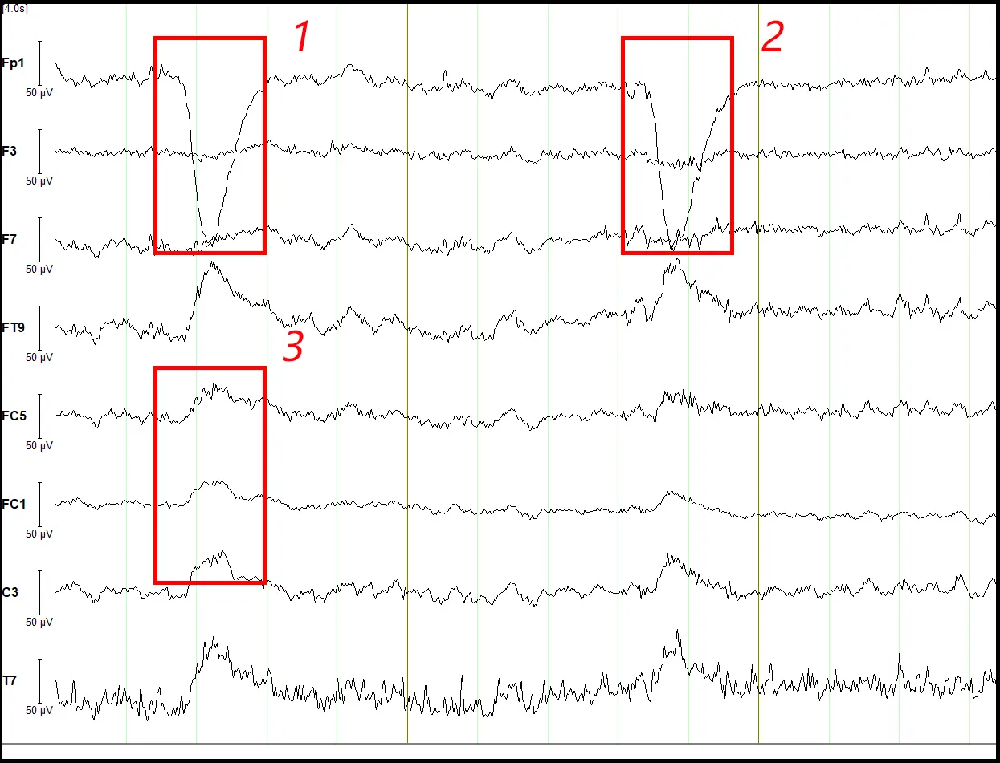

# 脑电信号预处理实践

!!! abstract 
    在本节课程中我们所指代的脑电信号主要是针对EEG信号的预处理。事实上，我们所拿到的实验数据可能是多元的，包含多种生物数据（例如心电数据、眼电数据等）。  
    
    下面是我们在本节中可能用到的工具的文档：  

    - [MNE Documentation](https://mne.tools/stable/documentation/index.html )
    - [mne_icalabel](https://mne.tools/mne-icalabel/stable/index.html)

在一个脑机接口的框架中，我们大体长以下这样：

<figure markdown="span">

<figcaption>脑机接口的流程示意</figcaption>
</figure>

但是由于实际中各种各样的因素干扰，我们所采集的脑电信号往往是存在各种干扰的（例如噪声和伪迹等）。

??? note "脑电信号的采集原理"
    在脑机接口的框架中，我们所采集的脑电信号是通过脑电帽来进行的。脑电帽上有多个电极，这些电极会记录头皮上不同位置的电位变化。
    事实上，我们采集脑电信号的原理是通过三个电极（参考电极（R）、活动电极（A）、接地电极（G））所构成的一个放大器进行的，脑电帽将会记录两个电极之间的电位差（[A-G]-[R-G]）=A-R 
    但是由于在信号G中无法避免的产生噪声，这将会使得A和G之间的电势包含噪声与头皮上的电位变化。

## 伪迹与噪声

- 生理伪迹：来源于生物体本身，常见的是：因眨眼、眼动、舌动、心跳、呼吸、肌肉运动和汗腺兴奋等产生的电生理信号。
- 非生理伪迹： 来源于外部环境，常见的是：电源线、设备开关、手机信号、无线网络等产生的电磁干扰。

对于非生理伪迹，例如常见的电源的频率干扰，我们可以在频谱图中较为明显的观察到一些峰值特征。

<figure markdown="span">

<figcaption>电源的噪声</figcaption>
</figure>

例如，在上面的例子中，我们可以清晰的在 50 Hz 左右看见一个明显的峰值，这就是电源的噪声。（事实上，对于50的倍数的频率都应该存在这个峰值）

对于这样的噪声，我们可以通过陷波滤波来进行处理。陷波滤波的原理是通过一个带阻滤波器来对特定频率的信号进行抑制。

<figure markdown="span">

<figcaption>陷波滤波</figcaption>
</figure>

在 MNE 中，我们可以通过自带的 `notch_filter` 函数来进行陷波滤波。这里默认的 bandwidth 是 1 Hz

```python
raw.notch_filter(50)
```

与电源的噪声在某些频率固定的强度不同，生理伪迹的噪声在时空上往往没有这样强的规律性。


<figure markdown="span">

<figcaption>眨眼伪迹</figcaption>
</figure>


上图是一个眨眼伪迹的例子，我们可以看到在某些时刻，脑电信号的幅度会突然增大（超出了200mv的范围）。为了处理这样的伪迹，我们可能需要通过ICA（独立成分分析）来进行处理。

ICA与PCA（主成分分析）不同，PCA是通过对数据进行线性变换来提取数据的主成分，而ICA则是通过对数据进行非线性变换来提取数据的独立成分。ICA的目标是将数据分解为若干个独立的成分，这些成分之间是相互独立的。即我们将采集到的信号分为真正的脑电信号、眼电信号、心电信号、肌电信号等，再保留真正的脑电信号从而去除伪迹。

但是ICA的结果往往是需要人工进行筛选的。一方面ICA的结果并不能保证每个成分都是独立的，ICA计算的算法、参数等也是高度经验依赖的值。另一方面，我们没有一个明确的范式来判断每个成分是否是伪迹。尽管我们可以通过 `mne_icalabel` 这个包来进行自动化的成分标注，但是其准确性不能够得到保证。

在MNE中，我们可以通过`ICA`类来进行ICA的计算。下面是一个简单的例子：

```python
from mne.preprocessing import ICA
from mne_icalabel import label_components
raw_ica = raw.copy()
n_components = 15
ica = ICA(n_components=n_components, method='infomax', fit_params=dict(extended=True), random_state=42)
ica.fit(raw_ica)
ic_labels = label_components(raw_ica, ica, method="iclabel")
labels = ic_labels["labels"]
probs = ic_labels["y_pred_proba"]
iclabel_dict = {
    'labels': labels,
    'probs': probs
}
bad = [i for i, (label, prob) in enumerate(zip(labels, probs)) if label not in ['brain', 'other'] and prob>0.7]
ica.exclude = bad
ica.apply(raw_ica, exclude=ica.exclude)
```

在实际的深度学习中，我们可能不会频繁的用到ICA来进行深度的数据预处理。因为在ICA的去除部分信号的过程中，我们想要模型学习的内容可能就丢失了。所以对于不同的数据集、任务等，我们可能需要根据实际情况来决定是否使用ICA来进行数据预处理。

## 预处理的流程与实践

在实际的脑电信号预处理过程中，我们可能需要进行以下几个步骤：

### 读取与重命名

部分的数据集可能会有一些不规范的命名方式，我们需要对数据集进行重命名，将其映射到国际的标准命名上。

### 重采样

由于不同的设备采集的信号的采样率可能不同，我们需要对数据进行重采样。常见的采样率是 250 Hz、500 Hz、1000 Hz 等。但是为了统一的模型计算的需要，我们可能要将其统一到同一个频段上。

### 设置参考电极

在脑电信号的采集过程中，我们需要设置一个参考电极。参考电极是用来计算其他电极的电位差的。常见的参考电极有：Cz、A1、A2 等。参考电极的选择的原则是保证差异最大化，一般在脑电记录的时候会采用的参考电极有鼻尖参考，cz或头顶中央参考，还有单侧乳突参考，乳突就是耳朵后面一小块突起的区域。我们所看到的每个通道的数值，其实就是指这个通道跟参考通道之间的电位差。

常用的一些参考位置有双侧乳突平均参考，指将两个乳突数据的平均值作为参考数据，或者是全脑平均参考，指的是将全脑所有数据的均值作为参考数据的方法，不过使用全脑平均参考的时候要注意，眼电数据不要纳入其中，因为眼电数据的波动起伏非常大，很容易对数据造成比较大的干扰。

### 滤波

对于脑电信号，我们可能需要进行带通滤波来去除低频和高频的噪声。常见的带通滤波范围是 1-40（80） Hz 等。这里对应的是高通滤波与低通滤波。

同时我们还需要进行陷波滤波来去除电源的噪声。陷波滤波的频率一般是 50 Hz 或 60 Hz。这些可以通过频谱图来进行判断。

### 标记坏道与插值

在采集过程中，由于各种原因，可能会有一些电极的信号不完整或者异常。我们需要对这些电极进行标记，并进行插值处理。（相当于四周的电极通过数值分析的方法计算）

### 实践中可能遇见的问题

1. 部分时间段上的整体异常噪声：在有的数据中，可能开头的几秒钟或者最后的几秒钟会有整体的异常噪声，这可能是由于不稳定，被试者移动等原因导致的。我们可以先通过将信号切片，然后对每个切片进行预处理，直接将这些时间段的数据删除。

2. ICA 的参数设置：ICA 的参数设置是一个经验性的过程。我们需要根据实际的数据集来进行调整。学长说，通常情况下，`n_components` 的值可以设置为 15-20 之间。`method` 可以设置为 `infomax` 或 `fastica` 等。

3. 坏道的标记： 一般而言，坏道体现为信号振动幅度非常大，且频率较快。但是分给我的数据似乎没有观察到明显的坏道。我们可以通过 `raw.plot()` 来观察信号的整体情况，或者通过 `raw.plot_psd()` 来观察频谱图（例如有明显的”离群之马“）。

4. 一般而言，信号的波动幅度是不会超过 200 μV 的。如果超过了这个范围，我们可以认为是坏段或者伪迹。但是这一步骤需要在插值坏导和ICA去除眼电成分之后再做，否则因为眼电成分的影响，可能会导致信号的波动幅度超过 200 μV ，这样就会去除过多的patch，导致数据过少。

下面是一些处理前后的比较：

<figure markdown="span">

<figcaption>H S3 EC 处理前</figcaption>
</figure>

<figure markdown="span">

<figcaption>H S3 EC 滤波与插值坏道后</figcaption>
</figure>

<figure markdown="span">

<figcaption>H S3 EC 通过ICA去除眼电后</figcaption>
</figure>