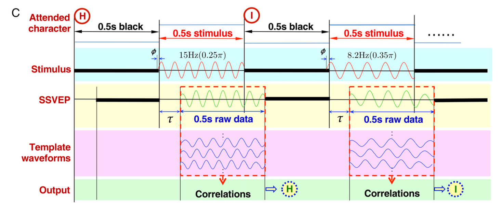
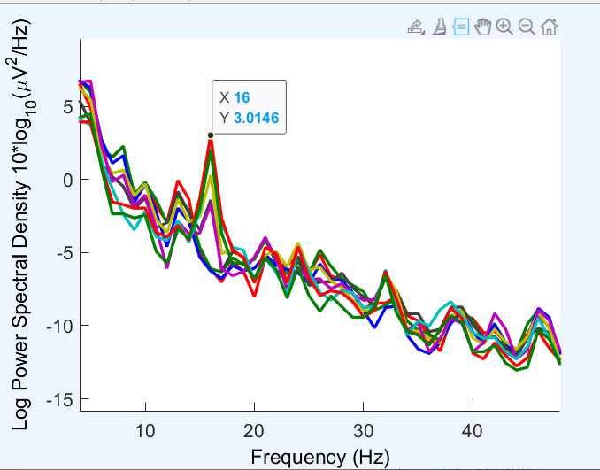
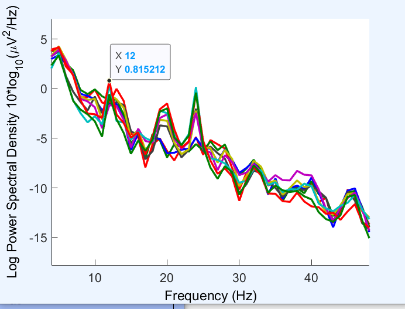

# SSVEP 范式及其应用

## SSVEP 原理

Steady-state visual evoked potential （稳态视觉诱发电位）。

<figure markdown="span">

<figcaption>SSVEP 范式示意图</figcaption>
</figure>

给定一定频率的闪烁的光源（x Hz）， 在脑电波的频谱图中会有对应的频段的峰值出现。这些峰值的频率可能与闪烁的光源的频率相同，也可能是其整数倍（例如 2x Hz, 3x Hz 等）。这些峰值的出现是因为视觉系统对闪烁的光源产生了响应。
<figure markdown="span">

<figcaption>SSVEP 8Hz的频闪在其谐波的峰值</figcaption>
</figure>
<figure markdown="span">

<figcaption>SSVEP 12Hz的频闪在其本身频段的峰值</figcaption>
</figure>

相应的信号主要是在人脑的枕叶（视觉皮层）中产生的。所以对应的主要是后脑勺的脑电极。

## CCA 典型相关分析

我们现在的任务，就是从所得到的各种繁杂的脑电信号中，高效、精确的提取出是否存在某个频率的峰值。

典型相关分析（Canonical Correlation Analysis, CCA）是一种统计方法，用于分析两个多变量之间的相关性。在脑机接口中，CCA 可以用来分析脑电信号与预期的模板信号之间的相关性。

假设我们有两组随机向量 $X = (X1,X2,X3,X4,...,Xp)$ 和 $Y = (Y1,Y2,Y3,Y4,...,Yq)$，CCA 的目标是找到线性组合 $a^TX$ 和 $b^TY$，使得这两个组合之间的相关性最大化。即：

$$ \max_{a,b} \text{Corr}(a^TX, b^TY) $$

这里的相关系数可以是皮尔逊相关系数或其他相关系数。在假定皮尔逊相关系数的情况下，CCA 的目标可以转化为求解以下优化问题：

$$ \max_{a,b} \frac{a^T \Sigma_{XY} b}{\sqrt{a^T \Sigma_{XX} a} \sqrt{b^T \Sigma_{YY} b}} $$

其中 $\Sigma_{XY}$ 是 $X$ 和 $Y$ 的协方差矩阵。

我们还可以发现，分母下的 $\sqrt{a^T \Sigma_{XX} a}$ 和 $\sqrt{b^T \Sigma_{YY} b}$ 是常数（在确定之后仅仅只差一个系数），所以我们可以将其去掉（即约定： $\sqrt{a^T \Sigma_{XX} a} = 1$ 和 $\sqrt{b^T \Sigma_{YY} b} = 1$），得到：

$$ \max_{a,b} {a^T \Sigma_{XY} b}$$

对于这样的特定约束条件下的优化问题，我们可以通过拉格朗日乘数法来求解。我们可以构造拉格朗日函数：

$$ L(a,b,\lambda) = a^T \Sigma_{XY} b - \frac{\lambda}{2} (a^T \Sigma_{XX} a - 1) - \frac{\mu}{2}(b^T \Sigma_{YY} b - 1) $$

$$ \begin{cases} 
        \frac{\partial L}{\partial a} = \Sigma_{XY} b - \lambda \Sigma_{XX} a = 0 \\
        \frac{\partial L}{\partial b} = \Sigma_{XY}^T a - \mu \Sigma_{YY} b = 0 \
    \end{cases} 
$$

我们可以得到 $\lambda{} = \mu{} = \rho{}$,最终可以整理得到：

$$
\begin{cases}
     \Sigma_{YY}^{-1} \Sigma_{XY}^T \Sigma_{XX}^{-1} \Sigma_{XY} b = \lambda^2 b \\
     \Sigma_{XX}^{-1} \Sigma_{XY} \Sigma_{YY}^{-1} \Sigma_{XY}^T a = \lambda^2 a
\end{cases}     
$$

这里有关于矩阵的微积分的推导属于我的知识盲区（x）

所以我们需要做的就是求解上述两个矩阵的特征值和特征向量。而对应的最大的相关系数，就是这最大的特征值 $\lambda$。

在实际的实践当中，假设我们得到了一个脑电信号的矩阵 $X \in \textbf{R}^{C \times T}$，接下来我们还需要考虑怎样去构建一个模板信号 $Y$？

先前我们提到了，SSVEP 的刺激频率在其谐波上会有响应。所以我们可以构建一个针对频率$k$的模板信号 $Y$，其形式为：

$$ 
Y_k(t) = \begin{pmatrix}
    \sin(2\pi k t) \\
    \cos(2\pi k t) \\
    \sin(2\pi 2k t) \\
    \cos(2\pi 2k t) \\
    \sin(2\pi 3k t) \\
    \cos(2\pi 3k t) \\
    \end{pmatrix}
$$

一般而言，我们只需要取谐波到3次（即 $k, 2k, 3k$），因为在实际的实验中，一方面，谐波的响应会随着谐波次数的增加而逐渐减弱，另一方面，人脑的信号也会随着频率的增高而衰减。

这样，我们就可以通过 CCA 来计算脑电信号 $X$ 和模板信号 $Y_k$ 之间的相关性，从而判断是否存在频率为 $k$ 的 SSVEP 响应。

## SSVEP 的实践

一些问题：

- 相位在其中的关联？
- 高频段的刺激的效果？是否存在局限？实验中选择频率的原则与范围？
- 为什么不在频谱图上直接寻找峰值？而是通过 CCA 来寻找相关性？

