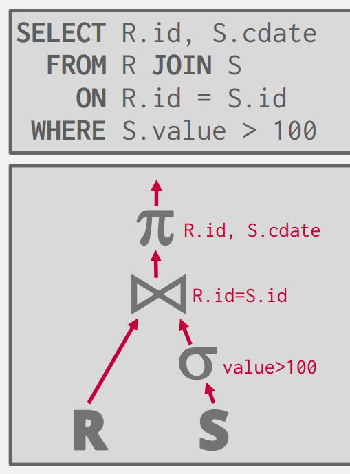
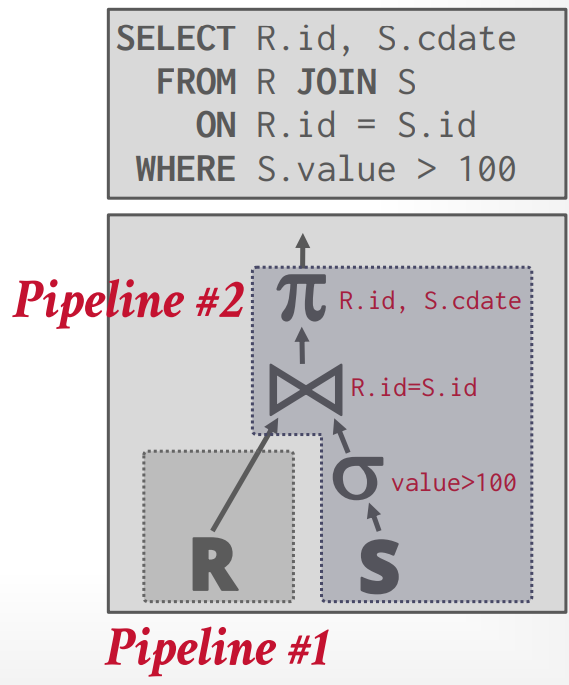

# Query Execution

假设我们的时Query Plan 可以表示成为一个由DAG连接的算子的集合

<figure markdown="span">

<figcaption>一个树状的Query Plan</figcaption>
</figure>

我们定义:

- **pipeline** (A sequence of operators where tuples continuously flow)是一系列连续的算子,所有的元组可以在不需要临时存储的情况下连续的在其中流动.

- **pipeline breaker** 是一个算子,需要所有的元组计算完毕后才能进行计算
    + Joins (对于建立的一方而言),Subqueries ,Order by...

此时我们的整个Query Plan可以划分为若干个 Pipeline

<figure markdown="span">

<figcaption>两个pipeline</figcaption>
</figure>

## Processing Models
处理模型定义了数据库系统如何处理query plan和如何将数据从一个算子移动到下一个算子.
我们称 

Control Flow : DBMS如何

- Approach \#1 : Iterator Model
- Approach \#2 : Materialization Model
- Approach \#3 : Vectorized / Batch Model