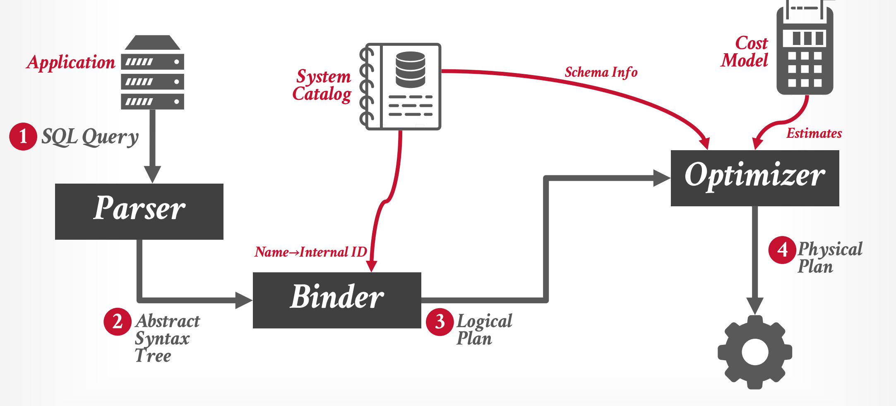
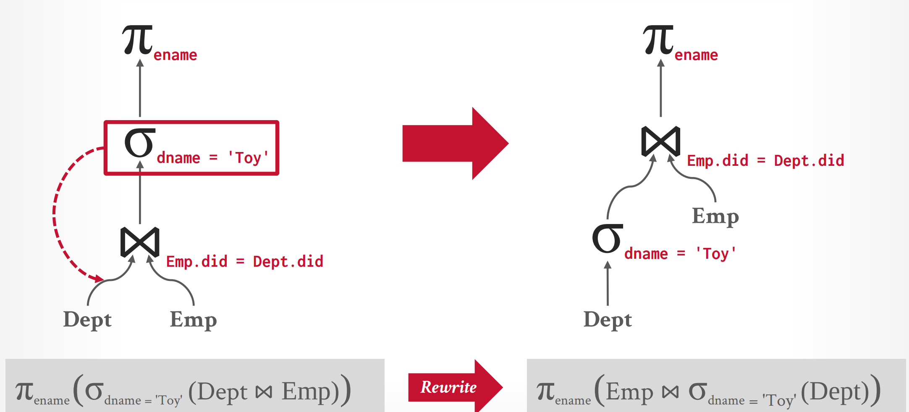
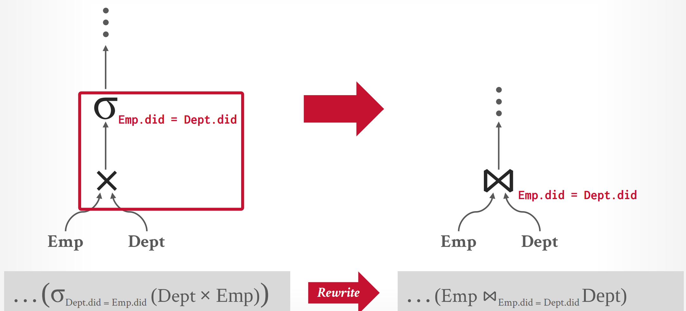
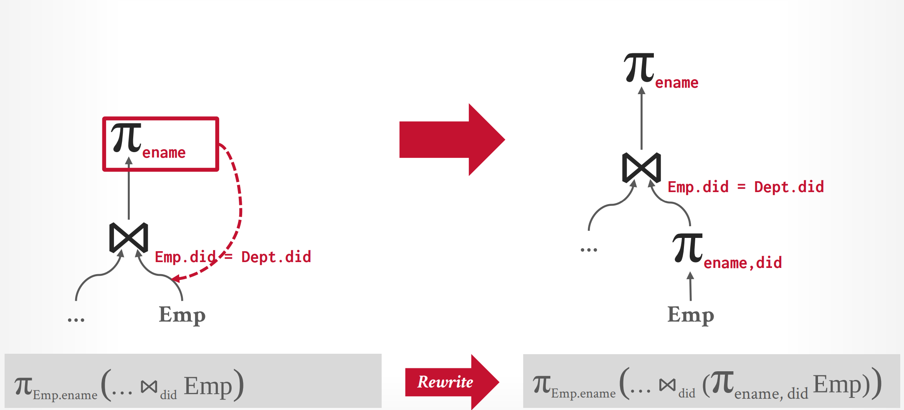
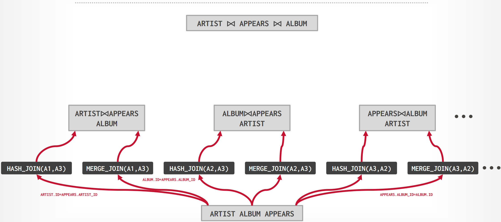
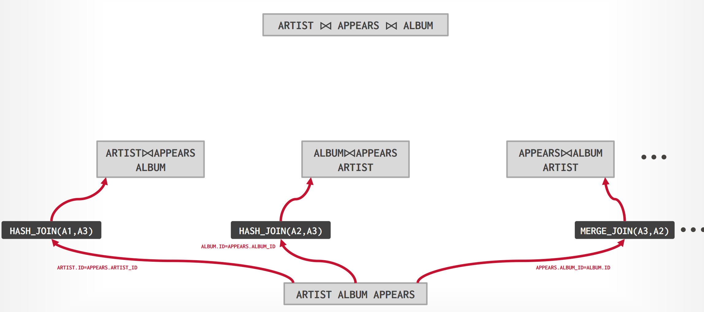
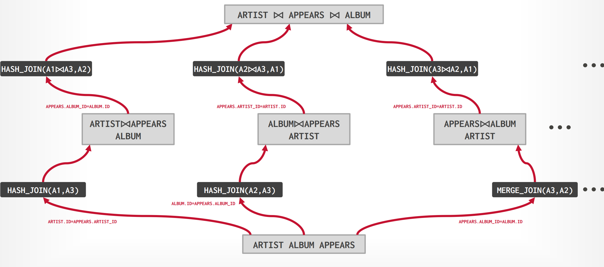
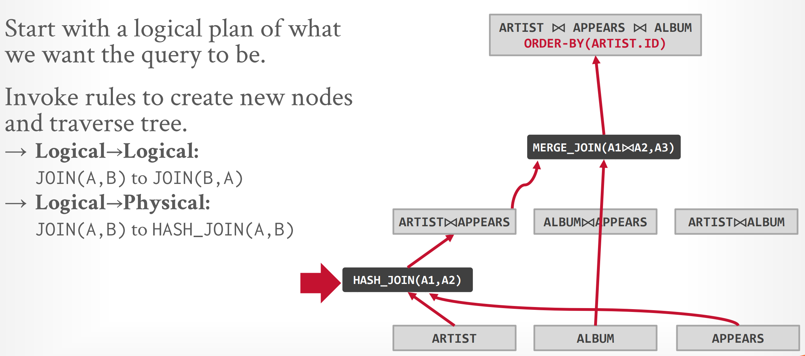
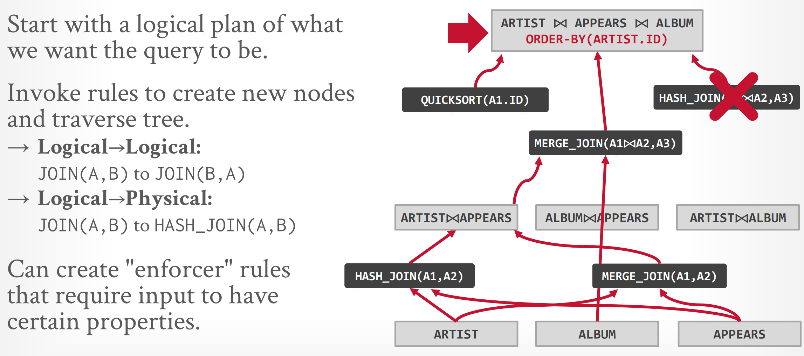
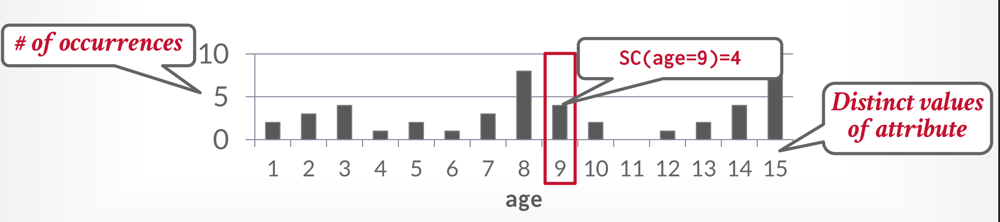

# Query Planning & Optimization

??? abstract "Questions After Note"

    1. 在我们的成本估计的过程中，我们需要考虑对于一个算子，通过输入的规模来估计其成本。问题在于：我们是否需要考虑更多运行时的因素来作为成本估计的输入？例如，如果我们并行执行了两个JOIN算符，此时由于BufferPool中存在竞争，对于实际成本的影响应该是显著的。

    2. 在统计一个表格、属性的元数据时，我们是否可以通过一个近似的“分布”来拟合实际的分布，使得在成本估计中获得更精确的值？

## Query Architecture Overview

<figure markdown="span">

<figcaption>Query 的框架</figcaption>
</figure>

我们从SQL语句到实际的Query Plan的整体框架如图所示：

1. 我们首先通过 Parser 生成一个抽象的语法树
2. 在生成语法树后，我们将树上的表格、索引等实例替换为一个实际的id(在Catalog Manager 中查询)，这一步称为绑定
3. 在绑定后，我们可以按照原始SQL的语义生成一个逻辑上的查询计划
4. 我们通过优化器对查询后的计划进行优化，最终生成一个实际会执行的计划

关于AST与BINDER，前者属于编译原理等的内容，后者与具体的实现有关，在这里不再赘述；我们希望讨论的是第三点和第四点：我们如何生成一个逻辑上的查询计划，并且优化为一个实际执行的计划

- \# **Logcal Plans** : 强调的是逻辑上等价的计划：对于一个SQL语句的输入，我们有多个逻辑上等价的计划，他们只要是在关系代数的层面上是等价的都可以

- \# **Physical Plans** ： 是指明确具体执行的方案和策略，需要具体到每个算子采取的算法等等..

!!! example
    
    例如在 JOIN 这一步，HASH_JOIN，INDEX_JOIN，NESTED-LOOP JOIN都可以是一个 Logical Plan，但是确对应着不同的 Physical Plan

非常遗憾的是，生成若干逻辑等价的 Query Plan Tree是一个NP-Hard的问题。所以我们不得不做出取舍

- 我们在一邻域内进行搜索，最终确定一个在启发函数（估价）上最小的方案，这样称为 Cost-Based Search
- 我们通过一些明确的规则或者技巧，进行优化（例如在Catalog 中存储更多的 metadata，将Select 下移），称为 Heuristics/Rules

### Heuristics/Rules
<figure markdown="span">

<figcaption>Predicate Pushdown</figcaption>
</figure>

对于第一个方案，我们可以知道这样总是有效的。因为人们/机器总会写出一些蠢蠢的代码；在上图中，原始方案我们在 Join 这一步直接采用的是原始的表格；但是显然我们希望参与Join计算的数据量越小越好，所以我们可以下放 Predicate 去优先筛选一部分数据；在筛选后的数据上进行Join显然是更优的。

<figure markdown="span">

<figcaption>Replace Cartesian Product</figcaption>
</figure>

同样我们也可以知道，笛卡尔积和Predicate在一起时，我们将其转化为Join也是更优的。

<figure markdown="span">

<figcaption>Projection Pushdown</figcaption>
</figure>

和 Predicate Pushdown 类似，我们首先只选择了有关的属性而抛弃了无关的属性做运算的话，能够在一些很大的表格上显著减少计算量。

像这样我们不断地去匹配一些已知的优化范式来减少计算量，就成为 Heuristics/Rules。我们不需要去具体的检查数据本身是什么样的，并且其优化效果是一定的。

### Cost-Based Search

这里的思路和启发式搜索十分类似；对于每一个从邻域搜索得到的树，我们通过一个启发函数来计算它的预计代价。我们最终选择有最小的启发函数值的方案。

我们需要讨论的情景有三种：**单个关系** 的查询；**多个关系** 的查询；**嵌套** 的查询

对于搜索，我们同样也有两种思路，**从顶至底** 的搜索与 **从底至顶** 的搜索

#### Single Relation

一般而言，我们在单个的关系上的查询运用规则去优化就已经足够了，我们仅需要选择我们便利的方式即可。

- Sequential Scan
- Binary Search (clustered indexes)
- Index Scan

这里我们需要根据我们 Predicate 本身来估计和选择

#### Multi Relation

对于多个表格，尤其是涉及到多个表格的Join，它们Join的顺序是十分重要的；这里就对应了我们所说的搜索顺序：

=== "Generative / Bottom-Up"

    我们从原始的关系表格开始迭代的生成一个计划，每次向计划里增加新的执行方式与策略，这里更类似于动态规划的思想。例如：
    <figure markdown="span">
    
    <figcaption>Projection Pushdown</figcaption>
    </figure>

    这里为了达到 $ARTIST \Join APPEARS \Join ALBUM$，我们选择了从三张原始的表格出发，来搭建一个计划；对于第一层，我们搜索所有可能的方案，并计算其代价，最终我们保留代价最小的方案。
    <figure markdown="span">
    
    <figcaption>Projection Pushdown</figcaption>
    </figure>

    然后我们在这些最小方案上继续搜索，找到下一步的所有可能方案，并计算代价和保留；最终我们在全局中寻找一个最优的方案。

    <figure markdown="span">
    
    <figcaption>Projection Pushdown</figcaption>
    </figure>

=== "Transformation / Bottom-Up"

    我们从最终的结果开始，从顶向底的生成我们的方案；对于这个例子而言，我们已知存在 ORDER BY 算符，我们则可以知道通过 MERGE_JOIN(A1$\Join$A2,A3) 可以得到结果，所以我们进一步扩展这个 Physical Op。
    <figure markdown="span">
    
    <figcaption>Projection Pushdown</figcaption>
    </figure>

    紧接着对于操作数 ALBUM，它已经是原始的表格，我们不需要再在其基础上进行分解了；而对于 $A1\Join{}A2$我们继续枚举..

    <figure markdown="span">
    
    <figcaption>Projection Pushdown</figcaption>
    </figure>

    最终我们可能会得到多个方案，按照启发函数进行选择即可

#### Nested Query

嵌套查询，对于人类而言更具有可读性，也可以进行更复杂的查询。对于一个复杂的嵌套子查询，我们通常有两种处理思路：

- Approach \#1 Rewrite to de-correlate and/or flatten them.
- Approach \#2 Decompose nested query and store results in a temporary table.

### Expression Rewriting

除了对于查询结构的优化，我们还可以对查询的表达式进行优化，例如对于 WHERE 和 ON 语句中的表达式进行优化。这一点在前一节已经提及；我们可以采取匹配某个Patter并优化的方法；我们可以进行实时编译...

例如，有可能会出现不可能的查询，或者可以合并的语句：

```SQL
SELECT * FROM A WHERE 1 = 0; 
SELECT * FROM A WHERE NOW() IS NULL;

SELECT * FROM A
WHERE val BETWEEN 1 AND 100
 OR val BETWEEN 50 AND 150;
```

前两者是恒假的，我们可以直接跳过；后者可以优化为：

```SQL
SELECT * FROM A
WHERE val BETWEEN 1 AND 150;
```

### Cost Estimation

接下来我们需要讨论如何进行代价的估计；这是一个相当困难的问题，并且我们估计的越准确，我们优化器所找出的方案一般更接近于最优解；并且我们还需要权衡这一步的性能与时间的开销。

在主流数据库中，我们可以通过一些语句来对某些表格与数据进行统计学上的分析，这更加有助于我们的估计；因为这会产生许多对于我们估计有用的元数据。

- Postgres/SQLite: ANALYZE
- Oracle/MySQL: ANALYZE TABLE
- SQL Server: UPDATE STATISTICS
- DB2: RUNSTATS

所以一个方法是，我们对于数据有柱状图的统计（离散意义上也可以），我们可以根据数据的分布来进行代价的估计。

<figure markdown="span">

<figcaption>Age Distribution</figcaption>
</figure>

例如，我们统计 Sel(age=9) 的代价，我们就可以通过元数据中的柱状图来进行分析；这样的数据不必要将更新每次都同步到元数据中；我们可以固定时间更新；可以设置更新同步的阈值；我们可以合并多个柱来得到一个大致范围的估计；这样就平衡了其开销与性能。

我们也可以通过统计学上的概率分布来计算（这里回收了我在开始的问题）；我们可以通过一个近似分布来计算某些数据出现的概率；并按照更新进行修正。

我们也可以通过直接采样（Sample）来直接获得其分布的大概，然后根据采样集的代价来估计真是代价。

