# Transaction And Concurrency Control

??? abstract
    在原本的 CMU 15-445 的课程设计中,这里对应的 4 讲

    - Lecture \#16: Concurrency Control Theory
    - Lecture \#17: Two-Phase Locking Concurrency Control
    - Lecture \#18: Timestamp Ordering Concurrency Control
    - Lecture \#19: Multi-Version Concurrency Control

    但是为了在笔记上保持连贯性,将这里的内容合并为一节,以期望更好的阅读体验.

## Transactions and ACID Criteria

在进入我们的主题以前,我们先来用一个例子讨论为什么我们需要事务(Transactions)?我们实现事务时可能会遇到什么样的问题?一个期望的并发控制是什么样的?

假设有一家银行提供了一个定时扣费的服务,每次将按照以下的逻辑从数据库中读取并执行:

<figure markdown="span">
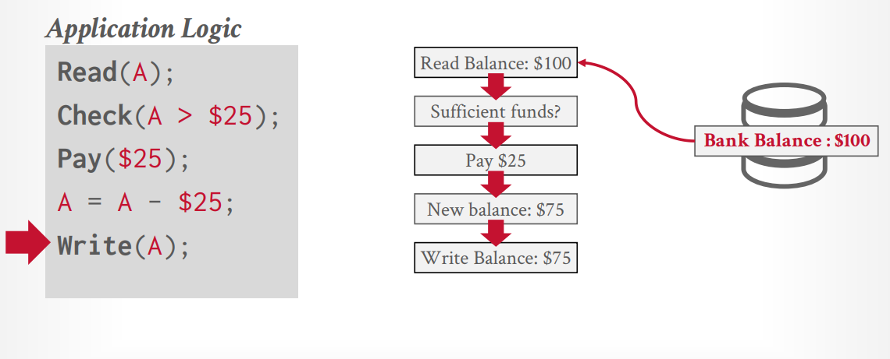
<figcaption>Bank Transaction Example</figcaption>
</figure>

如果遇见了一个突发情况,例如突然发生了断电,导致我们 `Write Back A`的这一步骤没有被实现:

<figure markdown="span">
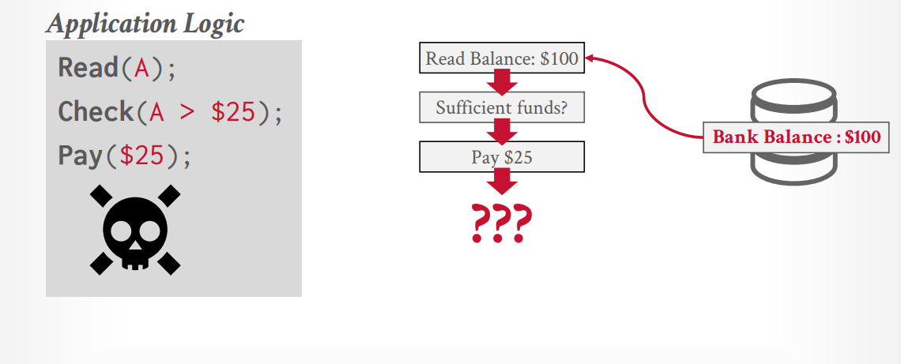
<figcaption>Oops! Something went wrong</figcaption>
</figure>

此时就遇见了一个非预期的情况:我们认为服务已经发生了,但是账户在数据库看来并没有扣费.

所以我们十分期望数据库能够实现这样一种操作:**要么全部执行,要么全部不执行**.即具有原子性(ATOM),是我们执行某一操作的最小单元.

同时,在现实生活中,一个具有规模的银行时时刻刻发生着成千上万这样的"交易",例如:如果一个用户同时订阅了大会员和盐选会员:

<figure markdown="span">
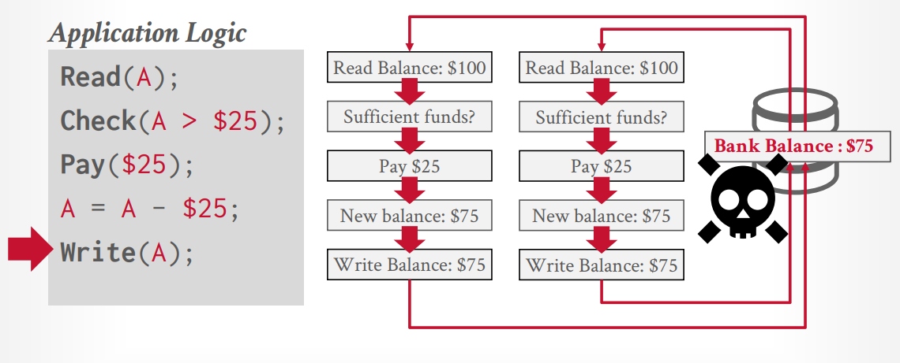
<figcaption>Bank Transaction Example 2</figcaption>
</figure>

此时我们执行了两个程序,同时读取了账户的余额:大会员的程序认为有足够的余额,所以扣费并写回;盐选的程序认为有足够的余额,所以扣费并写回;但是我们发现数据库还是存储了错误的数据,我们的 Transaction 重复写了答案,并且对于第二个Transaction(从某种意义上而言)读取了错误的数据.

所以我们发现,为了同时并行的处理不同的事务,我们不能对 **事务之间的隔离关系** 置之不理;我们需要严格的按照某种并发的控制协议来避免这些不期望发生的事件.

### Strawman System

在开始讨论我们事务处理的一些标准之前,我们先来看一些非常显然的 Idea:

- 串行的执行所有的 Txn,每一次只处理一个Txn.
    + 这样的设计一定能够保证事务的正确性
    + 但是在一个可能同时存在上千个Txn的Workload中

- 在事务开始之前,我们将整个数据库复制到一个 Workspace 中,只有当所有的事务的内容都成功执行之后,我们再将其归并到主数据库中
    + 这样的 Idea 有其可取之处,但是我们需要讨论更多的实现的细节

### Golden Criteria

经过上面的讨论后,我们需要"设计"一套抽象的标准,这告诉我们什么样的 Txn 设计是好的,以及我们的设计应该在哪些地方设计不同的机制去实现.

#### Atomicity : All or nothing

在事务的原子性中,事务有且仅有两个结果:

- 成功提交(Commit) : 我们的修改成功的写入了数据库中
- 失败中断(Abort) : 我们的修改没有成功的写入数据库中,并且我们需要将数据库完全恢复到事务开始之前的状态

为了实现这样的原子性,我们考虑了两种不同的实现方式:

1.**Logging**: 我们在每一次的修改之前,都将其写入到一个日志中,当我们需要回滚的时候,我们可以通过这个日志来恢复到之前的状态.

除了实现原子性以外,我们还有其他充分的理由采用日志的方式来记录我们的操作:

- 日志可以帮助我们实现审计的功能,我们可以通过日志来追踪到每一次的操作
- 日志可以提升我们的性能,我们可以提升写的性能(参见 Append-Only Log)

2.**Shadow Paging**: 我们在每一次的修改之前,都将其写入到一个新的页面中,当我们需要回滚的时候,我们可以通过这个新的页面来恢复到之前的状态.  
这一设计最早在 IBM 的关系型数据库 System R 中被提出,并且在 Oracle 的数据库中也有实现.但是现在的数据库中,仅有很少的数据库会使用 Shadow Paging 的方式来实现原子性,因为其实现的复杂度较高,并且在时空上的开销是无法忽略的.

#### Consistency : It looks correct to me...

在数据库中,我们通常会使用一些约束条件来保证数据库的一致性,例如:Check和Foreign Key 约束条件等.这些条件的设计和定义是由应用层来定义的,即他们的逻辑正确性不是数据库的责任;但是数据库需要保证在事务的执行过程中,这些约束条件是被满足的.

一方面,在事务的执行过程中,我们需要保证数据库的一致性,即在事务开始之前和结束之后,数据库的状态是一致的;另一方面,我们需要保证在事务的执行过程中,数据库的一些限制条件是被满足的,即在事务的执行过程中,数据库的状态是合法的.

#### Isolation : All by myself

在数据库中,用户提交不同的 txn,但是对于每个txn,我们不需要关心,也不知道其他的 txn 在做什么,我们只需要关心我们自己的 txn.即在 txn 的执行过程中,我们需要保证 txn 之间的隔离性.具体的事物的隔离并不由事务自身来负责,而是由数据库和不同的并发 **控制协议** 来负责的.

<figure markdown="span">

<figcaption>Definition of CCP</figcaption>
</figure>

**并发控制协议** (concurrency control protocol) 是一个非常重要的概念,在本节中我们将花费大量的时间来讨论并发控制协议的设计和实现.简言之,它避免了我们并行执行事务时会遇见的非预期的问题,定义了事务的隔离等级(告诉我们我们一定不会遇见那些问题,可能存在那些问题)

<figure markdown="span">
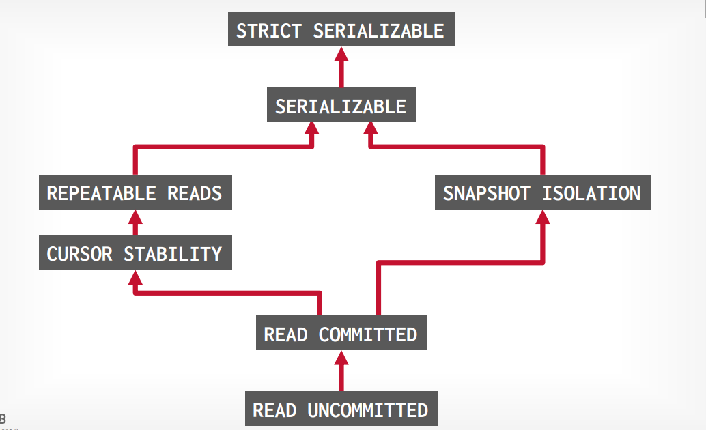
<figcaption>Different Levels in Isolation</figcaption>
</figure>

并发控制协议可以分为两类:

- **Pessimistic Concurrency Control**: 在事务开始之前,我们就锁定了所有的资源,在事务结束之后,我们才释放这些资源.即在事务的执行过程中,我们不允许其他的事务访问这些资源.
- **Optimistic Concurrency Control**: 在事务开始之前,我们不锁定任何资源,在事务结束之后,我们才锁定这些资源.即在事务的执行过程中,我们允许其他的事务访问这些资源.但是我们在事务结束后额外的检查事务的合法性.

#### Durability : I will survive

事务的持久性是指,在事务提交后,其效力将会一直存在,即使在系统崩溃的情况下,事务的结果也不会丢失.这就对应了我们对于操作的`Redo/Undo`.

### Conflicts and Final Goals

为了能够最大化并行的执行事务,我们实际上是在交错的执行每个事务中的操作。在下面的例子中，我们存在两个事务，一个是涉及100元的转账；另一个涉及6%的利息。  
在实际的场景中，我们并不知道这些事务的到达顺序与实际上应该执行顺序的关系（即实际上应该执行的顺序并不重要，因为这不是我们DBMS的责任）。所以我们只需要保证：我们对于这些操作的调度能够使得数据库状态的转换等同于某一 **串行执行** 的事务顺序即可。

<figure markdown="span">
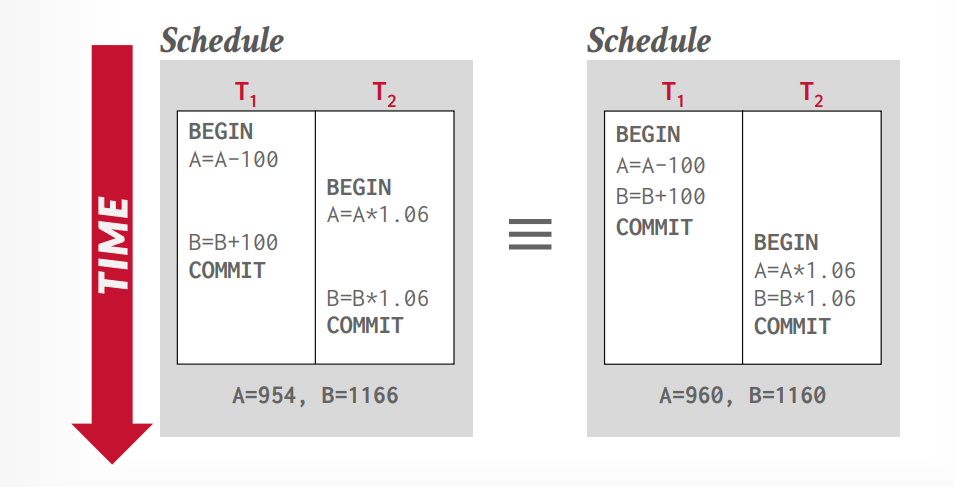
<figcaption>Interleaving Operations</figcaption>
</figure>

例如，在这里的例子中， 左边的执行顺序在结果上与右边不同，这样的调度（Schedule）不是等价的。但是，左边的执行结果与下图中先执行 $T_1$ 后执行 $T_2$的结果是等价的。所以我们说，这样的调度是一个 Serializable Schedule.

<figure markdown="span">

<figcaption>Interleaving Operations</figcaption>
</figure>

我们要求按照 Serializable Schedule 的标准来执行事务是一个很困难的要求。事实上，这是事务隔离的最高级别。除了要求 Serializable Schedule 以外，我们还可以按照避免的不同的冲突类型来对事务隔离等级进行分类。

我们将沿用这个例子来对不同的冲突进行介绍。事实上，这里的冲突类型和我们在体系结构中的并行所遇见的错误几乎一模一样：

1.Read After Write : Unpeated Read

<figure markdown="span">
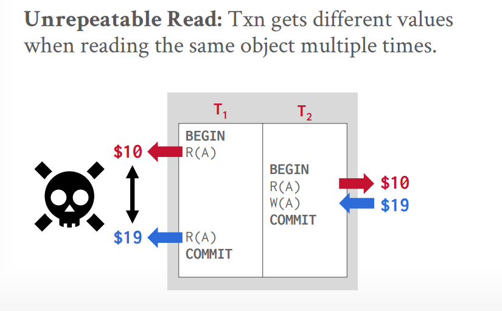
<figcaption>Unrepeated Read</figcaption>
</figure>

在同一个事务中出现了两次读取同一个变量的操作，但是在这两次读取之间，另一个事务对这个变量进行了修改。我们称这样的冲突为 Read After Write (RAW) 冲突。这样的冲突会导致我们在同一个事务中读取到不同的值。

对应的，如果保证同一事务每次读取同一个变量的值是相同的，此时我们称这样的隔离级别为 Repeatable Read。

2.Write After Write : Dirty Read

<figure markdown="span">
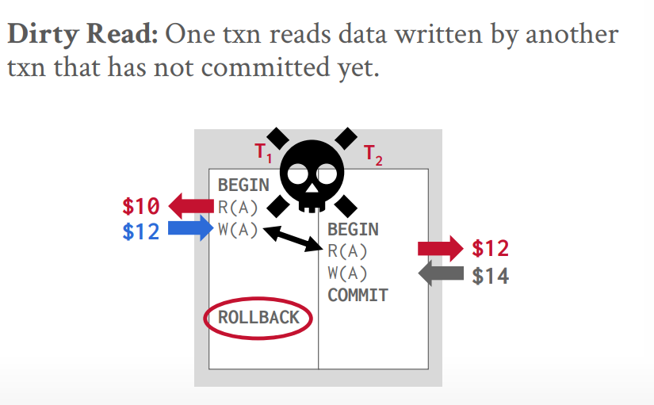
<figcaption>Dirty Read</figcaption>
</figure>

在两个事务中，如果一个事务读取到了另一个事务还没有 Commit 的值，此时我们称这样的冲突为 Dirty Read。(试想如果我们的没有Commit的事务Abort了，此时我们就读取到了非法的值)

对于Dirty Read而言，我们称能够避免这样的冲突的隔离级别为 Read Committed。

3.Write After Write : Lost Update

<figure markdown="span">
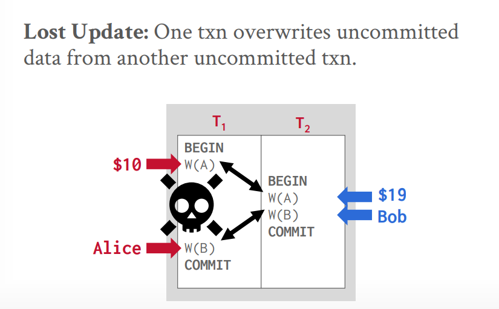
<figcaption>Dirty Read</figcaption>
</figure>

如果两个事务都对同一个变量进行了修改，但是在其中一个事务提交之前，另一个事务就已经提交了，此时我们称这样的冲突为 Lost Update。（因为在只看 Commit 的视角而言，被覆写的事务好像不存在一样）。

对于 Lost Update 而言，一般情况下仅有 Serializable 的隔离级别才能够避免这样的冲突。（虽然各个数据库的实现可能会有不同的实现方式，有的数据库的 Repeatable Read 能够避免这样的情况。事实上，一些DBMS所声称的隔离级别并不是它真实情况下的隔离级别。但是在一般的SQL标准下，Lost Update 并不在 Repeatable Read模式下保证）

在 serializable 的隔离级别下，我们同样存在两种级别：

- Conflict Serializable 
- View Serializable

在 Conflict Serializablity 中，我们要求：执行的 Schedule 中每一对冲突的操作的顺序与某一个串行执行的 Schedule 中的顺序是相同的。  事实上，所有的DBMS的实现都是 Conflict Serializable 的。因为这与我们实际上事务执行的意义无关，而仅仅在逻辑上作出了要求。

我们可以通过precedence graph来判断一个 Schedule 是否是 Conflict Serializable 的。我们将每一个事务看作一个节点，如果两个事务之间存在冲突的操作，我们就添加一条有向边。 如果这个图是无环的，那么我们就可以通过拓扑排序来得到一个串行执行的 Schedule。否则我们就不能得到一个串行执行的 Schedule。例如：

<figure markdown="span">
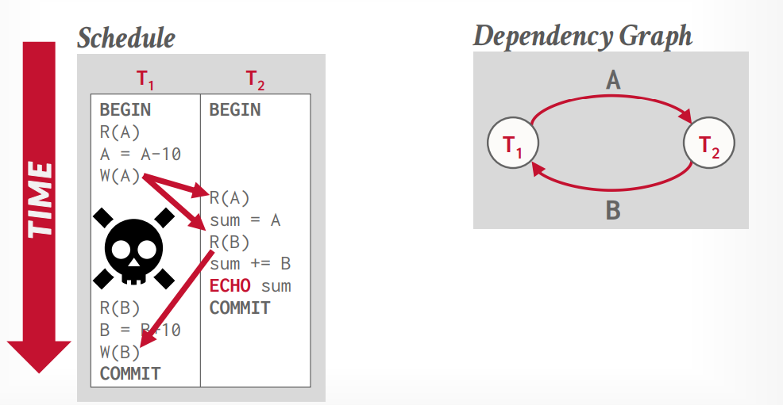
<figcaption>precedence graph</figcaption>
</figure>

在上面的例子中，T1 的 Write A 与 T2 的 Read A 之间存在冲突的操作，所以我们添加了一条有向边。T2 的 Read B 与 T1 的 Write B 之间也存在冲突的操作，所以我们添加了一条有向边。最终我们得到的图是一个有环图，所以这个 Schedule 不是 Conflict Serializable 的。

## Pessimestic Concurrency Protocols

在前文中我们提到了，对于事务的隔离协议，有且仅有两种不同的方式来实现：Pessimistic Concurrency Control 和 Optimistic Concurrency Control。

Pessimistic Concurrency Control ：对于一个事务而言，我们总是悲观的假设，我们处理的某个资源可能会被别人所修改和抢占，所以我们在事务开始之前就锁定了所有的资源，直到事务结束之后才释放这些资源。这样我们就可以保证在事务的执行过程中，我们不会遇见任何的冲突。

我们早在B+树一节中，就提及了 Lock 与 Latch的区别:

<figure markdown="span">
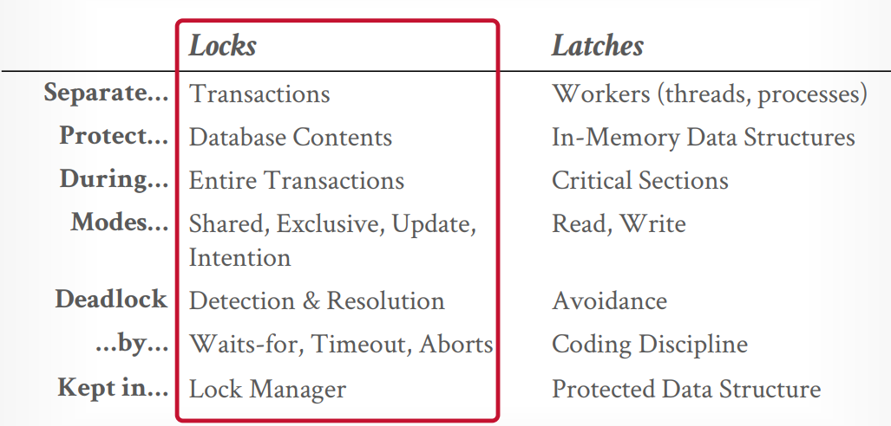
<figcaption>precedence graph</figcaption>
</figure>

在这里，我们将所有的锁的管理、申请、释放都交给了 Lock Manager 来进行管理。我们所需要考虑的，就是一个合理的，能够避免冲突的 Lock 的策略的设计。

### Lock Types

总的而言，我们的 Lock 可以分为两种类型：

- **Shared Lock**: 允许多个事务同时读取同一个资源，但是不允许修改这个资源。
- **Exclusive Lock**: 允许一个事务独占的读取和修改这个资源，但是不允许其他的事务读取和修改这个资源。

<figure markdown="span">
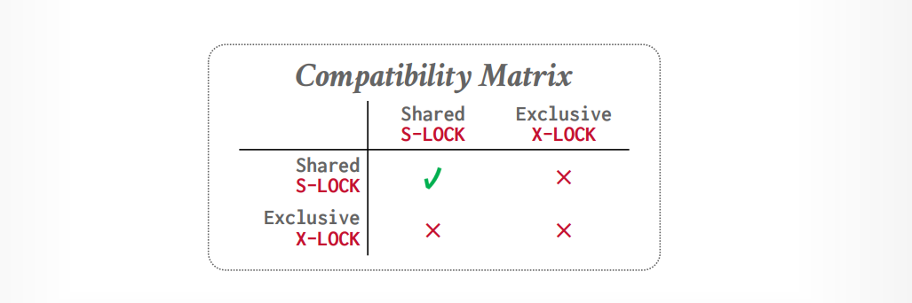
<figcaption>precedence graph</figcaption>
</figure>

我们可以用一个表格来表示不同Lock间的读写权限关系。

每一个DBMS都有自己的实现方式与类别，这些锁都可以在其官方文档中查阅。

### Two Phase Locking

在介绍 2PL 之前，我们先来看一下一般情况下的 Lock 可能会遇见什么样的问题。

