# Transaction And Concurrency Control

??? abstract
    在原本的 CMU 15-445 的课程设计中,这里对应的 4 讲

    - Lecture \#16: Concurrency Control Theory
    - Lecture \#17: Two-Phase Locking Concurrency Control
    - Lecture \#18: Timestamp Ordering Concurrency Control
    - Lecture \#19: Multi-Version Concurrency Control

    但是为了在笔记上保持连贯性,将这里的内容合并为一节,以期望更好的阅读体验.

## Transactions and ACID Criteria

在进入我们的主题以前,我们先来用一个例子讨论为什么我们需要事务(Transactions)?我们实现事务时可能会遇到什么样的问题?一个期望的并发控制是什么样的?

假设有一家银行提供了一个定时扣费的服务,每次将按照以下的逻辑从数据库中读取并执行:

<figure markdown="span">

<figcaption>Bank Transaction Example</figcaption>
</figure>

如果遇见了一个突发情况,例如突然发生了断电,导致我们 `Write Back A`的这一步骤没有被实现:

<figure markdown="span">

<figcaption>Oops! Something went wrong</figcaption>
</figure>

此时就遇见了一个非预期的情况:我们认为服务已经发生了,但是账户在数据库看来并没有扣费.

所以我们十分期望数据库能够实现这样一种操作:**要么全部执行,要么全部不执行**.即具有原子性(ATOM),是我们执行某一操作的最小单元.

同时,在现实生活中,一个具有规模的银行时时刻刻发生着成千上万这样的"交易",例如:如果一个用户同时订阅了大会员和盐选会员:


<figure markdown="span">

<figcaption>Bank Transaction Example 2</figcaption>
</figure>

此时我们执行了两个程序,同时读取了账户的余额:大会员的程序认为有足够的余额,所以扣费并写回;盐选的程序认为有足够的余额,所以扣费并写回;但是我们发现数据库还是存储了错误的数据,我们的 Transaction 重复写了答案,并且对于第二个Transaction(从某种意义上而言)读取了错误的数据.

所以我们发现,为了同时并行的处理不同的事务,我们不能对 **事务之间的隔离关系** 置之不理;我们需要严格的按照某种并发的控制协议来避免这些不期望发生的事件.

### Strawman System

在开始讨论我们事务处理的一些标准之前,我们先来看一些非常显然的 Idea:

- 串行的执行所有的 Txn,每一次只处理一个Txn.
    + 这样的设计一定能够保证事务的正确性
    + 但是在一个可能同时存在上千个Txn的Workload中

- 在事务开始之前,我们将整个数据库复制到一个 Workspace 中,只有当所有的事务的内容都成功执行之后,我们再将其归并到主数据库中
    + 这样的 Idea 有其可取之处,但是我们需要讨论更多的实现的细节

### Golden Criteria

经过上面的讨论后,我们需要"设计"一套抽象的标准,这告诉我们什么样的 Txn 设计是好的,以及我们的设计应该在哪些地方设计不同的机制去实现.

#### Atomicity : All or nothing

在事务的原子性中,事务有且仅有两个结果:

- 成功提交(Commit) : 我们的修改成功的写入了数据库中
- 失败中断(Abort) : 我们的修改没有成功的写入数据库中,并且我们需要将数据库完全恢复到事务开始之前的状态

为了实现这样的原子性,我们考虑了两种不同的实现方式:

1.**Logging**: 我们在每一次的修改之前,都将其写入到一个日志中,当我们需要回滚的时候,我们可以通过这个日志来恢复到之前的状态.

除了实现原子性以外,我们还有其他充分的理由采用日志的方式来记录我们的操作:

- 日志可以帮助我们实现审计的功能,我们可以通过日志来追踪到每一次的操作
- 日志可以提升我们的性能,我们可以提升写的性能(参见 Append-Only Log)


2.**Shadow Paging**: 我们在每一次的修改之前,都将其写入到一个新的页面中,当我们需要回滚的时候,我们可以通过这个新的页面来恢复到之前的状态.  
这一设计最早在 IBM 的关系型数据库 System R 中被提出,并且在 Oracle 的数据库中也有实现.但是现在的数据库中,仅有很少的数据库会使用 Shadow Paging 的方式来实现原子性,因为其实现的复杂度较高,并且在时空上的开销是无法忽略的.

#### Consistency : It looks correct to me...

在数据库中,我们通常会使用一些约束条件来保证数据库的一致性,例如:Check和Foreign Key 约束条件等.这些条件的设计和定义是由应用层来定义的,即他们的逻辑正确性不是数据库的责任;但是数据库需要保证在事务的执行过程中,这些约束条件是被满足的.

一方面,在事务的执行过程中,我们需要保证数据库的一致性,即在事务开始之前和结束之后,数据库的状态是一致的;另一方面,我们需要保证在事务的执行过程中,数据库的一些限制条件是被满足的,即在事务的执行过程中,数据库的状态是合法的.

#### Isolation : All by myself

在数据库中,用户提交不同的 txn,但是对于每个txn,我们不需要关心,也不知道其他的 txn 在做什么,我们只需要关心我们自己的 txn.即在 txn 的执行过程中,我们需要保证 txn 之间的隔离性.具体的事物的隔离并不由事务自身来负责,而是由数据库和不同的并发 **控制协议** 来负责的.

<figure markdown="span">

<figcaption>Definition of CCP</figcaption>
</figure>

**并发控制协议** (concurrency control protocol) 是一个非常重要的概念,在本节中我们将花费大量的时间来讨论并发控制协议的设计和实现.简言之,它避免了我们并行执行事务时会遇见的非预期的问题,定义了事务的隔离等级(告诉我们我们一定不会遇见那些问题,可能存在那些问题)

<figure markdown="span">

<figcaption>Different Levels in Isolation</figcaption>
</figure>

并发控制协议可以分为两类:

- **Pessimistic Concurrency Control**: 在事务开始之前,我们就锁定了所有的资源,在事务结束之后,我们才释放这些资源.即在事务的执行过程中,我们不允许其他的事务访问这些资源.
- **Optimistic Concurrency Control**: 在事务开始之前,我们不锁定任何资源,在事务结束之后,我们才锁定这些资源.即在事务的执行过程中,我们允许其他的事务访问这些资源.但是我们在事务结束后额外的检查事务的合法性.


#### Durability : I will survive

事务的持久性是指,在事务提交后,其效力将会一直存在,即使在系统崩溃的情况下,事务的结果也不会丢失.这就对应了我们对于操作的`Redo/Undo`.

### Conflicts and Final Goals

为了能够最大化并行的执行事务,我们实际上是在交错的执行每个事务中的操作。在下面的例子中，我们存在两个事务，一个是涉及100元的转账；另一个涉及6%的利息。  
在实际的场景中，我们并不知道这些事务的到达顺序与实际上应该执行顺序的关系（即实际上应该执行的顺序并不重要，因为这不是我们DBMS的责任）。所以我们只需要保证：我们对于这些操作的调度能够使得数据库状态的转换等同于某一 **串行执行** 的事务顺序即可。

<figure markdown="span">

<figcaption>Interleaving Operations</figcaption>
</figure>

例如，在这里的例子中， 左边的执行顺序在结果上与右边不同，这样的调度（Schedule）不是等价的。但是，左边的执行结果与下图中先执行 $T_1$ 后执行 $T_2$的结果是等价的。所以我们说，这样的调度是一个 Serializable Schedule.

<figure markdown="span">

<figcaption>Interleaving Operations</figcaption>
</figure>

我们要求按照 Serializable Schedule 的标准来执行事务是一个很困难的要求。事实上，这是事务隔离的最高级别。除了要求 Serializable Schedule 以外，我们还可以按照避免的不同的冲突类型来对事务隔离等级进行分类。

我们将沿用这个例子来对不同的冲突进行介绍。事实上，这里的冲突类型和我们在体系结构中的并行所遇见的错误几乎一模一样：

1.Read After Write : Unpeated Read

<figure markdown="span">

<figcaption>Unrepeated Read</figcaption>
</figure>

在同一个事务中出现了两次读取同一个变量的操作，但是在这两次读取之间，另一个事务对这个变量进行了修改。我们称这样的冲突为 Read After Write (RAW) 冲突。这样的冲突会导致我们在同一个事务中读取到不同的值。

对应的，如果保证同一事务每次读取同一个变量的值是相同的，此时我们称这样的隔离级别为 Repeatable Read。

2.Write After Write : Dirty Read

<figure markdown="span">

<figcaption>Dirty Read</figcaption>
</figure>

在两个事务中，如果一个事务读取到了另一个事务还没有 Commit 的值，此时我们称这样的冲突为 Dirty Read。(试想如果我们的没有Commit的事务Abort了，此时我们就读取到了非法的值)

对于Dirty Read而言，我们称能够避免这样的冲突的隔离级别为 Read Committed。


3.Write After Write : Lost Update

<figure markdown="span">

<figcaption>Dirty Read</figcaption>
</figure>


如果两个事务都对同一个变量进行了修改，但是在其中一个事务提交之前，另一个事务就已经提交了，此时我们称这样的冲突为 Lost Update。（因为在只看 Commit 的视角而言，被覆写的事务好像不存在一样）。

对于 Lost Update 而言，一般情况下仅有 Serializable 的隔离级别才能够避免这样的冲突。（虽然各个数据库的实现可能会有不同的实现方式，有的数据库的 Repeatable Read 能够避免这样的情况。事实上，一些DBMS所声称的隔离级别并不是它真实情况下的隔离级别。但是在一般的SQL标准下，Lost Update 并不在 Repeatable Read模式下保证）

在 serializable 的隔离级别下，我们同样存在两种级别：

- Conflict Serializable 
- View Serializable

在 Conflict Serializablity 中，我们要求：执行的 Schedule 中每一对冲突的操作的顺序与某一个串行执行的 Schedule 中的顺序是相同的。  事实上，所有的DBMS的实现都是 Conflict Serializable 的。因为这与我们实际上事务执行的意义无关，而仅仅在逻辑上作出了要求。

我们可以通过precedence graph来判断一个 Schedule 是否是 Conflict Serializable 的。我们将每一个事务看作一个节点，如果两个事务之间存在冲突的操作，我们就添加一条有向边。 如果这个图是无环的，那么我们就可以通过拓扑排序来得到一个串行执行的 Schedule。否则我们就不能得到一个串行执行的 Schedule。例如：

<figure markdown="span">

<figcaption>precedence graph</figcaption>
</figure>

在上面的例子中，T1 的 Write A 与 T2 的 Read A 之间存在冲突的操作，所以我们添加了一条有向边。T2 的 Read B 与 T1 的 Write B 之间也存在冲突的操作，所以我们添加了一条有向边。最终我们得到的图是一个有环图，所以这个 Schedule 不是 Conflict Serializable 的。

## Pessimestic Concurrency Protocols

在前文中我们提到了，对于事务的隔离协议，有且仅有两种不同的方式来实现：Pessimistic Concurrency Control 和 Optimistic Concurrency Control。

Pessimistic Concurrency Control ：对于一个事务而言，我们总是悲观的假设，我们处理的某个资源可能会被别人所修改和抢占，所以我们在事务开始之前就锁定了所有的资源，直到事务结束之后才释放这些资源。这样我们就可以保证在事务的执行过程中，我们不会遇见任何的冲突。

我们早在B+树一节中，就提及了 Lock 与 Latch的区别:

<figure markdown="span">

<figcaption>precedence graph</figcaption>
</figure>

在这里，我们将所有的锁的管理、申请、释放都交给了 Lock Manager 来进行管理。我们所需要考虑的，就是一个合理的，能够避免冲突的 Lock 的策略的设计。

### Lock Types

总的而言，我们的 Lock 可以分为两种类型：

- **Shared Lock**: 允许多个事务同时读取同一个资源，但是不允许修改这个资源。
- **Exclusive Lock**: 允许一个事务独占的读取和修改这个资源，但是不允许其他的事务读取和修改这个资源。

<figure markdown="span">

<figcaption>precedence graph</figcaption>
</figure>

我们可以用一个表格来表示不同Lock间的读写权限关系。

每一个DBMS都有自己的实现方式与类别，这些锁都可以在其官方文档中查阅。

### Two Phase Locking

在介绍 2PL 之前，我们先来看一下一般情况下的 Lock 可能会遇见什么样的问题。


<figure markdown="span">
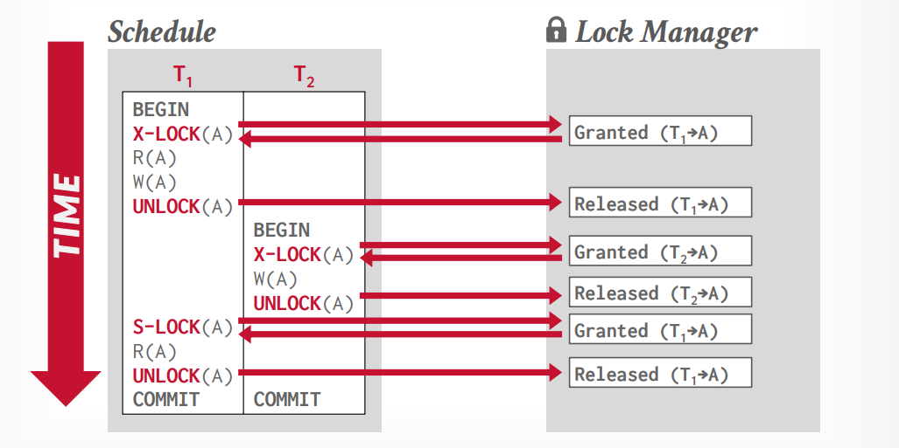
<figcaption>Lock Confics</figcaption>
</figure>

在上面的例子中，我们有两个事务 T1 和 T2。T1 先申请了 A 的排他锁，然后读取 A，修改A。然后T1 释放了 A 的锁。T2 先申请了 A 的锁，然后读取 A，修改A。然后T2 释放了 A 的锁。但此时当 T1 再次读取A 的时候，会发现 A 的结果与之前写入的结果不同，这里显然是存在冲突的。

所以我们需要设计一个策略，决定每一个事务对锁的申请是否成功，什么时候释放锁等。

#### 2PL

在 2PL 中，我们将 Lock 的申请和释放分为两个阶段：
- **Growing Phase**: 在这个阶段中，我们可以申请/升级任意的锁，但是不允许释放任何的锁。
- **Shrinking Phase**: 在这个阶段中，我们可以释放/降级任意的锁，但是不允许申请任何的锁。

<figure markdown="span">
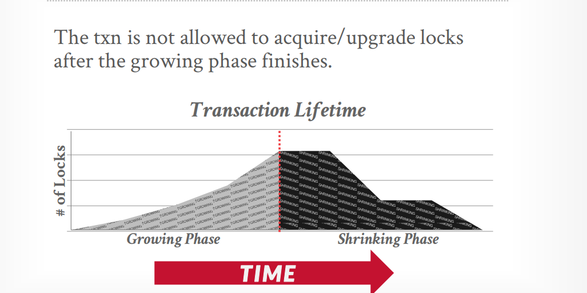
<figcaption>2PL</figcaption>
</figure>

那么在之前的例子中，我们就不会遇见相应的问题，因为 T1 不可能在事务的 Growing Phase 中释放对于A的锁。这样T2 就只能在 T1 释放了 A 的锁之后才能够申请到 A 的锁。这样就避免了 T1 和 T2 之间的冲突。

<figure markdown="span">
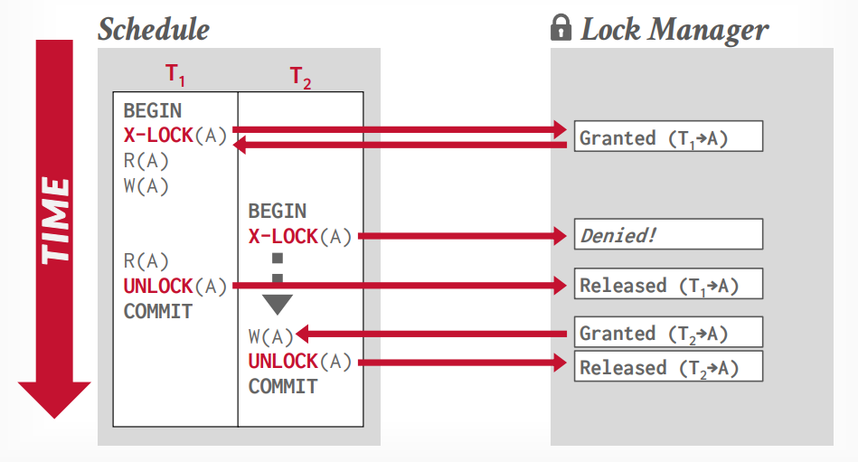
<figcaption>Avoidance</figcaption>
</figure>

2PL 的思想是较为简单的，但是却可能导致不同的问题：

- **Deadlock**: 在 2PL 中，我们可能会遇见死锁的问题。即两个事务都在等待对方释放锁，导致两个事务都无法继续执行下去。
- **Dirty Reads**: 在 2PL 中，我们还是没有避免 Dirty Reads 的问题。
- **Cascading Aborts**：在 2PL 中，可能会出现大量的 Cascading Aborts ，严重影响性能。

**Cascading Aborts**指的是：如果一个事务T2的读写基于另一个事务T1，那么当T1 Abort 的时候，T2 也必须 Abort。

由于我们的基础的2PL没有保证在Commit之前不会释放锁，所以我们可能会遇见这样的情况：T1释放了A的锁，T2 读取了 A 的值，但是 T1 还没有 Commit，此时 T1 Abort 了，那么 T2 也必须 Abort。如果这样的依赖关系存在于多个事务之间，那么我们就会遇见大量的 Cascading Aborts 的问题。

同时这也无法避免 **Dirty Reads** 因为同样的，我们在 Commit 前释放的锁都有可能导致 Read 读取了某个非法值。

#### Strong Strict 2PL

所以我们需要一个更强的条件来避免这些问题的发生，即 Strong Strict 2PL。

在 Strong Strict 2PL 中，我们额外要求：事务只有在Commit的时候才能释放锁。

<figure markdown="span">
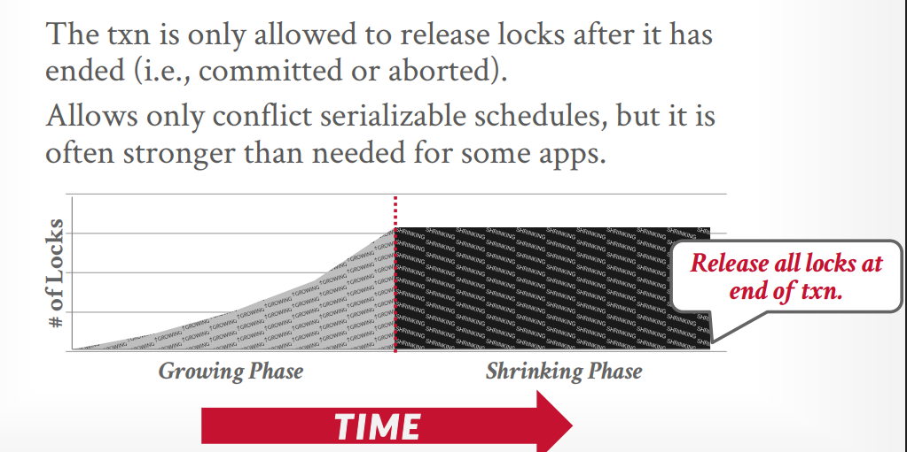
<figcaption>Strong Strict 2PL</figcaption>
</figure>


### Dead Locks

在 2PL 中，我们可能会遇见死锁的问题。即两个事务都在等待对方释放锁，导致两个事务都无法继续执行下去。（所有关于锁的协议都可能会遇见死锁的问题）。所以我们需要设计一个机制来避免死锁的发生。

一般而言，我们有两种方式解决锁的问题：

=== "Deadlock Prevention"
    Deadlock Prevention 的方式是通过 Lock 的申请顺序来避免死锁的发生。我们可以通过对 Lock 的申请顺序进行排序来避免死锁的发生。即在申请锁的时候，我们总是按照某种顺序来申请锁，这样就可以避免死锁的发生。这是一种积极的避免死锁的策略。

    - 如果申请锁的事务比持有锁的事务有更高的优先级，那么我们等待持有锁的事务完成。
    - 否则申请锁的事务比持有锁的事务有更低的优先级，那么我们直接终止。
    
    关于优先级的定义，可以有不同的标准，在不同的工作负荷下，也会有不同的表现和权衡。
    例如，我们可以按照事务的 ID 来申请锁（Timestamp）:我们规定更老的事务优先级更高；也可以规定更年轻的事务优先级更高。

=== "Deadlock Detection"

    和 Conflics Serilizable 一样，我们可以通过 Waits-for Graph 中是否存在环来判断是否存在 Deadlock 。即如果 T1 等待 T2 的锁释放，那么我们就添加一条有向边 T1 -> T2。 如果这个图是有环的，那么我们就必须要进行 Deadlock 的处理。否则我们就可以继续执行。

    Deadlock Detection 的方式是较为简单的，但是在实际的实现中，我们需要考虑到 Deadlock Detection 的开销。我们需要权衡在频繁的检查死锁与事务等待死锁解决的时间之间的权衡。

    在检测到死锁后，我们需要选择一个事务进行 Abort。如何选择是一个较为复杂的问题。我们可以选择等待时间最长的事务进行 Abort，或者选择资源占用最少的事务进行 Abort，或者选择申请的锁最少的事务进行 Abort，选择回滚链最短的事务进行Abort。不同的选择会导致不同的性能表现。

### Lock Granularities

当我们申请一个锁的时候，究竟是锁住了什么？一个表格？一个元组？还是一个元组中的一个属性？
我们接下来将讨论锁的不同的粒度。

<figure markdown="span">
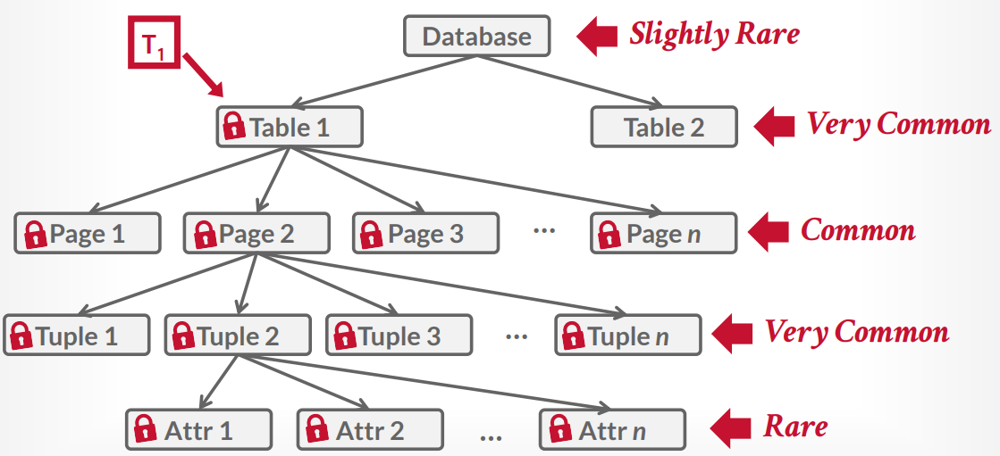
<figcaption>Lock Granularities </figcaption>
</figure>

考虑到不同的层级结构的锁，我们需要引入新的锁的类型来提升性能：

我们引入意象锁来表明：如果一个节点（数据库、表格、元组）被加上了意向锁，那么表明有一个事务正在对这个节点的子结点进行读写操作。意向锁的类型有三种：

- Intention Shared Lock (IS) : 表明有一个事务正在对这个节点的子结点进行 Shared Lock 的操作。
- Intention Exclusive Lock (IX) : 表明有一个事务正在对这个节点的子结点进行 Exclusive Lock 的操作。
- Shared + Intention Exclusive Lock (SIX) : 表明有一个事务正在对这个节点的子结点进行 Exclusive Lock 的操作，并且对这个节点本身进行 Share Lock 的操作。

如此我们可以更新我们的表格：

<figure markdown="span">
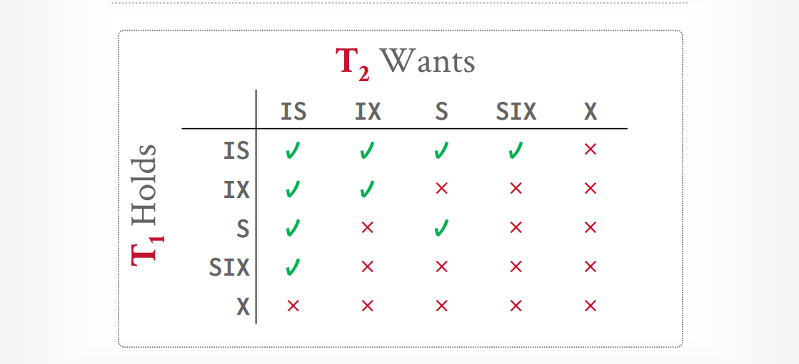
<figcaption>Matrices</figcaption>
</figure>

此时再次申请锁时，我们需要保证：

- 申请S锁时，必须保证在父节点上要有IS/S锁
- 申请X锁时，必须保证在父节点上要有X/IX/SIX锁

具体的例子可以查看[Lec17 的 Slides](https://15445.courses.cs.cmu.edu/fall2024/slides/17-twophaselocking.pdf)，由于例子和动画较长这里放不下。

### Lock in Practice

在实际的实现中，我们有的时候需要给DBMS进行一些暗示，来间接地管理锁的申请和释放。这样可以提升一些并行性。例如在 PosgreSQL 中，我们可以使用 `FOR UPDATE` 来表示我们需要对某个元组进行锁定。

```SQL 
SELECT * FROM T1 WHERE A = 1 FOR UPDATE;
```

此时表示我们在 读取 T1 的时候，我们需要对 T1 中的 A = 1 的元组进行排他锁。

同时我们也可以使用 `FOR SHARE` 来表示我们需要对某个元组进行共享锁。

我们可以通过`SKIP LOCKED` 来表示我们需要跳过已经被锁定的元组。这样可以提高执行的性能。（例如，有的时候我们只想知道一个大概的统计）


```SQL
SELECT * FROM T1 WHERE A = 1 SKIP LOCKED;
```

## Optimistic Concurrency Control

和悲观的并发控制不同，乐观的并发控制是基于这样的假设：我们在事务的执行过程中，假设不会遇见任何的冲突。即我们在事务的执行过程中，我们不需要对任何的资源进行锁定。我们只需要在事务结束的时候，检查一下是否存在冲突即可。

但是我们同样会涉及到对于同一个资源的操作，所以一般而言，OCC 的实现会涉及 Workspace 。即对于每一个事务我们会创建一个工作空间：

- 所有对象的读取都会将其备份至 Workspace 中
- 所有的修改会应用至 Wrokspace 中

当我们的操作完成时，我们对每一个 Workspace 进行检查，如果 Workspace 没有产生任何的冲突，我们就将其合并入主数据库中；否则我们就将其丢弃。

总的而言，OCC 的实现可以分为三个阶段：

- **Read Phase**: 在这个阶段中，我们追踪这个事务的所有读写的对象，并且将其备份至 Workspace 中。
- **Validation Phase**: 在这个阶段中，我们赋予每一个事务一个时间戳，并且检查这个事务的所有读写的对象是否存在冲突。
- **Write Phase**: 在这个阶段中，我们将 Workspace 中的所有修改合并入主数据库中，并更新这些对象的时间戳。

<figure markdown="span">
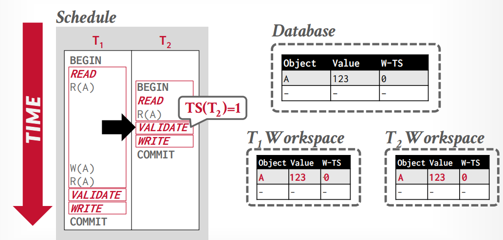
<figcaption>OCC Example 1</figcaption>
</figure>

例如，在上面的例子中，由于 T1 和 T2 都存在对于 A 的读写操作，所以我们分别从主数据库中读取了 A 的值，并且将其备份至 T1 与 T2 的 Workspace 中。

在 T2 的 Validation Phase 中，我们赋予 T2 时间戳 1 (因为 T2 比 T1 更先 Commit)，并检查T2是否存在冲突。

然后我们将 T2 的修改合并入主数据库中，并更新 A 的时间戳（但是这里并不存在更新，因为T2没有写）

<figure markdown="span">
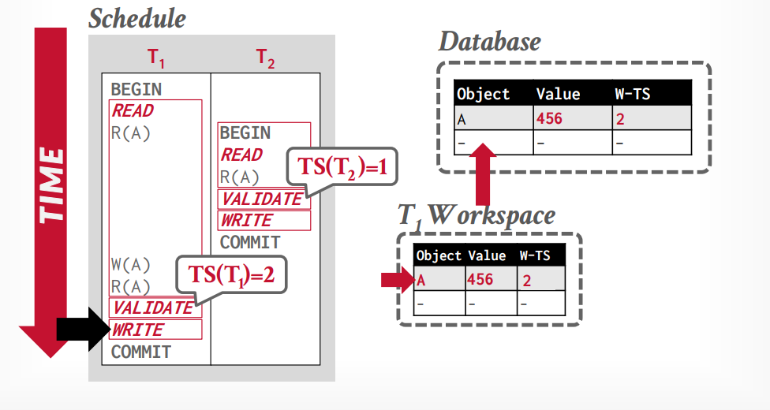
<figcaption>OCC Example 2</figcaption>
</figure>

然后我们在 T1 中写入 A（此时T1对于A的读取都是在 Workspace 中进行的）。然后在 T1 的 Validation Phase 阶段，我们赋予 T1 时间戳 2，并检查 T1 是否存在冲突。此时我们将T1 的修改合并入主数据库中，并更新 A 的时间戳。

### Validation Phase


可以看到，OCC最关键的部分在于 Validation Phase 的设计。那么我们该如何进行 Validate 呢？

我们假设在Validate的阶段，我们的验证是串行进行的。（并行的验证将会非常的复杂，我们在这里不做讨论）

=== "Forward Validation"
    向前验证正在提交的事务，是否和没有提交的事务存在冲突

    如果我们发现 TS(T1) < TS(T2)，那么以下三个条件之一必须成立：

    - TS(T1) < TS(T2)，那么 T1 的 Write Phase 必须先于 T2 的 Read Phase 发生
    - TS(T1) < TS(T2)，那么 T1 的 Write Phase 必须先于 T2 的 Write Phase 发生，并且 T1 的写入的集合和 T2 的读取的集合没有交集
    - TS(T1) < TS(T2)，那么 T1 的 Read Phase 必须先于 T2 的 Read Phase 完成，并且 T1 的写入的集合和 T2 的 **写入和读取** 的集合没有交集
    <figure markdown="span">
    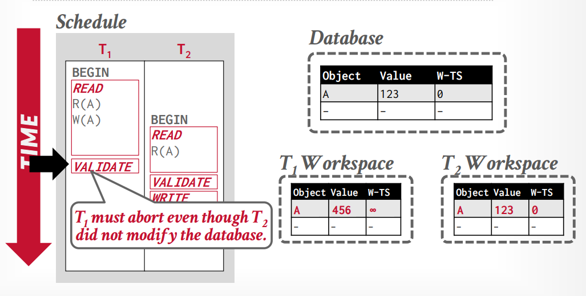
    <figcaption>Forward Invalidation</figcaption>
    </figure>

    例如，在这里，我们发现 T1 的时间戳大于 T2 的时间戳，按照第二条 T2 的 Write Phase 必须先于 T1 发生(即使T2没有实际上的Write)，所以T1必须被Abort。


=== "Backward Validation"
    向后验证正在提交的事务，是否和已经提交的事务存在冲突  
    同样的我们在这里也需要按照类似的要求去判断是否违反了/须遵循某些规则


---

### Write Phase

在写入阶段，我们需要将 Workspace 中的所有修改合并入主数据库中，并更新这些对象的时间戳。

- 串行的 Commit : 我们通过一个Latch来保证每次有且仅有一个事务处于验证/写入阶段
- 并行的 Commit ： 通过良好的代码设计来并行的执行验证/写入阶段

### OCC Observations

我们可以发现，OCC 在冲突较少的情况下（Low Conflics Workload）性能较好，因为我们不需要进行锁的申请和释放。

- 大多数的事务都是只读的事务
- 大多数的事务都只访问正交的数据

但是OCC仍绕存在一些问题：

- 频繁的拷贝，写回数据
- 验证/写回存在一个瓶颈
- Abort 对于性能的影响更大，因为一个事务在其基本完成之后才会触发 Abort。（相较于2PL而言）

## Phantom Reads

至今为止，我们讨论的写入的操作一般都是针对Update的，即我们所讨论的集合都是固定的。但是在实际的场景中，我们可能会遇见这样的情况：我们在一个事务中读取了一个集合，但是在另一个事务中插入了一个新的行，此时我们在第一个事务中读取这个集合的时候，可能会发现这个集合的大小发生了变化。

<figure markdown="span">
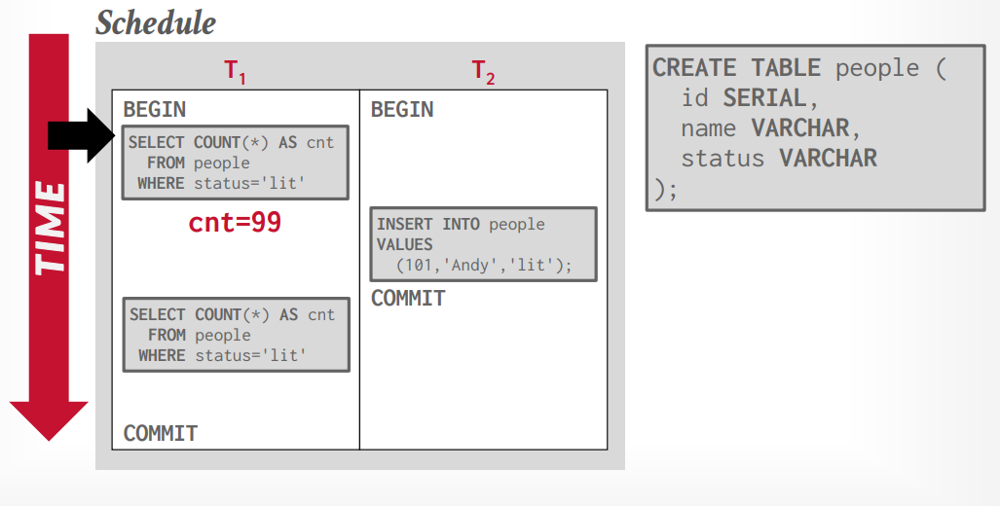
<figcaption>Phantom Reads</figcaption>
</figure>

如果我们在 T2 的事务中插入了一个新的行，那么在 T1 中，仍然会读取到 T2 中的行。

这样的现象被称为 Phantom Reads。这诚然是我们不希望发生的。一般而言，我们可以采用下面的三种方法来避免这样的现象：

- Re-Excute Scan : 我们重新运行一个查询，并统计其结果，检查是否存在大小的变化
- Predicate Locking : 我们对每一个查询开始前的谓语进行判定，并锁定谓语对应的行
- Index Locking : 我们对每一个索引的范围进行锁定

## Isolation Levels

在学习了不同的并发控制协议之后，我们最后在来看一看不同的隔离级别：
<figure markdown="span">
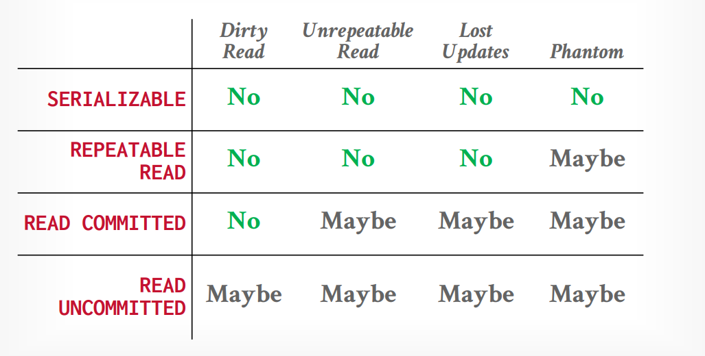
<figcaption>Isolation Levels</figcaption>
</figure>

最终，我们可以给出不同的隔离级别的一个具体的实现方案：

- **SERIALIZABLE**: Strong Strict 2PL with phantom protection (e.g., index locks).
- **REPEATABLE READS**: Same as above, but without phantom protection.
- **READ COMMITTED**: Same as above, but S locks are released immediately.
- **READ UNCOMMITTED**: Same as above but allows dirty reads (no S locks).

我们在实际的实践中，可以使用SQL来设置不同的隔离级别：

```SQL
SET TRANSACTION ISOLATION LEVEL SERIALIZABLE;
```

但是并不是所有的DBMS都支持所有的隔离级别。我们所说的 SERIALIZABLE 只是一个Golden Goal，为了达到这个目标，我们可能会牺牲一些性能。所以我们需要在性能和隔离级别之间进行权衡。

除此之外，DBMS可能并不会实际实现某一个隔离级别，即使他们声称实现了这个隔离级别。

<figure markdown="span">
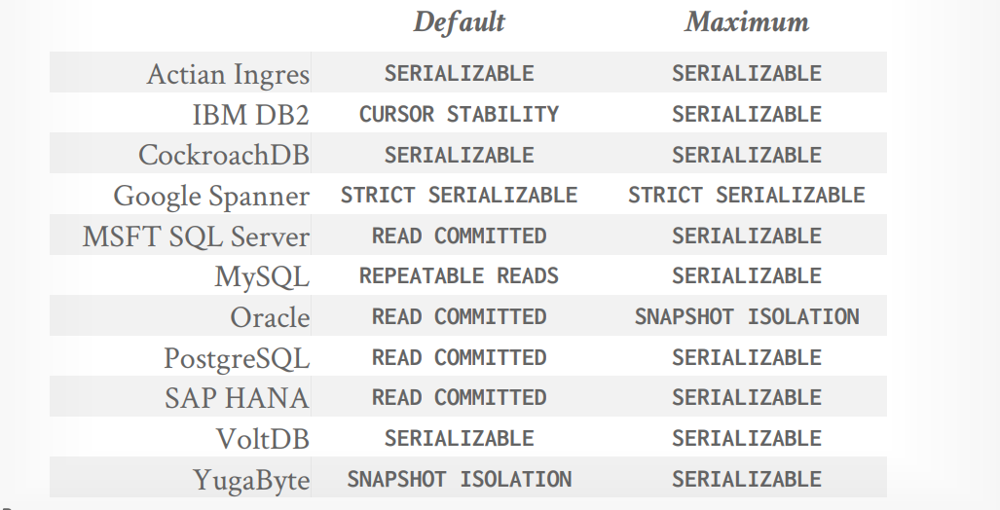
<figcaption>Isolation Levels in Popular DBMS</figcaption>
</figure>

值得注意的是，Oracle和  YugaByte 出现了一个新的隔离级别：Snapshop Isolation。这是一个独立于我们目前的设计思路的一个隔离级别。我们将在下面的MVCC中进行介绍。

