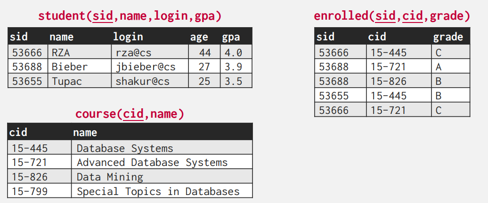
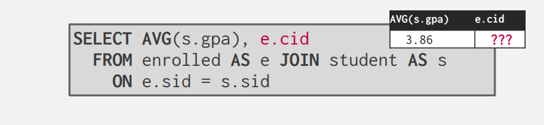
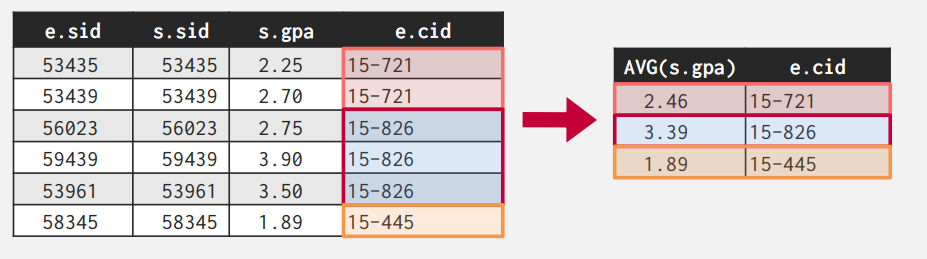
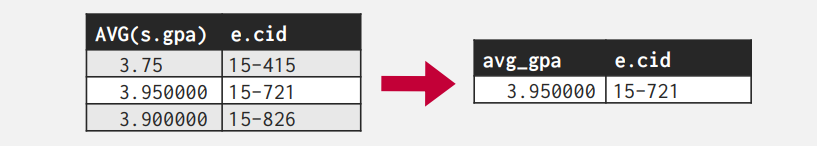
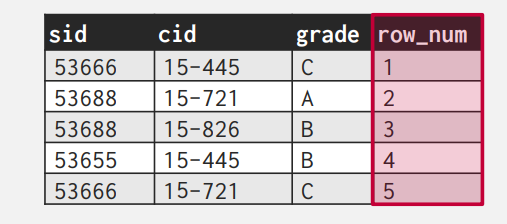
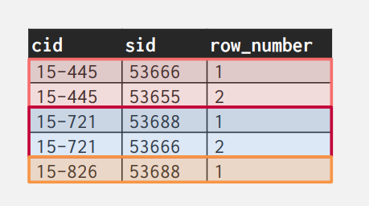

# Mordern SQL

##  RELATIONAL LANGUAGES

关系语言主要包含三种：

- Data Manipulation Language (DML)
- Data Definition Language (DDL)
- Data Control Language (DCL)

其中 DML 我们在第一节中已经介绍过了。DDL 适用于定义数据库中的表等结构的语言，而DCL是用于数据库的安全维护的语言(i.e. 权限等)。

!!! warning
    需要额外注意的一点是，SQL 是基于 bags(可能存在复制)来实现的，而关系是建立在集合上的（不可能存在重复）。

这一节主要涉及SQL的

- Aggregations + Group By
- String / Date / Time Operations
- Output Control + Redirection
- Window Functions
- Nested Queries
- Lateral Joins
- Common Table Expressions

在本节中我们假设有以下的数据库。


## AGGREGATES

返回一个单一的值，一般是对于一系列元组的计算。

- AVG(col)  → Return the average col value.
- MIN(col)  → Return minimum col value.
- MAX(col)  → Return maximum col value.
- SUM(col)  → Return sum of values in col.
- COUNT(col)→ Return # of values for col.

??? example 
    当我们需要统计有多少学生的 login 中有 '@cs' ，我们可以通过
    
    ```SQL
    SELECT COUNT(login) AS cnt
      FROM student WHERE login LIKE '%@cs'
    ```
    当我们统计这些学生的平均绩点
    
    ```SQL
    SELECT AVG(gpa), COUNT(sid)
      FROM student WHERE login LIKE '%@cs'
    ```

    事实上，COUNT括号中的东西并不重要，因为此时数据库系统知道我们只需要统计数量，而并非计算其值。

<!-- !!! warning  -->
**我们不能够在AGGREGATE外面直接合并其他的行**，这是一个未定义的行为。（因为他们可能具有不同的长度，并且毫无意义）
例如，下面的行为毫无意义。

所以如果 Non-aggregate 在 SELECT 中出现时，一定需要和 GROUP BY 语句相连。
正确的做法是:

```SQL
SELECT AVG(s.gpa), e.cid
    FROM enrolled AS e JOIN student AS s
    ON e.sid = s.sid
    GROUP BY e.cid
```


首先我们通过 JOIN 语句获得了 e 与 s 所有可能的组合，然后我们通过 ```e.sid = s.sid``` 这个条件来进行筛选。然后我们根据 e.cid 进行分组，分别计算每一组的平均绩点。这样的 aggregate 语句才是有意义的。

对于每一个出现的非 aggregate 的值，我们都需要将其放入 GROUP BY 中。
```SQL
SELECT AVG(s.gpa), e.cid, s.name
    FROM enrolled AS e JOIN student AS s
    ON e.sid = s.sid
    GROUP BY e.cid, s.name
```

现在我们考虑对 aggregate 的计算结果进行筛选，我们需要用到 HAVING 语句。（其实相当于 GROUP BY 的 WHERE）

例如我们想查看上面结果中 GPA 大于 3.9 的值。


```SQL
SELECT AVG(s.gpa), e.cid
  FROM enrolled AS e JOIN student AS s
    ON e.sid = s.sid
 GROUP BY e.cid
HAVING AVG(s.gpa) > 3.9;
```
我们可以得到以下的结果


## STRING

### STRING TYPE

不同的 SQL 的实现采取了不同的字符串类型。``` MySQL ``` 的字符串最为特别，因为在字符串计算时对于大小写并不敏感。

<center>

|Version|String Case|String Quotes|
|:--:|:--:|:--:|
|SQL-92 |Sensitive |Single Only|
|Postgres |Sensitive |Single Only|
|MySQL |Insensitive |Single/Double|
|SQLite |Sensitive |Single/Double|
|MSSQL |Sensitive |Single Only|
|Oracle |Sensitive |Single Only|

</center>

### STRING OPERATIONS

#### LIKE 字符串匹配

LIKE 关键字可以用于字符串的匹配。这与 Linux 下的通配符比较类似。

- '%' 可以匹配任何的子串（包括空的字符串）
- '_' 可以匹配一个字符（但要求字符不能为空）

同时也支持字符串正则匹配。（但ANDY也不知道SQL标准的是否支持这个）

例如:
```SQL
SELECT * FROM enrolled AS e
  WHERE e.cid LIKE '15-%'

SELECT * FROM student AS s
WHERE s.login LIKE '%@c_'
```

SQL 还定义了不少的字符串函数，例如 CONCAT 连接字符串、 SUBSTRING 裁剪字符子串 、UPPER用于小写转大写。

```SQL
SELECT SUBSTRING(name,1,5) AS abbrv_name
 FROM student WHERE sid = 53688   -- 从第一个字符开始，连续的五个字符

SELECT * FROM student AS s
WHERE UPPER(s.name) LIKE 'KAN%'   -- 全部转换为大写
```

但我们需要额外注意字符串的连接

!!! warning
    在不同的DBMS中对于字符串连接有着不同的规定。

    ```SQL
    SELECT name FROM student
    WHERE login = LOWER(name) || '@cs'  -- SQL 92 Standard

    SELECT name FROM student
    WHERE login = LOWER(name) + '@cs'   -- MSSQL 

    SELECT name FROM student
    WHERE login = CONCAT(LOWER(name), '@cs') -- MySQL
    ```

## DATE AND TIME

事实上在SQL中 DATE 、 TIME 和 TIMESTAMP 是三种不同的类型。但是由于各个版本的实现都不尽相同，这里的实际情况比较复杂：部分数据库可以用 NOW 函数来获取当前的日期和时间戳；SQL 标准规定了 CURRENT_TIMESTAMP 这个关键字。（但在 MySQL 中这里居然也可以是个函数）。我们可以通过 DATE() 进行类型转换，可以通过CAST 进行转换。有的数据库 DATE 类型可以直接相减；有的不能，但有 DATEDIFF 函数（对，又是 MySQL）。所以具体的操作需要参考具体的DBMS实现。

## OUTPUT REDIRECTION

在 SQL 标准中，我们可以向Linux 的管道一样重定向输出。但同样的，这里存在诸多的语法差异，例如：

```SQL
SELECT DISTINCT cid INTO CourseIds
 FROM enrolled;                        -- SQL 92

CREATE TABLE CourseIds (
 SELECT DISTINCT cid FROM enrolled);   -- MySQL

SELECT DISTINCT cid
 INTO TEMPORARY CourseIds
 FROM enrolled;                        -- Postgres
```

这里有两种可能的情况，一种是我们重定向的表格未定义，此时将会新建一个表。另一种是表格已存在，我们将结果拼接到表格后(值得注意的是，此时一定有相同的列数)。

## WINDOW FUNCTIONS

WINDOW FUNCTION 类似于 Python 中的切片的操作。这里的 WINDOW 相当于一个滑窗，我们可以指定 FUNCTION 所作用的范围和方式。

> Sytax: ```SELECT ... FUNC-NAME(...) OVER (...)  FROM tableName```

例如如果我们想获得学生注册表格中的行数:

- ROW_NUMBER()→ # of the current row
- RANK()→ Order position of the current row.

```SQL
SELECT *, ROW_NUMBER() OVER () AS row_num
 FROM enrolled
```



但同样的我们可以通过 PARTITION BY 来指定我们的分类，这里相当于按照课程进行分类。于是我们的 ROW_NUMBER 就变为了从每一类中计算的行数。

```SQL
SELECT cid, sid,
 ROW_NUMBER() OVER (PARTITION BY cid)
 FROM enrolled
ORDER BY cid
```



OVER 里还支持 ORDER BY 的关键字。这意味着我们的函数将在排序后的结果上运行。

下面给出了一个复杂的例子。这里是从学生中选出第二高的成绩，运用到了嵌套查询。
```SQL
SELECT * FROM (
 SELECT *, RANK() OVER (PARTITION BY cid
 ORDER BY grade ASC) AS rank
 FROM enrolled) AS ranking
WHERE ranking.rank = 2
```

## NESTED QUERIES

在一个查询中我们可以插入另一个查询，这样可以构成更复杂的查询。

- 对于 DBMS 而言这是一个优化问题
- 嵌套可能发生在查询的各个位置

```SQL
 
  SELECT name FROM student
  WHERE sid IN (
  SELECT sid FROM enrolled
  WHERE cid = '15-445'
  )
```

在嵌套查询处理两层查询的关系时，可以有如下的谓词:


- ALL Must satisfy expression for all rows in the sub-query.
- ANY Must satisfy expression for at least one row in the sub-query.
- IN Equivalent to '=ANY()' .
- EXISTS At least one row is returned without comparing it to an attribute in outer query.

## LATERAL JOINS

LATERAL 算符允许引用相邻的另一个嵌套查询的内容

```SQL
SELECT * FROM
 (SELECT 1 AS x) AS t1,
 LATERAL (SELECT t1.x+1 AS y) AS t2;
```

如果我们想知道每门课程的注册学生人数和平均 GPA。按注册人数降序排列。

```SQL
SELECT * FROM course AS c,
 LATERAL (SELECT COUNT(*) AS cnt FROM enrolled
          WHERE enrolled.cid = c.cid) AS t1,
 
 LATERAL (SELECT AVG(gpa) AS avg FROM student AS s
          JOIN enrolled AS e ON s.sid = e.sid
          WHERE e.cid = c.cid) AS t2;
```

