# Database Storage

## DISK-BASED ARCHITECTURE

所有的 DBMS 都假定工作于某种非易失性的磁盘上。从本质上讲，DBMS就是在易失和非易失的磁盘上调动数据。

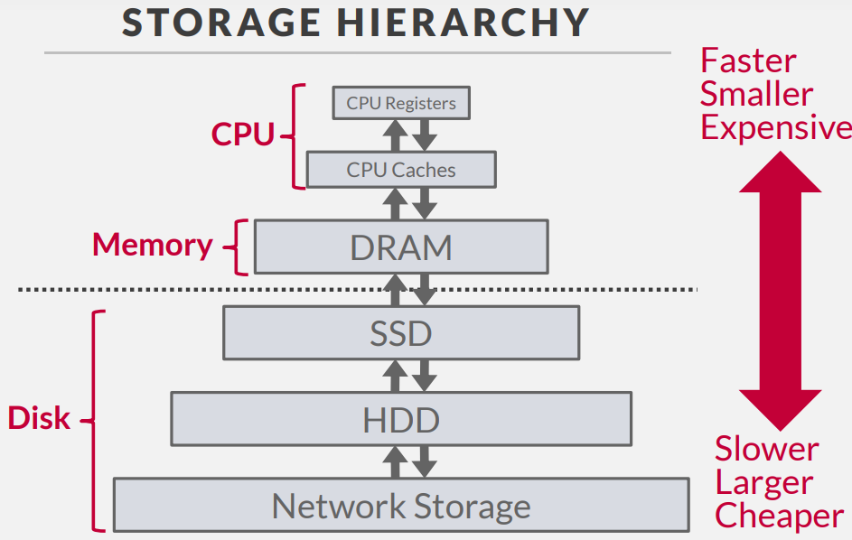

越向上的的储存速度越来越快，但越来越昂贵，并且空间越来越小。向下越来越慢，但是越来越便利。我们唯一关心的是 DRAM 和 SSD 之间的界限，因为DRAM以上的数据断电后会失去，我们称为 Volatile ； 而 SSD 及以下的数据为 Non-Volatile。 另外一个区别在于寻址的方式，DRAM以上的储存可以按照字节编码来随机任意的访问每一个字节；而 SSD 以下的数据需要按照顺序访问一个块。(这些特性将在我们的数据库的储存和访问的算法中体现)

在这一节课中，我们将统称 DRAM 为 Memory ； SSD HDD 和 Network Storage 为 Disk； Register 和 Cache 为 CPU（但在本课中不会被详细考虑）

所以我们期望设计一个满足一下需求的数据库储存系统：

- 允许DBMS 在数据超出内存的情况下也能够正常的管理

- 尽量避免在读写上较长的 Stall

- 随机位置的访问代价过于高昂，我们理想情况下应该最大化顺序访问

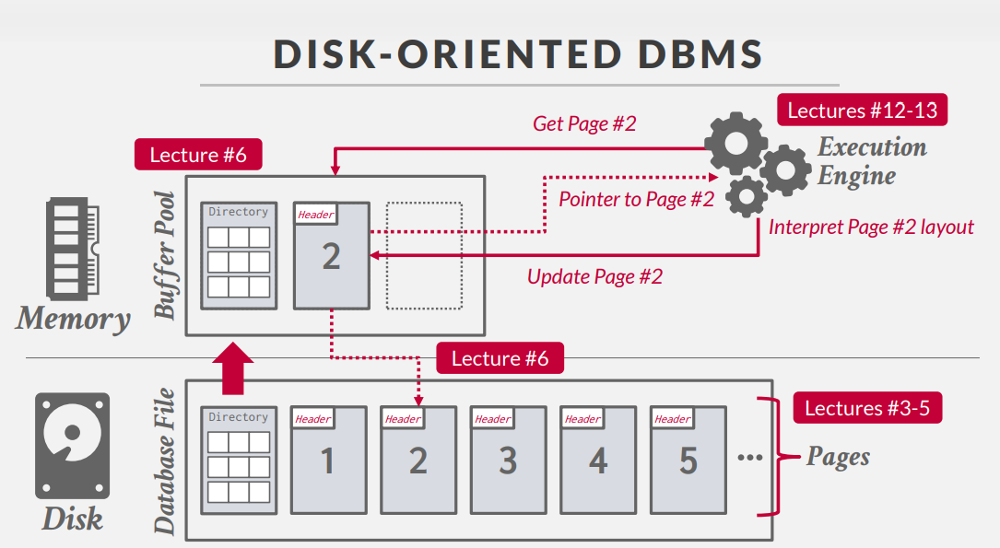

上图是一个基于磁盘的数据库的例子，当我们想要访问某一段数据时：

1. Excution Engine 首先明确我们需要的数据在哪一页？（图中的例子在第二页）

2. 我们从 Disk 中读出了 Directory ，将其放进 Buffer Pool 中。

3. 根据 Directory 我们读出 Page 2，并返还给 Engine 一个指向 Page 2 的指针。

4. Engine 根据 Page 2 的内容进行解释。

5. 当我们更新 Page 2 时我们首先更新内存中的 Page 2，最后我们将其写回至 Disk 中。

 

??? tip "为什么不直接使用 OS 作为 DBS 的储存管理？"
    
    MMAP的方式有很多缺点

    - OS 有可能随时处理掉脏页
    - 如果采用 MMAP， DBMS不知道数据在哪一页上，此时OS触发 Page Fault，这引起的 IO 中断的代价过于高昂
    - OS 管理的储存很难去验证数据的有效性，有可能产生 SIGBUS 的中断，导致 DBMS 不得不去处理
    - OS 本身的表现并不优异，其结构和算法在其他方面做出了妥协，而牺牲了直接的性能

    但我们也不能完全抛弃 OS （虽然有 Yellowbrick 的数据库确实是这么做的），需要维护一个平衡

    > The OS is not your friend              -- Andy

## DATABASE STORAGE

我们设计数据库储存时面临的两大问题：
- Problem 1: DBMS 应该以何种方式表示数据？
- Problem 2: DBMS 如何管理数据在内存和磁盘见的移动？

<!-- ### STORAGE MANAGER -->
### Problem 1 DATA REPRESENTATION

在数据库系统中负责维护和协调不同文件的部分，我们称之为**储存管理器**。数据库文件被分割为“页”(Page)，存储管理器将会追踪数据写入了哪些页，以及每个容器所剩余的空间。

通常情况下，DBMS 不会自行维护多个副本（假设这些是由数据库以外的组件去维护的）

一“页”是一块固定大小的数据

- “页”内的数据可以是元组、可以是元数据、可以是索引、可以是日志等等
- 大多数的系统不会使用混合类型的“页”（我们假定一页只会包含一个对象的信息）
- 每一页都会拥有一个独特的 ID，同时 DBMS 通过某种方法或机制将ID映射到储存设备上的物理位置

!!! note "区分不同的 page"

    - 硬件上的 Page (4KB)
    - OS 的虚拟 Page（4KB）
    - 数据库中的 Page (512B~32KB)

不同的 DBMS 有不同的管理文件中的页在磁盘上位置的方式

- 堆 Heap File Organization
- 树 Tree File Organization
- 顺序/有序 Sequential/Sorted File Organization
- Hashing File Organization

#### HEAP FILE

Heap File 是无序的页的集合，我们的元组将以随机的顺序储存（关系模型保证了我们并不关心这里的顺序）我们需要支持创建、查询、写入、删除页；同时也需要能够遍历所有的页。

当有且仅有一个文件的时候，这些操作是非常简单的，例如在下面的例子中，我们只需要计算 Offset = PageNumber x PageSize 即可
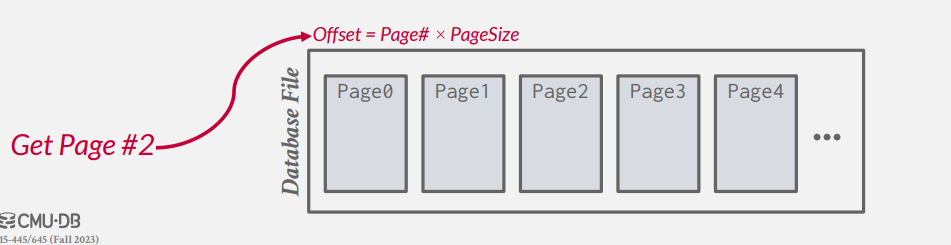

问题在于当我们有多个文件时，我们该如何知晓某一页在哪个位置？以及其在文件中的偏移量？

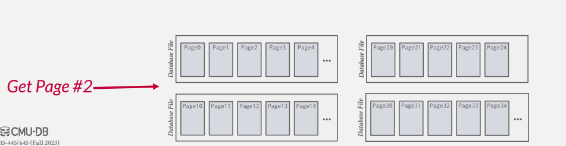

Heap File 为这些 Page 设置了一个页目录，DBMS负责维护这个特殊的“页”，来将页号与数据在文件中的地址一一映射。（不同的DBMS有不同的处理方式。有的数据库将其储存在文件的Header中，例如SQLite；有的数据库将其储存在单独的文件中）

#### INSIDE PAGE

现在我们来讨论每一页中将会储存那些信息？

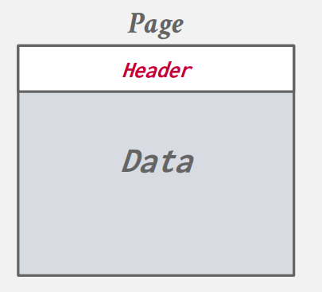

每一页应当包含一个 Header ，用于记录各种有关页的附属信息

- 页的大小
- 校验和
- DBMS的版本
- 修改的权限
- 压缩、编码的信息
...

除了页头以外，我们还需要关注数据的储存方式。（我们假设我们按照行的方式来储存 tuple）

- Approach \#1: Tuple-oriented Storage
- Approach \#2: Log-structured Storage
- Approach \#3: Index-organized Storage

##### Tuple-oriented Storage

当我们按照 tuple 的方式储存时，一个很直观的想法是，我们只需要记录一个tuple的数量，当我们插入一个新的 tuple 时，我们直接在文件末尾写入，并更新数量即可。

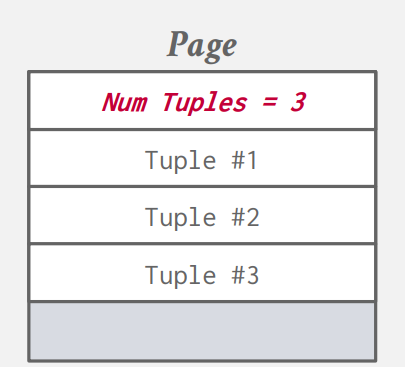

但这样的结构有很明显的缺点，当我们删除掉一个 tuple 时，将会打乱掉所有的顺序。并且如果当数据并非定长的时候，这种方法完全不可行。

一个常见的策略是 Slotted Page 分槽页。

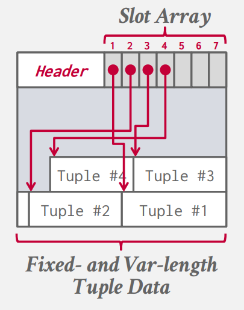

我们将会维护一个 Slot Array 用于记录每一个“槽”结束的地址。

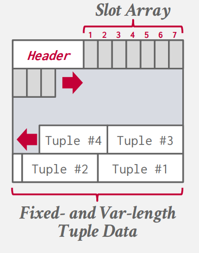

当我们插入一个记录时，我们的 tuple 从前向后增长，我们 array 从后向前增长。页头需要额外记录插槽的数量和最后一个槽的偏移量。

我们还需要考虑的是 Record ID 。DBMS需要唯一的识别每一条 tuple ， 这意味着我们也需要唯一的赋予每一个 tuple 一个识别 ID。这有可能是 File ID,Page ID,Slot ID 的数学组合。但事实上这些 ID 在应用层没有任何意义，因为只是标识储存的一个值，它可能会随时变化。（SQLite 直接将此作为了主键）

这样基于元组的储存仍然有一些问题：

- Problem \# 1: Fragmentation
    + 页内的空间并没有得到充分的利用，（可能使页内空间碎片化 ）
- Problem \# 2: Useless Disk I/O
    + DBMS 需要读取完整的一页才能够获取、更新一个元组
- Problem \# 3: Random Disk I/O
    + 当我们随机的更新元组时，其随机访问地址的开销较大(最坏的情况每一个页只包含了一个我们要查询的元组)

##### Log Oriented Storage

我们可以看到 DBMS 在 Tuple Oriented Storage 中储存的一些问题在于我们需要去动态实时的维护这些内容。但如果我们根本不需要去直接知晓现在储存的是什么，而是去关心它的历史的话，我们就得到了日志的储存方式（有点类似于git）

- 每一条日志代表着对于一个元组的 **插入/删除** 
- 可以被 LSM(Log Structure Merge Trees) 实现

当磁盘缓冲区填满时，我们再按照日志去读写磁盘。（对于日志型的记录，我们永远不会修改之前的记录。即修改日志本身，也只是新添加一条日志）

所以我们的一条日志需要包含：

- 关于元组唯一确定的识别码
- 插入/修改的日志记录需要包含元组的内容
- 删除需要标记具体的元组

但显而易见的，由于我们每次只会增加一条日志，对于读取/查询的开销将会增加。我们需要一个特殊的数据结构来维护这个查询（对于每一个需要查询的元组，我们维护一个特殊的数据结构，来告诉我们修改这个元组最新的记录储存在哪里）

- 如果这条日志在内存中，直接读取
- 如果这条日志在磁盘中，我们需要额外读取

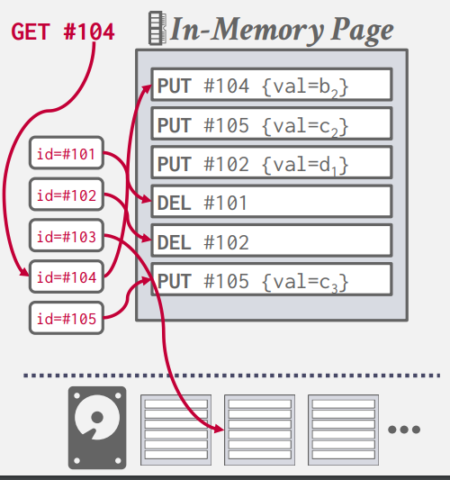

DBMS 通常不需要去维护所有的记录，所以我们也需要定期的去清理这些日志来减少空间的浪费（按照从新至旧的过程记录最新的我们所关心的值就可以了）这样的压缩可以保证我们每一页的记录中只包含一条我们所关心的内容。

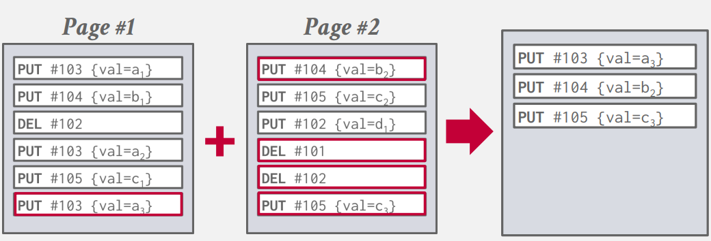

假定我们写入磁盘中的日志记录都是压缩后的记录，此时我们的顺序不在重要了（因为我们已经知道一个元组有且仅有一条记录）我们可以额外的按照 Index 来排序来优化我们内存中的查找。（SSTables）

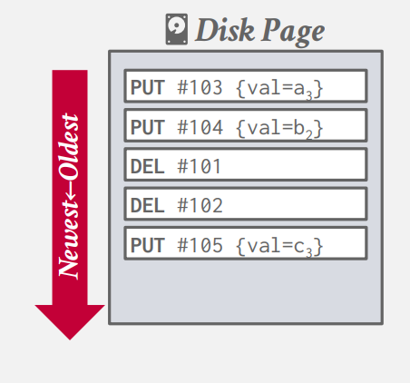

压缩的方式有两种：第一种较为显然，我们任取两个相邻的日志记录合并即可，这种方式被称为全局合并(Universal Compaction)。第二种为级合并（类似于加法树）。

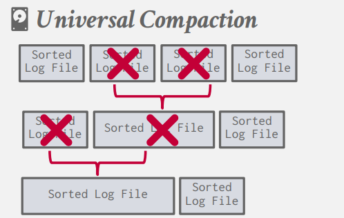
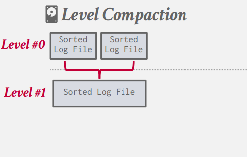

##### Index Oriented Storage

所有的元组在页上按照 key 来储存，我们使用一个数据结构来维护它的索引。（这里类似于页表，key同样会有个offset，而剩下的当做索引）

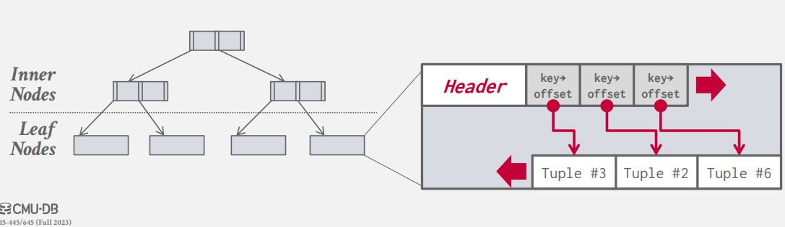

#### INSIDE TUPLES 

对于元组中的所有的 attributes ，我们希望它是字节对齐的。为此我们需要引入 Padding。即对于每一个属性，我们不希望它出现跨字的情况，当其出现时，我们通过填充零来避免这种情况。

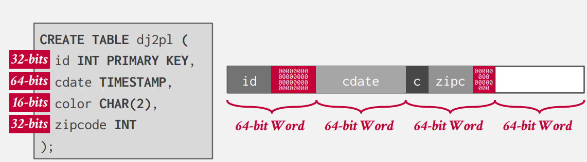

但我们也可以通过重排这些数据来实现避免跨字的功能。（但仍然可能需要 Padding）例如：
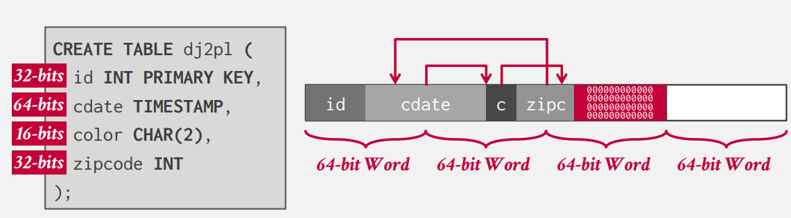

元组数据类型在不同的 DBMS 的实现中不尽相同，但大部分的数据遵循如下：

- INTEGER/BIGINT/SMALLINT/TINYINT
     + 与 C/C++ 相同.
- FLOAT/REAL vs. NUMERIC/DECIMAL
     + IEEE-754 标准 / 固定位数的浮点数（DBMS自己实现的类型）.
- VARCHAR/VARBINARY/TEXT/BLOB
     + 元组的头记录其长度，紧接着是数据或者指向数据的指针（如果数据过大）
- TIME/DATE/TIMESTAMP/INTERVAL 
     + 32/64-bit 整数Unix标准时间戳