# Storage Models

## DATABASE MODELS

我们可以简单的对数据库的工作做出三种分类：

- OLTP: Online Transaction Processing : 每次操作只涉及数量级较小的读/写

- OLAP: Online Analytical Processing  : 每次操作设计复杂的查询，需要计算大量的 aggregates. 一般而言 OLAP 需要 OLTP 侧从现有的数据中分析和提取新的数据。

- HTAP: Hybrid Transaction + Analytical Processing :OLTP 和 OLAP 的结合

我们先前所设计的的储存模式默认将一个 tuple 的所有 attributes 全部储存在一个 page 中（对于一些超大的 attributes 可能不是这样的），但这实际上对于 OLAP 而言并非最优的策略。

!!! Warning "Wiki 例子"

    假设我们有一个 wiki 数据库，其中保存了用户、页面和每一次修改的信息

     
    ```SQL
    CREATE TABLE useracct (
        userID INT PRIMARY KEY,
        userName VARCHAR UNIQUE,
        ⋮
    );

    CREATE TABLE revisions (
        revID INT PRIMARY KEY,  
        userID INT REFERENCES useracct (userID),
        pageID INT REFERENCES pages (pageID),
        content TEXT,
        updated DATETIME
    );

    CREATE TABLE pages (
        pageID INT PRIMARY KEY,
        title VARCHAR UNIQUE,
        latest INT
        REFERENCES revisions (revID),
    );

    ```

    其中，revisions 中的 useracct 和 pages 两个指针分别指向一个页面和一个用户；而 page 中的指针指向最新的一个修改。
    当我们想要查询一个页面对应的最新的ID时，就可以按照如下的方法去查询,这样的操作就是 OLTP 的。

    ```SQL
    SELECT P.*, R.*
    FROM pages AS P
    INNER JOIN revisions AS R
    ON P.latest = R.revID
    WHERE P.pageID = ?
    ```

    而 OLAP 则是对应需要读取大部分数据的操作。例如我们需要查询登录的用户的主机名以 '.gov' 结尾的数量

    ```SQL
    SELECT COUNT(U.lastLogin),
        EXTRACT(month FROM
                U.lastLogin) AS month
        FROM useracct AS U
    WHERE U.hostname LIKE '%.gov'
        GROUP BY
         EXTRACT(month FROM U.lastLogin)
    ```

## STORAGE MODELS

DBMS 的储存模型指的是数据库系统如何在物理层面上组织磁盘和内存中的元组以及它们相对于其他元组和自身属性的关系。对于不同的查询，储存模型将会有不同的影响，这对于数据库的设计与构建是十分重要的。常见的储存模型有三种：

- N-Ary Storage Model (NSM)
- Decomposition Storage Model (DSM)
- Partition Attributes Across (PAX)

### NSM

N-Ary Storage Model 是将一个元组中的所有属性连续的存储在一页的储存模型（行储存）。这有利于 OLTP 类型的工作，因为此时的查询只会访问单独的个体。一般而言 NSM 的页面的大小都是硬件页面的大小的整数倍。

例如，当我们想要执行一个用户的登录时，我们根据 Index 找到对应的页，再根据 Slot Offset 找到对应的位置即可。
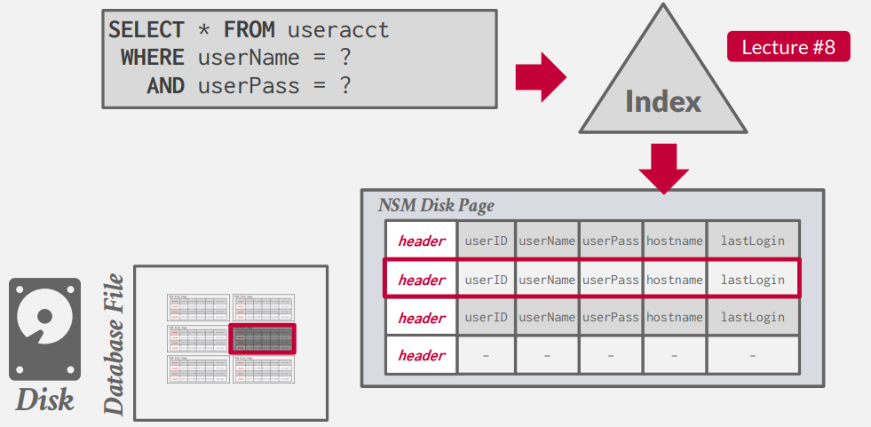

但是如果我们想要查询登录的用户的主机名以 '.gov' 结尾的数量时，我们需要扫描表上所有的页，因为我们需要查看所有的元组中是否是符合条件的。但是我们进需要 lastLogin 和 hostname 两个属性，可以看到我们访问了许多无用的数据。

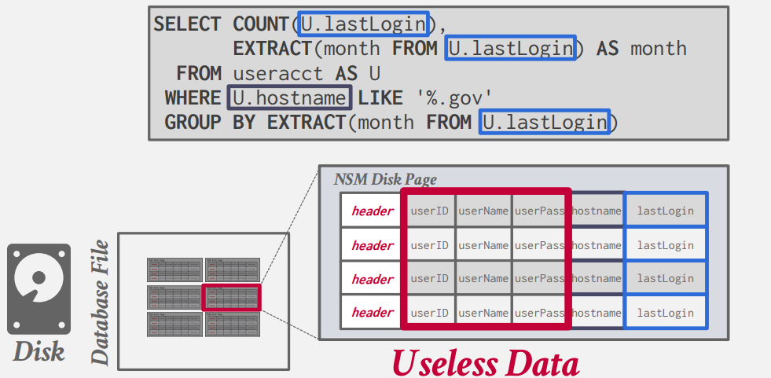

- Advantages
    - 可以进行快速的插入，更新，和删除
    - 对于需要查询一整组元组的操作而言比较友好（OLTP）
    
- Disadvantages
    - 对于需要扫描表格中大量的数据或者仅需要部分属性的查询而言并不友好
    - 对于压缩而言并不好，因为在一个页面中存在多个值

### DSM

与行储存相反，我们不再将同一个元组的所有属性储存在一起，而是分别将每一个属性单独储存在一个块(Block)中。这有利于 OLAP 的工作。而 DBMS 同时也负责在读写数据时对于元组的属性的拆分和合并。

此时，对于固定长度的属性，我们将其分别储存在不同的文件中（也可能包括 meta-data ，例如 null）。
<center>

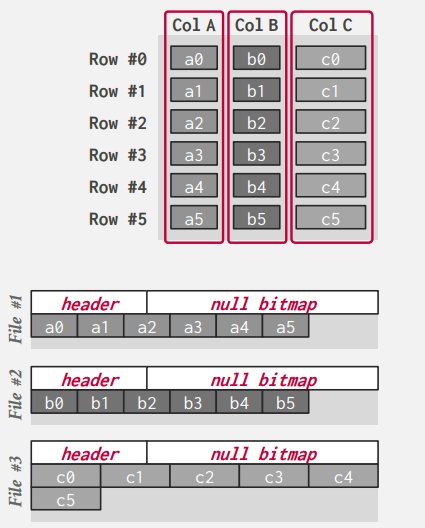
</center>

但是我们在 DSM 中需要额外考虑的一点是，我们该如何将属性对应到元组上？

- Fixed-length Offsets：我们将元组唯一的索引作为其属性在页中的 Offset 偏移量。（但这里额外需要每一个值的长度是固定的。）
- Embedded Tuple Ids ： 我们将元组的 ID 在页中额外储存为一列，和每一个属性一一对应。

<center>

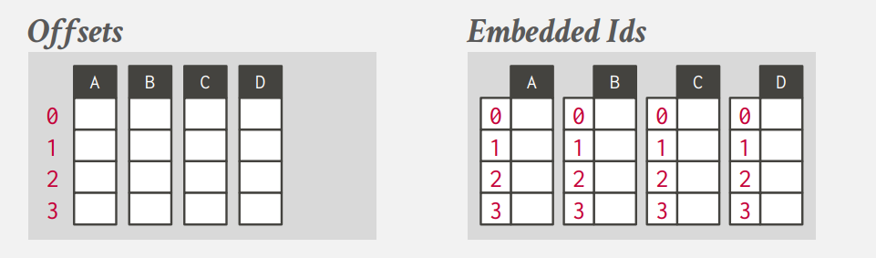
</center>
但实际情况下往往存在可变长的值的情况，为了使用第一种方法，我们需要进行 **压缩**(例如字典压缩)。

- Advantages
    - 减少不必要的IO查询的浪费
    - 对于 OLAP 类型的工作，有着更好地性能
    - 更利于数据压缩
- Disadvantages
    - 对于点对点的查询、插入、更新较慢


### PAX

DBMS 在数据库页面内垂直分区属性。这样做的目的是在保留行存储的空间位置优势的同时，获得列存储更快处理的优势。全局的文件头包含每一行组的偏移量。而每一行组中，将包含按照属性进行分类的列。


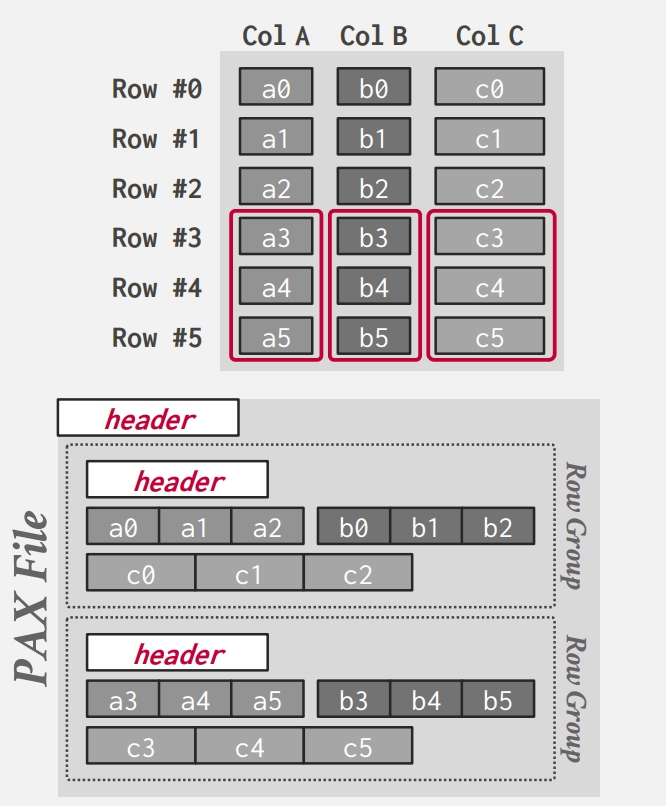

## COMPRESSION

实际上 IO 是我们数据库系统在查询操作是的一个瓶颈，所以我们可以通过压缩数据来实现在相同 IO 下更好的性能。这相当于在 CPU 和 IO 中进行权衡，压缩将会减小IO的压力，但会增加CPU的载荷。

具体而言，我们希望实现如下的压缩：

- 压缩后必须产生固定长度的值
- 在查询操作中，我们希望尽可能的延迟解压的操作
- 必须是无损压缩

我们同样也要考虑在什么层面进行压缩：


- Choice \#1: Block-level
    - 对于同一个表格中的元组进行压缩

- Choice \#2: Tuple-level
    - 对于一个元组中的内容进行压缩 (NSM-only).

- Choice \#3: Attribute-level
    - 对于单个属性进行压缩 (overflow).
    - 也可以对于同一元组的多个属性进行压缩

- Choice \#4: Column-level
    - 同时对多个元组的同一属性进行压缩 (DSM-only).

#### NAIVE COMPRESSION

DBMS 通过通用的数据压缩算法对数据库中的数据进行压缩 (e.g., gzip, LZO, LZ4, Snappy, Brotli, Oracle OZIP, Zstd).其中的一个例子便是 MySQL 中 InnoDB.

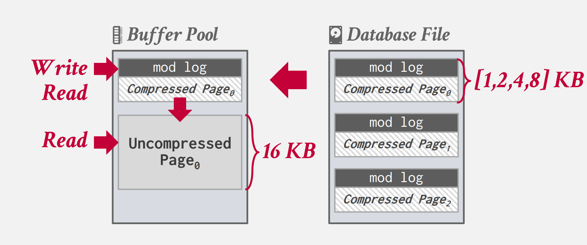

首先数据被压缩成二的整数次方大小的压缩页，并维护一个 mod log （日志类型）。当我们需要插入一个值时，我们将其从文件中拿出，放入 buffer pool 中,并将需修改添加到 mod log 中，此时不需要解压；当我们读取数据时，我们将其解压，并将mod log合并，最后重新压缩放回文件。

但由于数据库并不知道压缩后数据的含义（因为这些算法都是建立在某种字典压缩上的，而DBMS并不知道其具体的含义），我们在查询前必须要全部解压缩才能够实现。我们希望数据库能够实现自己的压缩算法，使其能够在压缩的数据上进行查询。

#### RUN-LENGTH ENCODING

将一列中连续重复的值变为特定偏移量处该值出现的次数。这对于排序后的表而言效果较好。我们进需要记录：属性的值，开始的偏移量，重复的次数即可。

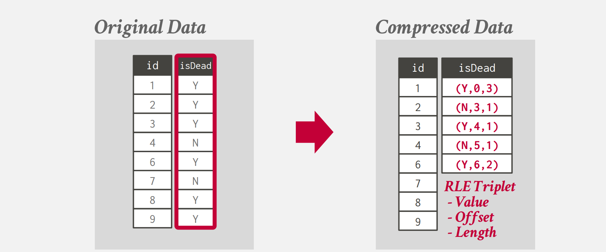

#### BIT-PACKING

如果属性的值实际上远小于我们声明的类型的值，我们可以减小实际储存的值的位数。


<center>

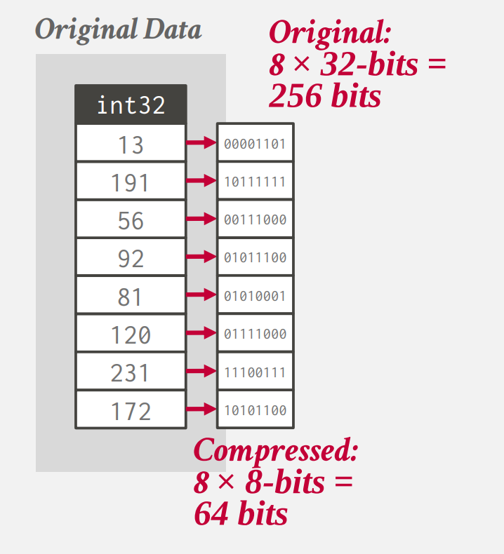

</center>

#### MOSTLY ENCODING

在 BIT-PACKING 中，我们无法保证每一个值都会远小于我们声明类型的值。所以当一个属性的绝大多数的值小于声明类型的值时，我们将极大的值单独储存，剩下的值按照 bit-packing 的方式储存。

#### BITMAP ENCODING

如果我们有一个属性，其不同的值的个数较少，我们可以为每一个不同的值单独储存一个bit值，表示其是否具有这个值。

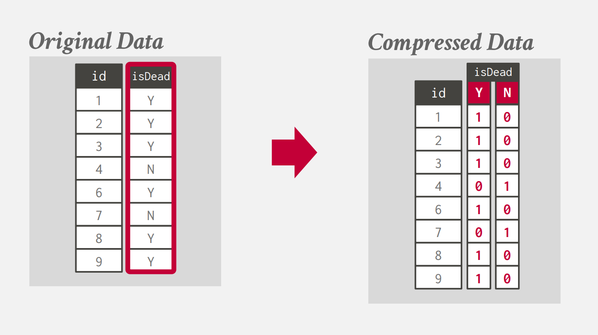

#### DELTA ENCODING

当我们储存的值之间比较接近时，我们可以不在储存值，而是仅仅储存相邻两个属性的值之间的差。此时我们也可以进一步的复用 RLE 压缩。

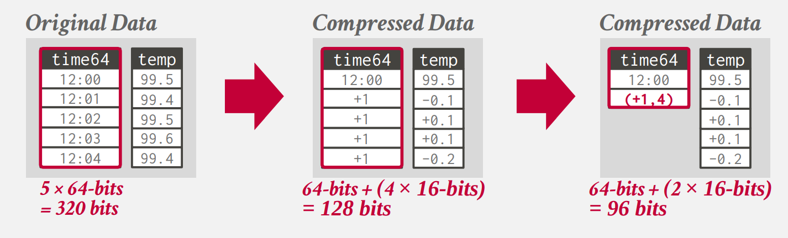

#### DICTIONARY COMPRESSION

我们将常出现的值用固定长度的编码代替，同时维护一个词典用于映射值与编码。（这是实际上数据库中最为常用的压缩方法）字典压缩也支持范围查询，我们只需要保持编码顺序与原始值的顺序即可。

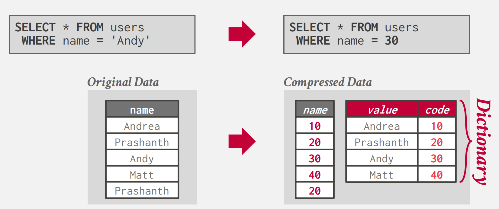

所以我们需要一个数据结构，能够帮助我们完成解压缩的过程，同时维护原始值的相对顺序。

