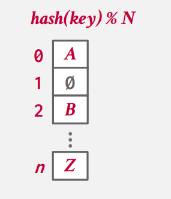
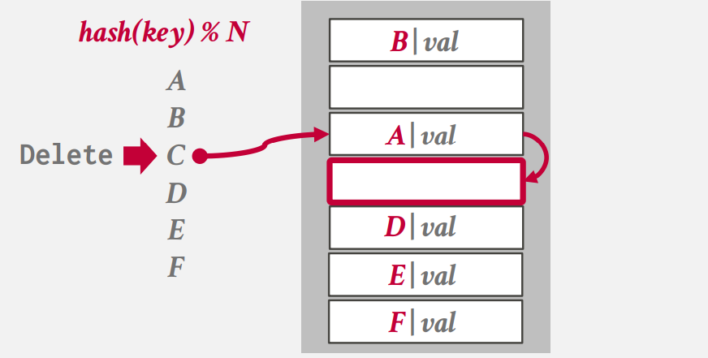
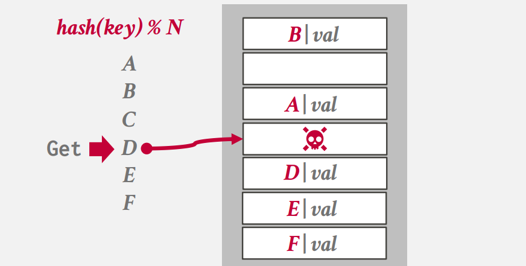
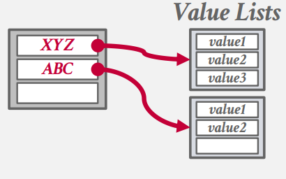
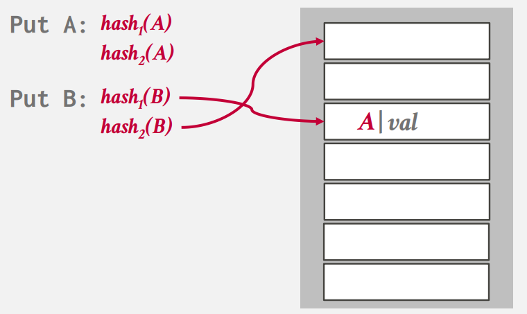
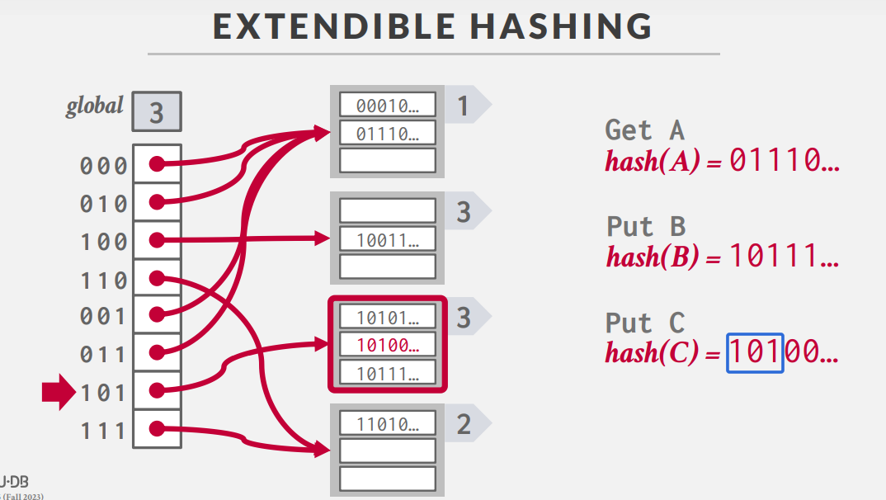
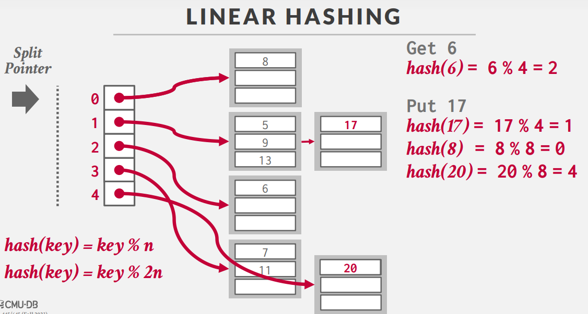

# Hash Tables

我们需要高效、安全的数据结构来表示系统的状态与数据：

- Internal Meta-data
- Core Data Storage
- Temporary Data Structures
- Table Indexes

所以通常而言我们使用两种了类型的数据结构来维护这个过程：

- Hash Tables (无序的)
- Trees (有序的)

我们所言的高效和正确的数据结构，需要具有如下的特征：

- **Data Organization**: How we layout data structure in memory/pages and what information to store to support efficient access.

- **Concurrency**:  How to enable multiple threads to access the data structure at the same time without causing problems.

!!! Quote "Definition"
    A hash table implements an unordered associative array that maps keys to values.

    It uses a hash function to compute an offset into this array for a given key, from which the desired value can be found.

需要注意的是，也许哈希表的时间复杂度平均为 O(1) 是一件好事，但是在数据库系统中，常数同样很重要！在巨大的表格中，例如涉及十亿个键的匹配，单次查询1ms的优化都会导致整体性能的巨大优化。

## Types of Hash Tables

### Static Hash Table

我们从最普通的哈希表，哈希函数模 N 的值将作为存储的位置的偏差量 (1)。需要注意的是，我们可能需要从储存原始的键值，来检测是否发生了冲突。
{ .annotate }

1.  

但这样的哈希表只在理想的情况下工作：

- Assumption \#1: Number of elements is known ahead of time and fixed.
- Assumption \#2: Each key is unique.
- Assumption \#3: Perfect hash function guarantees no collisions.

显然第三假设里的完美哈希函数并不存在。

在这个例子中，我们可以看见我们理想的设计思路：

1. 哈函数需要将一个较大的键映射到一个较小的值域里面，这需要我们在性能与冲突率上权衡
2. 我们需要考虑如何处理键的冲突，以及在申请**一个较大的哈希表**和**维持较小的表所需要的额外的操作**之间权衡

### Hash Functions

在数据库系统中，我们并不关心哈希函数的任何保护隐私机制，所以我们不需要使用具有加密性质的哈希算法(e.g. SHA-256)。数据库系统更倾向于使用那些成熟的哈希算法。例如，常见的哈希算法如下：

- **CRC-64** (1975)
→ Used in networking for error detection.
**MurmurHash** (2008)
→ Designed as a fast, general-purpose hash function.
- **Google CityHash** (2011)
→ Designed to be faster for short keys (<64 bytes).
- **Facebook XXHash** (2012)
→ From the creator of zstd compression.
- **Google FarmHash** (2014)
→ Newer version of CityHash with better collision rates.

### Hash Schemes

在 Hash Schemes 中，我们需要讨论的是，在键经过哈希函数转换为了整数后，我们该如何具体的储存和处理冲突？

#### Linear Probe Hashing

线性探测的思路非常简单： 

Single giant table of slots.

Resolve collisions by linearly searching for the
next free slot in the table.

Linear Probing 固然简单，但当**删除**的时候将会非常的麻烦，例如：

当我们插入C时，先前由于C与A位置冲突，C被排在了A的下一个；当我们删除C时，同样也是删除了A的后一个位置。但当我们查询D时，我们将会查找到一个空槽。

为了处理这样的操作，我们要么通过 Reshashing , 即移动、整理所有的元素，但这效率相当地下；或者我们额外设计一个标记，来记录已经删除过数据的空的槽位。

接下来需要解决的问题是不唯一的键值，我们需要处理当键值相同的时候值不唯一的情况。

=== "**Separate Linked List**"
    
    我们可以将哈希表储存的值变为一个列表 (1) ，列表内包含所有的可能的值。
    { .annotate }

    1.  

=== "**Redundant Keys**"
    我们也可以将其直接插入到表格中，按照正常的冲突方法来解决(1)，这也是绝大多数的数据库的方法。
    { .annotate }

    1.  

#### Cuckoo Hashing

为了解决上述的部分问题，我们可以引入多个哈希函数来找到多个位置来进行插入操作。即，当当前的哈希函数给出的位置被占用时，我们使用另一个哈希函数给出的位置，直到可以被放入为止(1)。
{ .annotate }

1.  

一个显然的问题是，当我们用尽所有的哈希函数，都无法找到一个合适的位置时，该怎么处理冲突？

我们可以通过先将就放不下的键，让它放入某个位置，因为它没有选择可言了；此时我们需要给原来在此处的位置的值重新找一个位置，即调用另一个哈希函数来看看有没有其他的选择；我们不断回溯直到所有的值都各就其位为止。

这里的例子可以参见 [第七讲的slides](https://15445.courses.cs.cmu.edu/fall2023/slides/07-hashtables.pdf)

但是这里我们又回到了我们设计存储时的一个基本的原则：应该最大化顺序的访问，但这里的 Hashing 的访问是随机的。

一个有趣的问题是可以通过并行访问来实现对多个位置的同时访问吗？Andy给出的解释是对于SIMD或向量化的架构，这也许是成立的；但如果我们使用多个线程来实现这个过程，往往得不偿失。

### Dynamic Hashing
上述的两个方案，无论是 Linear Probing 亦或是 Cuckoo Hashing 都是静态的；我们需要去知晓/预估整个表格的大小，否则我们需要不断地 Rehashing/Rebuild 来适应表格的大小。我们期望一种动态的结构，能够以增量的方式来调整哈希表的大小，同时避免 Rehashing 的情况。

=== "Chained Hashing"

    在 Chain Hashing 中，我们在同一位置不再局限于存储同一个值。例如我们可以存储一个链表指针，将所有具有同一哈希函数的值都放进去。

    此时插入与删除将取决于我们存储多个值的结构，基本上变为了一个线性查找的过程。这样做的好处在于我们的存储结构可以采用变长的结构（e.g. vector）而不会影响到表格的其他部分。并且这里执行的是顺序的访问。

    我们可以在维护指针的同时，使用 [Bloom Filter](https://en.wikipedia.org/wiki/Bloom_filter)来判断值是否存在；如果不存在则可以免去一次线性的查找。

=== "Extendible Hashing"

    Extendible Hashing 的思路与 Chain Hashing 几乎完全一致，唯一的区别在于我们存储数据的 Bucket 的管理。Extendible Hashing 中多个位置的实际存储可能指向同一个 Bucket。当我们需要重建Hashing Table时，我们对这些Bucket进行分割、重排、增加大小来维护整个表格。

    

    我们需要维护一个全局的位数 N，对于每一个哈希函数给出的值，我们观察其前 N 位，将其对应到不同的 Bucket 上。当某个 Bucket 被填满时，我们需要扩充全局位数，然后新增更多的 Bucket 来对应新增的位数；同时合并一些 Bucket 来维护原有位数下的情况。
=== "Linear Hashing"
    Linear Hashing 是 Prosgress数据库使用的哈希方法。它维护了一个指针，用于指向下一个需要被分裂的Bucket。当任意的Bucket溢出时，我们将指针指向的Bucket

    

    例如，在上面的例子中，Split Pointer指向了0，此时我们插入 17 时，Bucket 1 发生了溢出，所以我们扩展 Bucket 1 的大小，然后将 Bucket 0分裂为两个；具体的分裂过程为按照第二个哈希函数进行分类。然后我们将 Splite Pointer 下移一位。

    这听着反直觉，但实际上最终会调整每一个 Bucket 的大小为合适的值。

Hash Table是速度与灵活性权衡后的一个结果，但我们将不会在实际的建立index的过程中使用它（尽管部分数据库给予了其支持），因为它并不支持前缀查找。而这将在下一节 B+ Tree 中得到解决。