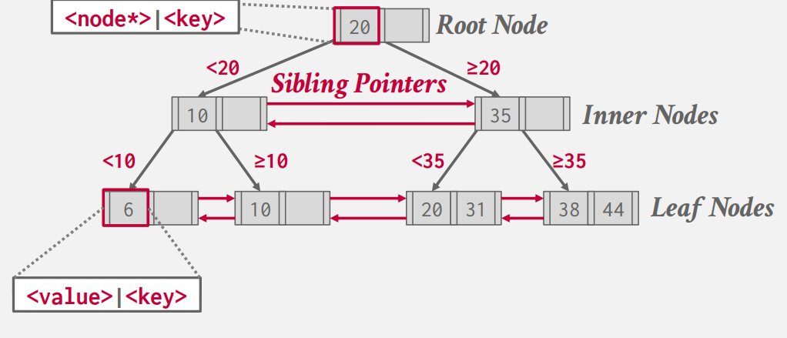
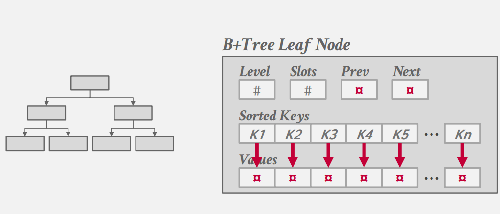
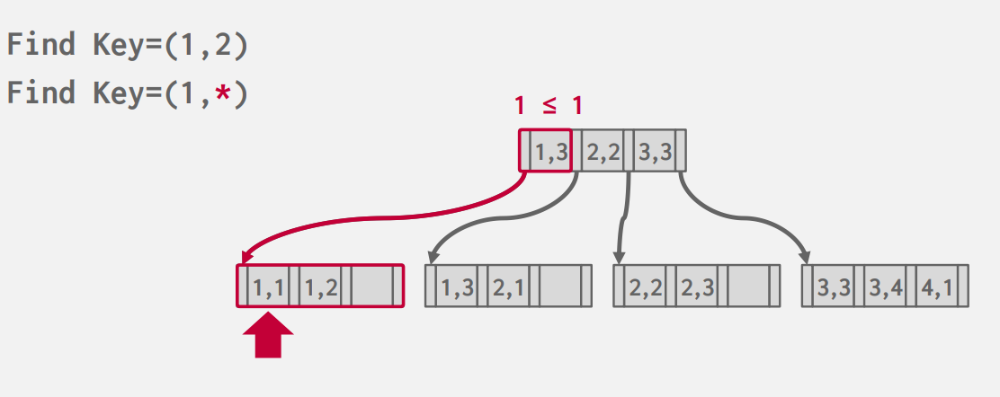
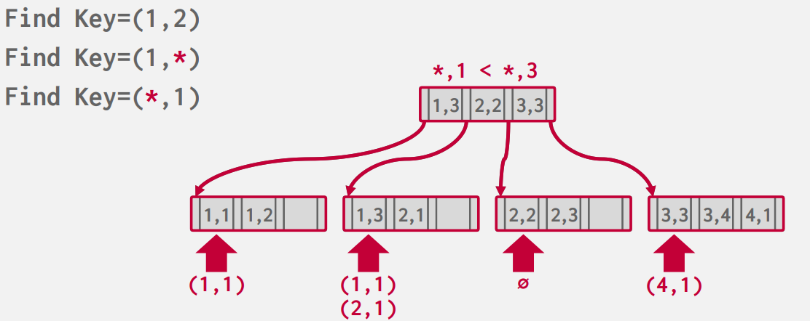
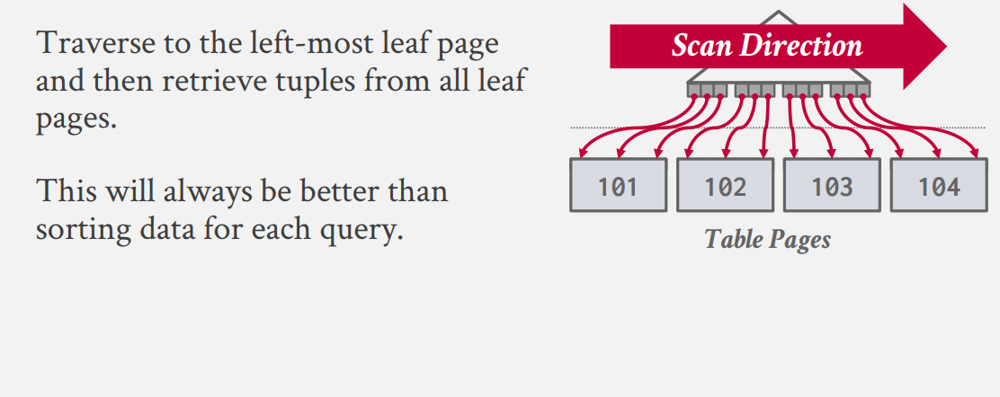
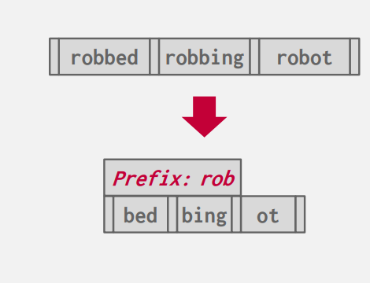
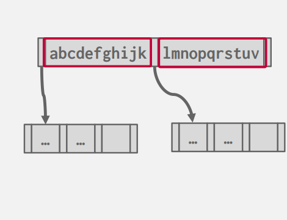
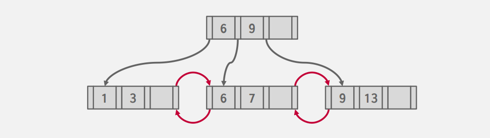
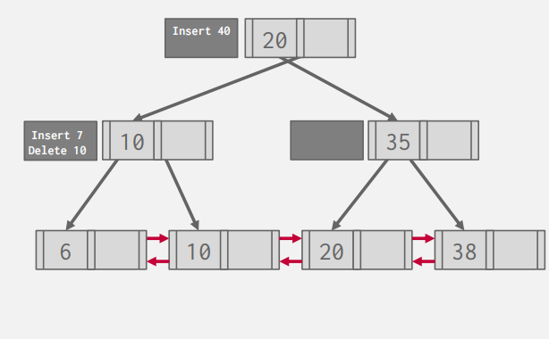

# B+ Tree Index

## B-Tree Family

当我们谈论到 B+ 树时，实际上我们指代的是一系列的衍生数据结构：

- B-Tree (1971)
- B+Tree (1973)
- B*Tree (1977?)
- B$^{link}$-Tree (1981)
- Bε-Tree (2003)
- Bw-Tree (2013)

??? Tips "B+树为什么开头为 B"

    B 树的名称最早出现在 *The Ubiquitous B-Tree* 这篇文章中，但具体的原因作者 Bayer 并没有给出；人们一般认为 B 代表 Balanced,Broad,Bushy,或者直接以作者名字首字母命名。

## B+ Tree Structure 

!!! Quote
    A B+ Tree is a self-balancing, ordered tree data structure that allows searches, sequential access,insertions, and deletions in **O(log n)**. 

与 ADS 中提及的 B+ Tree 不同部分是：

- 在数据库中我们的Sibling Node之间维护了一个链表式的指针；这意味着我们不需要递归地回到上一层来寻找下一个节点，我们可以通过 Sibling Pointer 直接在叶子ia节点间顺序的访问（我们假设叶子结点的存储是顺序的），这有利于我们的IO

- 在数据库中 B+-Tree 的叶节点保存的是 value/key  pairs 的格式,而叶节点与内节点存储的值不同。

- 我们将在叶节点的第一个或最后一个增加哨兵空节点，作为 NULL 存储的地方

当我们有了一个 B+Tree 作为索引，接下来我们考虑叶节点究竟放什么？

- \#1 Record IDs 叶节点仅保存指向实际存储位置的指针 (Prostgres,SQL Server,Oracle)
- \#2 Tuple Data 叶节点直接存储我们的值 (Index-Organized Storage) (SQLite,SQL Server,Oracle,MySQL)

!!! note "Selection Conditions"
    B+Tree 相对于 Hash Table 的一个显著优势是，它对于查找条件的支持更加广泛。对于哈希表而言，我们只能给定确定的 key 来查找，即基于等于的查找；但对于 B+ Tree 而言，我们可以支持大于、小于的查找。这意味着我们可以进行 前缀、后缀、甚至中间部分的查找。更具体而言，如果我们在 <a,b,c> 上建立了索引，那么我们的 B+ Tree 可以执行 a=1 AND b=2 (没有 c), (b=2) 类型的查找。

    但上述的查找需要我们对于各个属性有一个良好的排序（即具有良序性）

    
    

## Index In Databases

另一个问题在于我们建立索引是由谁所决定的？通常情况下，由使用者来决定建立哪些索引；但人们一直在尝试通过自动的方式来建议建立哪些索引。一般而言，我们的索引更多，查询的速度将会加快；但与此同时，我们的插入、删除等的成本将会增加（索引需要与实际内容同步）..所以这里存在一个有趣的 Trade Off

最后一个问题是关于重复的键值:

- Approach \# 1 最好的方案当然是确保 key 的不重复性：我们可以将 Record ID 加入到 key 中，这样我们所有的 Key 将会是独一无二的。但由于我们的 B+Tree 的性质，我们仍然能够通过 key 的一部分来查找我们想要的值。

- Approach \# 2 我们允许叶子结点包含多个重复的值，但每个叶子节点的独立值的数量保持B+ Tree的性质，但这样的结构更加难维护。

再次回到最初始的地方，B+ Tree 要求我们的存储的key是具有某种可排序性的；但部分的数据库支持 Clustered Indexes , 这是一种根据 Primary Key 来排序的 Index，即使这里的存储的值本身是无序的。这样的Index能够保证我们在访问各个Index时能够按照磁盘存储的顺序来遍历，这样最大化了顺序IO

但当我们按照其他的顺序进行Index时，我们可能会发现我们需要访问的 Page ID 等并不唯一(乱序)；所以为了优化访问，我们可能需要先记录我们需要访问的 Page ID （存到某种 buffer 中），在整个 Index 寻找完毕后，按照 Page ID Slot ID 等排序，再进行访问。这称为 Index Scan Page Sorting

## B+ Tree Design Choices - Optimization

我们介绍了 B+ Tree 的各个性质、结构；但仍需讨论一个问题：数据库系统中的 B+ Tree 实际上是怎么样的？我们可以通过哪些方法来优化？

### Node Size

节点的大小一般由设备的存储速度等来决定：

- HDD: ~1MB
- SSD: ~10KB
- In-Memory: ~512B 

节点越大、更多的访问将发生在叶节点；节点越小、树越高，更多的访问将发生在根节点。这与我们在 ADS 的并行算法中讨论的 Trade Off 相似。

### Merge Threshold

并非所有的数据库都在半满的时候合并、分裂节点。这和我们在 ADS 中讨论过的 alpha Tree 的阈值相似。我们也可以容忍一些不平衡的情况来权衡 IO 方面的表现。例如我们可以在 69% 满时分裂、合并节点。

### Varible-Length Keys

对于可以变长的 keys ,我们的处理方法与之前处理变长类型的 attributes 相类似。

- Approach \#1: 我们将存储一个指向实际存储 key 的指针 
    + 这种方法的B+ Tree又被称作 T-Tree
    + 和之前的情况类似，由于这种方法会导致随机的存储访问，所以实际上并没有数据库系统的实现采取了这种方法

- Approach \#2: 变长的节点
    + 需要更复杂的内存管理

- Approach \#3: 填充成为固定长度

- Approach \#4: Slots Idea

### Intra-Node searches

当我们获取了某一个节点后，我们该如何获取/搜索其内部的信息？与 ADS 不同的是，数据库中的B+ Tree的 Order 可能会非常的大，每个节点的遍历同样会影响效率

- 线性查找: 我们对 List 从头至尾遍历；可以使用 SIMD 的向量化指令来加速这一过程
- 二分查找: 有序性，显然
- 插值查找: 类似于数值分析中的插值法，我们可以根据部分值建立插值公式，来预测我们想要查找的值的位置。这对于具有一定分布规律的值有显著的提升。

### Prefix Compression

我们对相同的前缀进行压缩，可以减省 IO 代价并提升性能（甚至进一步建立索引）

### Suffix Truncation

只存储对于我们索引有效的前缀；但这样的设计对我们的增删将会带来更多的麻烦。例如，当我们插入新的数据后，有可能原来的前缀无法有效的指引了。

### Bulk Insert

类似于建堆的方法，对于已有的数据，我们排序后自下而上的建立整个 B+ Tree ，而免去依次插入所带来的时间。

### Lazy Mechanism -> B $\epsilon$ Tree

和线段树等数据结构类似，我们可以发现对于增删的操作的代价是较为高昂的。我们可以引入日志类型(log based)的懒操作的机制：即对于每一个操作，我们并不立即执行，而是将其放入一个缓冲池。当查询时，我们先在缓冲池内查找；当缓冲池满时，我们将操作下放到其对应的子节点中(如果是叶节点就执行操作)。

