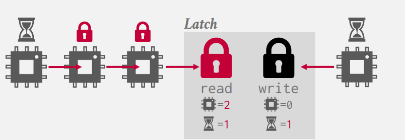
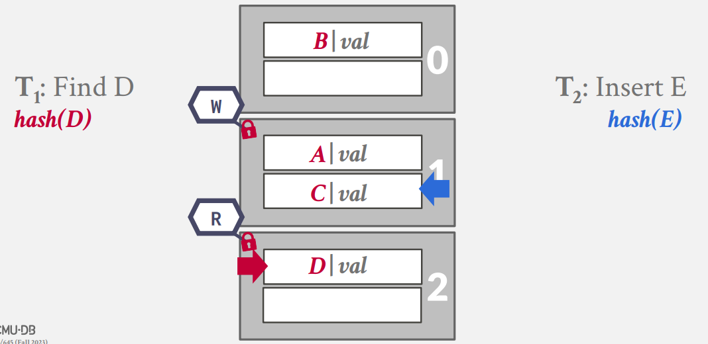
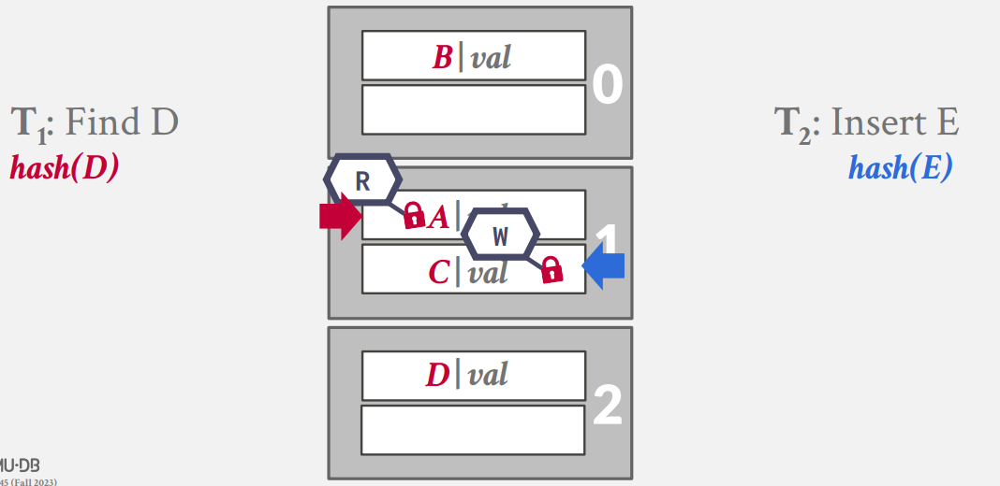
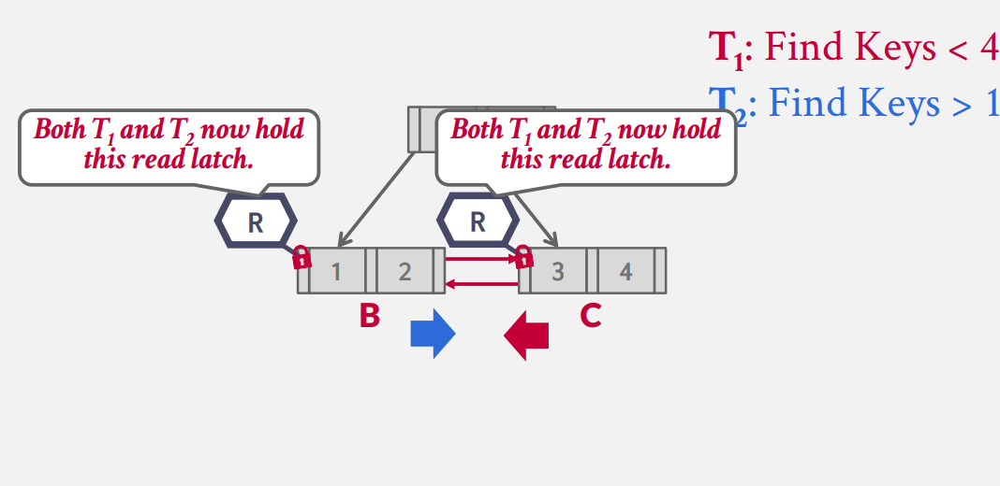

# Concurrency Control

我们至今讨论的所有数据结构都是基于单线程的假设，但对于 DBMS 而言，我们有时更需要多线程的访问支持来更好的利用现代CPU多核的特点。

## Concurrency Control Protocol    

为了使得并行的线程保证读写的正确性，我们需要遵守一个统一的 **并发控制协议** ,但设计并发i控制协议的准则可能各不相同。

- Logical Correctness： 线程能够准确的读取它期望读取的数据吗？

- Physical Correctness：数据对象内在的物理存储是正确的吗？

Locks vs Latches

|    |  Locks  |  Latches  |    
|:--:|:--:|:--:|
|Seperate|Transactions|Workers|
|Protect|Database Contents|In-Memory Data Structures|
|During|Entire Transactions|Critical Sections|
|Modes|Shared, Exclusive, Update,Intention|Read, Write|
|Kept In|Lock Manager|Protected Data Structure|

我们的 Latch 存在两种模式:

- Read Mode : 所有的线程都可以自由的读取数据，因为此时不会发生冲突；任何线程都可以申请 Read Latch ,无论其他线程是否拥有Read Mode 的Latch
- Write Mode : 仅有一个线程都可以写数据；当其他线程拥有某种Mode 的 Latch，任何线程都不可以申请 Write Latch 

## Latch Implementations

=== "Test-and-Set Spin Latch"
    TAS 的效率较高，但是其对于缓存与操作系统不友好(1)；一个在C++中实现的例子是``` std::atomic<T>```
    {   .annotate   }

    1.   
    这里存在一个 NUMA 的问题，即如果一个cpu想访问另一个cpu的缓存，将会存在较大的延迟


    ```cpp
    std::atomic_flag latch;
    ⋮
    while (latch.test_and_set(…)) {
    // Retry? Yield? Abort?
    }
    ```

=== "Blocking OS Mutex"
    这里的 Mutex 互斥锁是最易实现的一种（C++的 ptread 已经帮你实现了）

    ```cpp
    std::mutex m;
    ⋮
    m.lock();
    // Do something special...
    m.unlock();
    ```

    但由于Mutex的实现有操作系统的参与，这里的Latch效率低下且不可控。

=== "Reader-Writer Latches"
    这里的 Latch 允许并行的读，并且维护一个 read/write 的优先级队列。

    

    例如，在图中的例子里，当Reader持有Latch时（可以有多个Reader，但是有一个上限），Write将会在队列中等待，超出上限的 Reader 也会等待。


## Hash Table Latching

哈希表上的 Latch 非常好实现：

- 所有的线程在哈希表上都按照同一方向来遍历和查找（这保证了第二条性质）并且一次仅会访问同一页/槽

- 死锁不可能发生

如果我们需要调整表格的大小，我们只需要在全局上设置一个Write Latch即可。

另一个问题是我们的Latch的粒度应该是多少（即，一个Latch究竟管辖多大的范围？）

- Page Latch

    

- Slot Latch

    

## B+ Tree Latching

### Basic Algorithm

我们在B+树上的协议需要满足支持多个线程同时对数据结构进行修改/访问

- 获取父节点的 Latch
- 获取子节点的 Latch
- 释放父节点的 Latch 如果父节点当前是安全的

一个节点是安全的当前仅当操作后它不会分裂或者合并

- 对于插入而言，节点不是满的
- 对于删除而言，节点比半满多

所以对于读操作而言，我们首先在子节点上获取Read Latch，然后释放父节点的Latch，直到我们找到我们所需的节点为止。

对于写操作而言，我们从根节点开始获取 Write Latch ，然后检查子节点是否是安全的，如果是安全的，我们将释放所有祖先节点的Latch

但我们可以发现，对于所有的操作，我们都需要先获取根节点的 Latch 才能够进行，此时这里便成为多线程的一个瓶颈。所以我们亟需一个性能更好的 Latch 的协议与算法来保证多线程能够以最佳的效率进行。

### Better Optimization

Bayer and Schkolnick 提出一个更加‘乐观’的算法。事实上，由于我们的节点存储在页上，所以一个节点的操作往往不会发生任何的分裂/合并。

对于读操作而言，没有发生改变；对于写操作而言，我们总是以读的方式来访问内部节点；而以写的方式访问叶节点。如果我们发现叶节点是不安全的，那么我们从头开始按照读的方式重新访问获取Latch。

### Deadlock

当所有的线程都以从上往下的顺序访问时，我们不会发生任何的死锁的情况。但如果一个线程从兄弟节点访问呢？



由于 Latch 并不保证和死锁的检测，所以这里唯一避免死锁的方法是更好地代码实现。叶节点的兄弟节点的Latch获取需要支持一个 non-wait Mode ： 这意味着任何试图从兄弟节点获取 Latch 的请求都不会等待。如果一旦我们发现从兄弟节点的请求 Latch 失败都会导致线程终止掉自己。

事实上在这里存在更多的考量，当我们发现无法从Sibling 节点申请Latch的时候，我们有三种选择：1. Wait 2. Kill itself 3. Kill Others 对于第一种选择，我们并不知道这一个Latch将会被占有多久，这对于我们的查询而言是十分不安全的（用户可能因此而等待若干时间）。对于第三种考量，由于线程间并不知道对方在做什么（也许操作系统知道，但是任何涉及操作系统的调度都不是好的设计），所以这样随意地操作也是不安全的。

因此我们只剩下了唯一的选择：因为我们只知道自己在做什么，所以我们只能终止自己这个进程。（也许这里涉及到操作的回滚）

### Conclusion
设计一个能够安全的支持并行操作的数据结构一直是一个“臭名昭著”的问题。我们在本节中仅仅涉及了B+树上的一些技巧，事实上还有更多更加高级、精妙的有关 Tread-Safe 的技巧。

