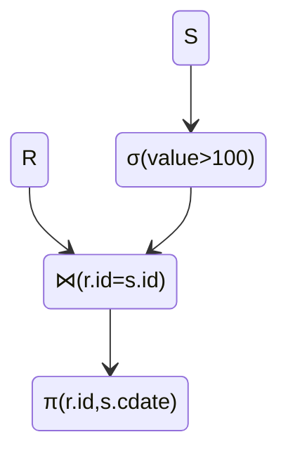
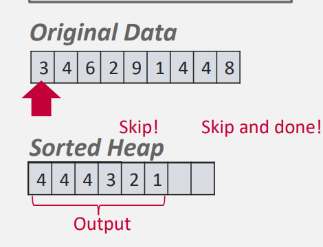
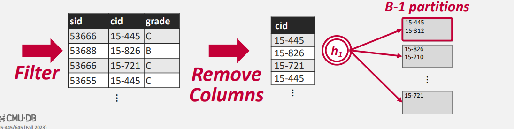

# Sorting And Aggregations

在本讲中我们将会讨论我们先前所提到的数据库模型中的第四层： **Operator Execution**

当我们假设我们已经通过关系代数的化简的方式对我们的查询进行优化后，我们该如何在数据库系统中执行某个具体的算法来实现对应的关系算符？

在优化后我们的关系计算可以表示为一个 Tree (对于存在嵌套查询的情况，可能是一个 DAG )。所以我们一定存在某一种计算顺序能够使得我们从下而上的执行，最终在根节点得到我们的结果。

例如我们有一个查询 `#!sql SELECT R.id, S.cdate  FROM R JOIN S  ON R.id = S.id WHERE S.value > 100` 可以表示为：

<center>


</center>

在设计这样的算法时，我们需要注意到：

- 我们不能假定所有的数据都在内存中，它有可能在硬盘中
- 我们希望最大化顺序的IO
- 对于溢出到磁盘中的数据我们希望能够用到缓冲池

在原始的 Relational Model 的数据库中我们不需要进行关系的排序；但我们在数据库的实现中可能需要各种各样的排序：
- 排序可以支持 `DISTINCT` 关键字去重
- 排序可以支持 `GROUP BY` 关键字
- 排序后的数据在建立 B+ 树索引时会更快

## In Memory Sorting

对于内存中的排序，我们有许多十分优秀的算法：快速排序、归并排序...

对于绝大多数的数据库都是用的快速排序；对于部分的平台（例如python）则是使用的 TimSort 

## External Memory Sorting

=== "Top-N Heap Sort"

    当一个查询包含排序，并且限定了前 N 个结果时 (`LIMIT N`) 我们可以通过建立一个大小为 N 的堆来进行排序
    :例如如下的包含前六项的例子

    ```SQL
    SELECT * FROM enrolled
    ORDER BY sid
    FETCH FIRST 4 ROWS
    WITH TIES
    ```
    

=== "External Sorting"

    这里的处理和我们在ADS课程中的处理是一模一样的.(包括 N-Way Sort 和 Read And Write Buffer)

=== "B+ Tree Sorting "

    当我们在部分的Tuple上建立了索引之后,我们可以直接通过索引来进行排序.(e.g. B+ Tree).此时我们需要考虑两种情况:

    - 建立在聚合索引上的 B+ Tree
    - 建立在非聚合索引上的 B+ Tree

    当B+ Tree 建立在聚合索引上时,这意味着我们的数据是按照顺序排列的;所以我们可以从最左的页开始一次遍历排序.
    当B+ Tree 建立在非聚合索引上时,我们所有的数据是由乱序的指针所指引的.这将导致我们无法最大化顺序的 IO.


## Hashing Aggregate

我们发现排序对于我们的数据的存储有着诸多的要求.那么有没有更多的实现 Aggregate 的算法呢?

- 按照 Group By 进行分组
- 按照 DISTINCT 去重

在没有指定的顺序的情况下,实际上Hashing是一个更好的方法.但我们先前讨论的哈希的算法都是基于内存上的,和排序算法一样,在磁盘上的哈希会更加的复杂.

### External Hashing

由于磁盘与内存间的限制,我们需要将Hashing分为两个部分来讨论:

- Phase \#1 Partition
    + 将数据按照哈希的键值分组
    + 当内存满时写入磁盘
- Phase \#2 Rehash
    + 对于每一个划分,我们建立 In-Memory 的哈希表

对于第一个阶段,我们采用第一个哈希函数 $h_1$ 将其分为不同的 Page 中.当我们有 B 个不同的 Buffer 时,我们用 B-1 个 Buffer 用作划分;剩余的Buffer用于Input.



对于第二个阶段,我们使用另一个哈希函数 $h_2$ 建立 In-Memory 的哈希表,将符合条件的 Tuple 进行合并.我们更多的 Aggregate Function 也是建立在第二个阶段进行的(max,min,avg).

