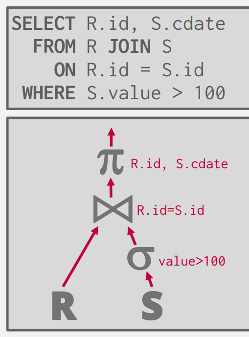

# Join Algorithms

在我们的数据处理中,JOIN 是一个很常见的操作,它可以帮助我们减少信息的重复，可以在没有信息丢失的情况下重构我们的元组。

在本节中，我们仅会讨论Binary Joins，即仅包含两个表格的算法（对于多个表格同时的交较为复杂，并且仅在数据库的学术研究中应用，几乎没有实际的数据库来使用它们）。


## OPERATOR OUTPUT 算子的输出

让我们回到在上一讲中的例子：假设我们已经在查询优化后得到了一个树状的QUERY PLAN，树的根就是我们的查询结果，我们还需要讨论以下两个问题：

{align=right width="300"}


- \# 1 实际上在我们的树上"流动"的数据的格式是怎样的?
- \# 2 我们该如何从众多的JOIN算法中选择最优的呢?

=== "Early Materialization"
    对于第一个问题,一个很自然的想法是:我们所有的计算都会产生一个临时的表格(对于JOIN同样如此),表格中实际存储了所有的数据.这样的实现被称为` Early Materialization `.
    
    一个显而易见的好处是这里的数据都在内存中,我们不需要反复的在内存与磁盘间交互拿取数据;但是对于一个庞大到内存放不下表格而言,这样的实现反而增加了许多不必要的开销.

=== "Late Materialization"
    与之相对的实现方法则为` Late Materialization`.我们仅在JOIN后保留我们需要对比的属性,而其余的属性需要我们在原表格中去找寻数据.这增加了我们进行计算的开销,但从另一种程度上避免了数据复制的成本.


事实上,这两者并无绝对优劣之分.Late Materialization 在列储存数据库中更为常见,因为我们可以将不关心的数据避之不谈.

---


## COST ANALYSIS CRITERIA 开销分析的准则

对于第二个问题,我们实际上需要一种可以衡量各个JOIN算法的指标(也许我们可以使用算法中的时间/空间复杂度;但在数据库系统中,我们关心的具体细节不同)

假设我们有两张表格 R 与 S,其中:

- R 有 m 个元组,存储在 M 页上
- S 有 n 个元组,存储在 N 页上

我们假设最初的数据都在磁盘上,我们需要最小化数据库的瓶颈,这也是我们衡量 JOIN 算法的标准:为了实现JOIN的IO的操作次数.

## JOIN ALGORITHMS

### Nested Loop Join 嵌套循环

一个很自然的想法是:对于两个表格R与S,我们直接将R与S的每一个元组一一比较,当我们需要匹配的属性相同时则进行输出.

```python
foreach tuple r ∈ R:
    foreach tuple s ∈ S:
        if r and s match then
```

这是一个很普适很"暴力"的算法,如果 R 对应的外层循环(这也是为什么我们将R与S分别称为外表(Inner Table)与内表(Outer Table)的原因),可以很轻松的分析得到这样的代价是: $M + (m \cdot N)$

如果我们将其带入实际的例子 (1) 可以发现这样的JOIN非常低效,如果R作为外表,需要大约1.3h的时间用于磁盘的读写,而S作为外表(2),需要1.1h.
{ .annotate }

1.  我们假设 M = 1000, m = 100,000 N = 500, n = 40,000
2.  这也启发我们永远将小的表格作为外表


但是从另一个角度而言,我们的例子中两个表格总共占大约 6MB 大小的空间,这在当下甚至可以放入CPU中的L3 Cache(相较于内存而言更快).如果不考虑我们衡量标准中的极端情况时,实际上我们的暴力算法也并非如此不堪,甚至便于实现.


### Block Nested Loop Join 缓冲块嵌套循环

和我们排序的算法类似,当我们的内存不能够Handle时我们考虑使用Buffer来并行优化我们的算法.

假设我们有 B 个 buffer ,其中一个用于内表的存储,另一个 buffer 用于输出,剩余的 buffer 用于并行匹配外表:

```py
foreach B - 2 pages pR ∈ R:
  foreach page pS ∈ S:
    foreach tuple r ∈ B - 2 pages:
        foreach tuple s ∈ ps:
            if r and s match then emit
```
我们使用了 B-2 个Buffer来扫描外表R,这将消耗 $M + (\lceil M / (B-2) \rceil) \cdot N$.这样的优化方法在数据库系统中是常见的.

### Index Nested Loop Join 索引嵌套循环

我们的嵌套循环之所以缓慢是因为我们总是会重复的扫描内表来进行匹配.如果我们能够直接知道内表中我们想要查找的值的位置呢?

如果我们的表格上已经建立了索引(比如在S上建立了索引)我们就可以通过索引直接查找.这样的开销为$M + (m \cdot C)$这里的C并非是一个常数,而是取决于我们具体建立了什么索引.但这里的C是为了区别于N,即比N小的多的一个数.

```py
foreach tuple r ∈ R:
  foreach tuple s ∈ Index(ri = sj):
    if r and s match then emit
```

### SORT-MERGE Join 排序合并

我们先前的讨论都是建立在我们不打乱原始的数据顺序上的.但是如果我们出于某种原因已经对数据进行了排序,或者我们查询的结果要求排序,在排序后的基础上再进行JOIN将会减小我们许多的开销.类似于归并排序,这里的合并我们只需要顺序的扫描两个表格各一次即可

所以我们可以得到:

- 对表格 R 排序的开销 : $2 M \cdot (1 + \lceil log_{B-1} \lceil M/B \rceil \rceil)$
- 对表格 S 排序的开销 : $2 N \cdot (1 + \lceil log_{B-1} \lceil N/B \rceil \rceil)$
- 合并的开销: $(M+N)$

### Hash Join 哈希

最后我们来讨论最有用的一种合并算法(虽然 mysql 直到近几年才引进了这种Join算法).我们将Hash Join分为两个阶段:

- \# Phase 1 Build
    + 我们扫描外表用哈希函数h1建立哈希表格,这里的哈希表格可以是我们之前讨论过的任意一种
- \# Phase 2 Probe
    + 我们用哈希函数h1对内表S进行映射,然后在对应的Bucket中寻找相同的tuple

对于第二步探测,我们可以使用Bloom Filter进行进一步的优化.在进行匹配前我们首先通过Filter进行判断是否存在.

和之前的讨论一样,如果当内存放不下我们的哈希表时我们可以通过分块哈希的方法:

- 将 R 通过哈希函数分到 k 个 bucket 中
- 将 S 通过相同的函数也分到 k 个 bucket 中
- 最后在k个 bucket 中一一对应的匹配

如果当我们的数据分布的情况并不理想,我们可以进行多次哈希(使用第二个哈希函数将过大的 bucket 再次分为多个 bucket)

<figure markdown="span">
  
  <figcaption>Partition Hash</figcaption>
</figure>

当我们不需要进行多次哈希时我们需要花费:划分时的两个读表格写的开销 $2(M+N)$ 和探测时$(M+N)$的开销

## Conclusion

我们可以发现,基于哈希的JOIN 几乎总是优于基于排序的JOIN,我们可以总结:

- 排序在非均匀分布的表现上更加优秀
- 排序在我们需要结果排序时更加优秀