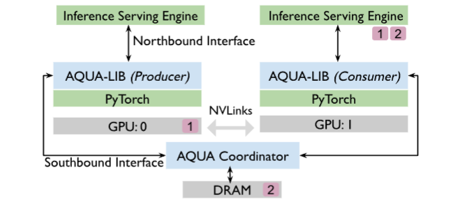
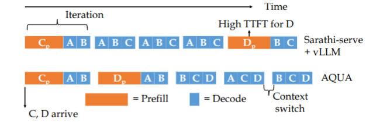

# Aqua： 面向大规模GPU网络加速的 LLM 内存卸载方法

!!! note "Key Idea"
    利用 Nvlinks 的高速带宽等特点，将GPU集群中的 **空闲内存资源** 进行高效共享，采用 **抢占式** 的调度，提升云托管LLM等场景中突发情况下推理的 **响应速度** 和 **吞吐量** 。

## 背景与现状

**当前的问题**

- 队列式的响应会导致突发状况下，部分Prompt 的 Starvation 问题，导致响应时间过长(类似于OS 中的任务调度)。

- 现有的解决方案：利用分时抢占的方式，允许新的 Prompt 进入队列并抢占正在执行的 Prompt 的资源，以减少响应时间。但是其缺点是会导致资源的频繁切换，增加Paging的开销，降低系统的整体效率。

- 那么如何提出一个新的调度算法，能够在 **保证响应时间的同时，最大程度地利用系统资源，减少Paging 的Overhead** ？

## Aqua 的组成

Aqua 由三个部分组成：

- Aqua Profiler: 负责采集和估计GPU内存的使用情况和性能指标，将其标记为 `Consumer` 和 `Producer`，为调度算法提供数据支持。

    !!! note 
        - Consumer: 代表当前正在执行的 Prompt，对于GPU内存的需求较大，需要更多的内存来维持推理的负载。
        - Producer: 代表即将进入队列的 Prompt，对于GPU内存的需求较小，不需要更多的内存来维持推理的负载。

- Aqua Placer: 负责根据 Profiler 的数据和调度算法的决策，将 Comsuer 和 Producer 进行配对，并通过 Nvlinks 的高带宽实现内存资源的共享。
- Aqua Lib :由于我们对于资源的需求也是动态变化的，Aqua Lib能够动态的调整资源的分配和调度（例如归还分配给 Consumer 的内存资源）

!!! warning "缓存命中"
    目前的主流的推理引擎中，普遍会缓存推理的上下文，用于高效的减省推理中的重复计算；但是对于大规模的模型而言，如果KV Cache 的总内存超过了GPU，也可能出现 Starvation 的问题（因为换进和换出还是需要重复加载这部分Cache？）

## Aqua 的组件设计

### Profiler

不同的模型实际上对于资源类型的需求不同（例如计算与内存），视觉和音频生成模型在推理的峰值下，仍有充足的内存空余；这里Aqua Profiler通过采集不同的 Batch Size 对应的空闲内存（事实上，吞吐量并不会随着Batch Size 的增加而线性增长，有一定的限制）。如果在最高的吞吐量下的内存空闲高于某个阈值，那么就认为其可以是一个 Producer。

和 FlexGen中提到的背景相似，LLM 上的推理主要有两个阶段：prefilling 阶段和 decoding 阶段。由于严格的交互式 SLA 约束，LLM 推理时 GPU 显存往往没有被充分利用。

!!! note "SLA"
    SLA 指交互式应用场景下的响应性要求，例如聊天系统或实时助手。典型指标包括：

    - P99 Time Between Tokens (TBT) ≤ 100ms

    - Time To First Token (TTFT) ≤ 1s

但是实际上这样的方法无法有效的确定LLM的真实内存需求，我们真正的问题在于，在给定 SLA 和数据集以及 Chunk Size 等信息，我们需要确定最高的请求速率以达到最高的内存利用率。所以 Profiler 通过二分的方法确定最高的 RPS 。并在最高的RPS的情况下，确定其 Consumer 和 Producer 的身份。

此外，由于**内存的波动**，还需要考虑归还 Producer 其新需要的内存需求。但总的而言，只要请求模式遵循历史分布，其空闲内存估计应当保持准确。

对于 Consumer 还需要采集再不同规模的突发情况下（不同的RPS）所需要的 Swap Space 的大小，以便于后续的调度算法进行决策。

### Placer

Placer 采用的是 Consumer 和 Producer 一对一的模式（如果存在一个 Producer 对应多个 Consumer，此时 Nvlink 被多个Consumer共享，就丢失了本质的优势，例如一个200Gb/s 的Nlink被4个Consumer共享，单个Consumer只能获得 50Gb/s 的带宽，和Pcle就没有优势了。）

考虑有有 S 个服务器，每台服务器有 G 个 GPU，有 N 个模型，每个模型的内存需求为 $R_m$，算法的输出应当是一系列变量 $x_{m,s}$如果第 m 个模型放置在了 s 上。那么可以形式化的表达如下的限制：

- 一个模型分配了一张GPU $\sum_{s=1}^S x_{m,s} = 1, \forall m \in M$ 即一个模型不能拆到多个服务器，也不能不放。
- 如果一个模型被拆成多个 TP shard，那么这些 shard 必须映射到同一台服务器$x_{p[j] , s} == x_{p[j+1], s}, \forall j \in P_m$。

- 显卡的数量限制 $\sum_{m=1}^N x_{m,s} \leq G, \forall s \in S$ 即每台服务器上分配的模型数量不能超过GPU的数量。

- 一个服务器 s 上的显存占用为 $mem_s = \sum_{m=1}^M x_{m,s} \cdot R_m$，为正则还有盈余，为负显存不足

- 我们还需要尽量的平衡 Consuer 和 Producer 的数量 $eq_s = \sum_{m=1}^M x_{m,s} \cdot (t)$，其中 $t = \frac{|R_m|}{R_m}$ 即是否是 Consumer还是 Producer。

那么总体的优化目标是们要同时（负载均衡）：

- 让各服务器 mem_s 接近 0
- 让各服务器 eq_s 接近 0

!!! question 
    原论文中的公式中的 $G_s$的含义是什么？这里没有找到对应的定义和记录？

### Lib

为了能够弹性的实现张量的迁移，还需要一个新的 Aqua 张量，并决定何时对张量进行迁移以及迁移到哪里？

对于每一张GPU都运行了一个Aqua Lib的实例，并判断当前是一个 Profiler 还是一个 Consumer；Serving engine（如 LLM 推理服务）会定期向 Aqua-lib 汇报运行指标；

- GPU 是 producer 且 serving engine 报告 负载上升 ， 那么Aqua-lib 会主动回收（re-claim）之前借出去的显存
- 反过来负载回到 profiling 时的“稳态值”，Aqua-lib 会再次把显存借给 consumer

但是 Aqua-lib 不直接控制模型，而是“通知”，并不直接 malloc 和 free 内存，而是告知 Serving Engine；同时还需要维护一个 **协调组件**，维护：哪些 GPU 在请求显存，哪些 GPU 在提供显存，保证线程安全，防止多个 consumer 同时抢同一份显存。

对于不存在 Producer 的情况，则 Fall back 到DRAM上。对于需要 Reclaim 的情况，Producer 通过调用协调组件来通知 Consumer 归还显存；而 Consumer 定期的调用 API 询问是否需要规划内存。

!!! question
    论文中提到Aqua平台是在vLLM和FlexGen的基础上实现的，但是这里和FlexGen的关系是？一个面向于实时性交互，而另一个在与限制内存的情况下的推理可行性和时延还吞吐量？

## Aqua的公平调度的设计

在现代 LLM 推理系统（例如 vLLM）中，调度策略通常是：

- 把多个请求的 prefill chunk 和其他请求的 decode 混合成一个 batch
- 优先安排 decode（因为 decode 是持续在线的）

但是我们也不能直接使用OS中的分片时间的调度，因为 Prefill 和 Decode的计算性质不太一样，现代系统通过“chunked-prefill”：把 prefill 和 decode 混在一个batch 中，利用资源互补性，提高吞吐。

!!! question 
    这里提到的削弱的优势具体是什么？OS的调度为什么会破坏（或者说OS方式的调度运用到这里具体是什么我不太明白，是基于什么调度的）

在 Aqua 中，给定 Batch Size b 分为 p 个 Prefill Token 和 d 个 Decode Token，我们的策略是，先将 d 设置为最大的值，然后 p 中优先选“prefill 进度最少”的 prompt，d 中优先选“已生成 token 最少”的 prompt，这样的混搭即“已经被服务得少”，优先服务谁。为了简化，使用迭代的次数来衡量时间片的大小（或者单位）。

同时在 Aqua Tensor 的实现中，由于在 vLLM 中一个 prompt 的 KV cache 不是连续内存，是很多小块 tensor 的集合；如果直接逐个小 tensor 复制，会产生大量小规模 memcpy，传输效率极低。所以优先聚合成为一个大的临时 tensor 进行传输，传输完成后再拆分成小 tensor 进行计算，优化了 memory offload 的 I/O 模式
