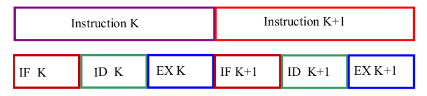
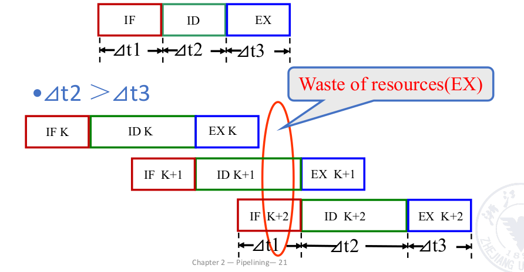
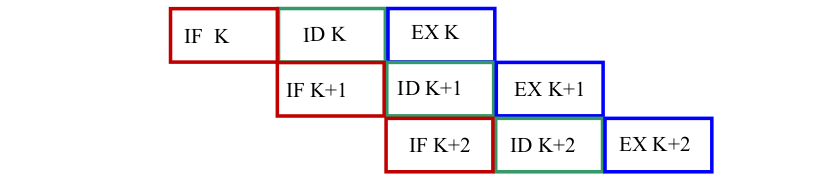
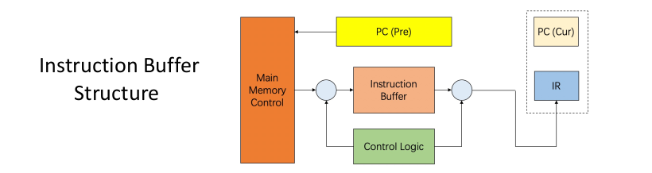
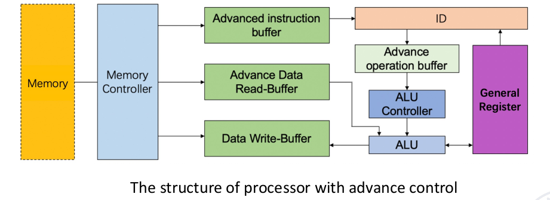
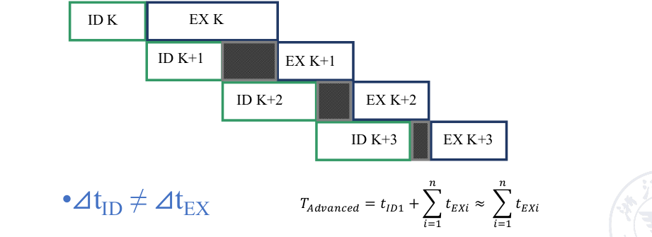
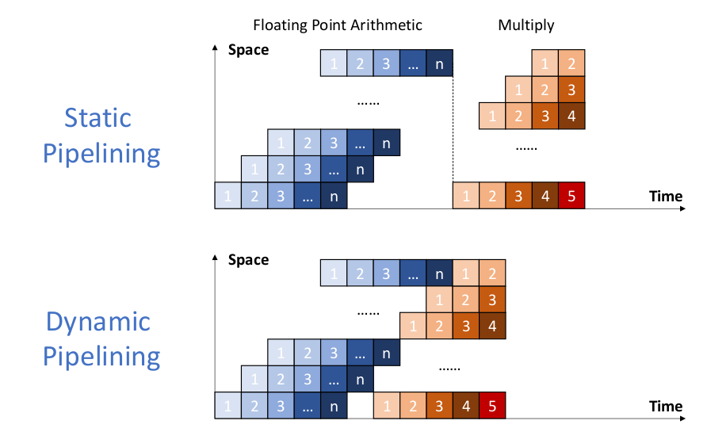
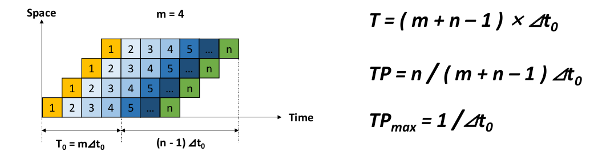

# Pipeline

我们已经在计组中学习过了基础的流水线，但我们在体系中将会更深入的流水线。

从机器的角度而言，加速指令的执行一般有两种方法：

- 减少单个指令执行的时间
    + 性能更高的设备 More high-speed devices
    + 更好地计算方法 Better calculation methods
    + 提升指令内的并行 Improve the parallelism of each microoperation in the instruction
- 减少整个程序运行的时间

事实上，流水线是一种“伪并行”

!!! quote

    Pipelining is an implementation technique whereby multiple
    instructions are overlapped in execution; it takes advantage of
    parallelism that exists among the actions needed to execute an
    instruction.

在流水线中，我们有三种执行模式

=== "Sequential execution"  
    

    指令按顺序执行，没有查重叠的部分。总时间为：

    $$ T = \sum_{i=0}^n (t_{IF} + t_{ID} + t_{EX}) $$

=== "Single Overlapping execution"
    

    有且仅有一个重叠部分，但是当且仅当指令时间相同时才能够达到最优的效率；否则可能会出现浪费资源或者资源竞争的情况。

=== "Twice Overlapping execution"
    

为了解决读写指令与内存的冲突的问题，我们需要额外添加 Buffer Pool 来加快IF段的时间。当BufferPool有空闲时，内存可以一直向Buffer中写入指令，使得IF更快地取指。

### Buffer

此时IF阶段变短后我们可以近乎忽略,则 Twice Overlapping 几乎变成了 Single Overlapping 的情况。此时可以简化 Twice Overlapping 带来的硬件成本。

我们同样也可以将这样的设计逻辑添加到ID阶段。例如这里额外新增了3个Buffer，来平衡各个阶段时间的差异。（可以看到这里ID不再需要等待EX阶段结束再执行）

### Characteristics of pipelining

- Single function pipelining 单功能流水线
- Multi function pipelining  多功能流水线
    - Static Pipelining 静态流水线
    - Dynamic pipelining 动态流水线

## Performance evaluation of pipelining

### Throughput

$$ TP = \frac{n}{T_k} $$

当任务数远大于阶段数时，吞吐量将会受限于瓶颈段（最长的阶段）

