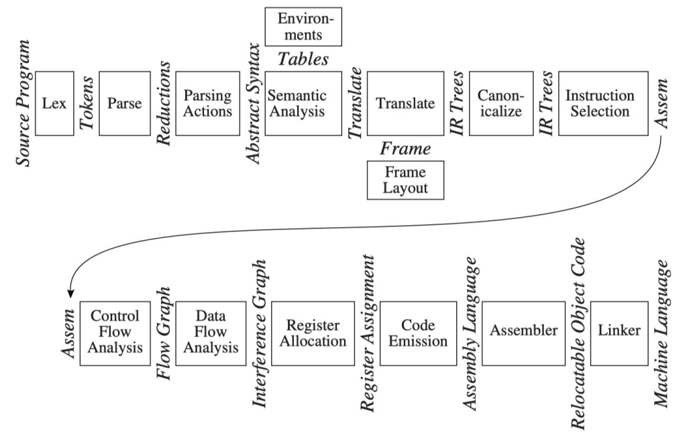

# Introduction to Compilers

## What is a Compiler

- Definition : **Translate a program language to another equivalent program language** 将一个编程语言翻译为另一个编译语言
  
- A complex program 总体而言是一个复杂的程序，可能涵盖 10000 ~ 1000000行代码的规模
  

## Why should we learn compilers

- Applicable techniques and principles 部分的原理和技术是通用的
  
- Touching upon many fields 涉及了计算机的各个领域
  

## How to Learn Compilers

- Describe as follows:
  
  - Techniques
    
  - Data Structures
    
  - Algorithms
    

**同时需要学习 Tiger 和 SysY，前者可能出现在理论题目和期末考试中**

## Modules and Interfaces

上图是教材中一个典型的编译器的模块和接口，尽管主流编译器可能有差异，但是总体的阶段和接口是通用的。

- **Phases**:阶段是描述编译过程中的不同的阶段，每一个阶段可以对应一个模块
  
- **Interfaces**:接口描述了不同阶段之间交换的信息
  

!!! note "为什么要使用 **多阶段** 的设计？"
    - 允许复用部分的模块和接口，例如当我们修改了源语言的时候，可以比较简单的修改上层的模块
   
    - 允许IDE中更方便的高亮和分析等
   

---

### Overview of the Phases

1. Lex Analysis 将源程序的字符转换为单独的单词(Token)
  
2. Parse：分析程序的短语结构，进行切分等
  
3. Parsing Actions: 将每个短语修改为一个语法树
  
4. Semantic Analysis 决定每一个短语的含义，将变量的声明于定义连接，检查表达式的类型
  
5. Frame Layout：决定函数调用期间，在运行时栈（runtime stack）上为该函数分配的栈帧（stack frame）的内存组织结构
  
6. Translate： 产生中间的表达（树），应当与任何的源语言和目标语言无关
  
7. Canoicalize: 简化表达和标明副作用等，进行规范化
  
8. Instruction Selection 将 IR-Tree 的阶段组合成一段段对应目标代码的指令
  
9. Control Flow Analysis: 根据指令序列构建控制流图
  
10. Data Flow Analysis: 根据指令序列分析信息和数据在变量之间的转换和流动
  
11. Register Allocation: 为变量和临时变量选择对应的寄存器；同时还需要考虑对应的优化
  
12. Code Emmision: 将机器码中的临时名称替换为真实的机器寄存器
  
!!! note 

    - 上述的流程中可能有的编译器在设计中将部分的阶段合并为一个
        - 例如将语法分析和语义分析合并等
        - Instruction Selection 和 Code Emmision 合并
        
    - 有的简单的编译器也不会进行控制流分析等
  
---

## Tools and Software

在编译中有两种非常有用的抽象：

- Regular expressions 用于词法分析
  
- Context-free Grammars 用于语法分析
  

对应了两个工具：

- Lex 将声明的规范转换为一个 lexical analysis 词法分析器
  
- Yacc 将声明的语法规范转换为一个语法分析器