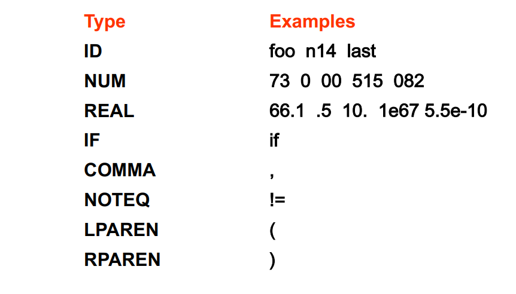
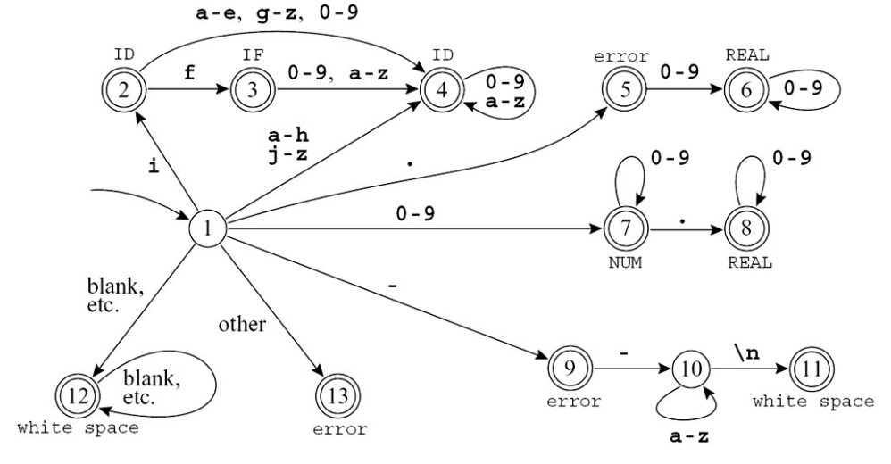
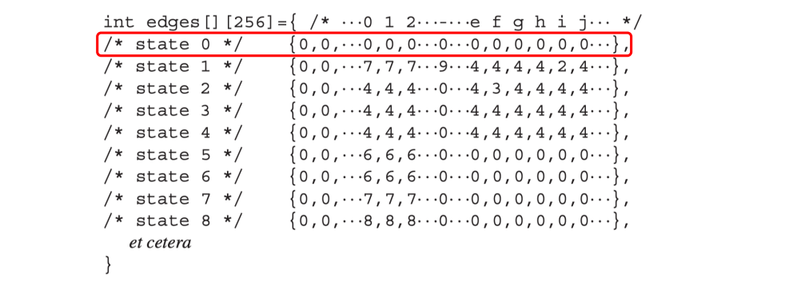

# Lexical Analysis

编译器的翻译顺序总体而言，可以看为将语言拆开来进行分析其各个结构和含义；然后将其组合到一起

- Front end 部分执行分析
  
- Back end 进行组合生成
  
- 现代的编译器还包含 Middle End ，在IR的层面进行优化
  

前段部分可以进一步的分为

- 词法分析
  
- 语法分析
  
- 语义分析
  

---

## Overview

词法分析的任务：输入一个字符流，输出一个Toekn流（删除了空白字符和注释）

词法分析对于下层的接口通常是一个函数 `getToken` ，返还了下一个Token。

但关键之处在于，如何用形式化的方式和工具进行词法分析：

- 能够更加高效和解耦合
  
- 类似的方法在语法分析中也很有用
  

### Lexical Token

一个 Lexical Token 是一个字符串，是构成程序语言语法的基本单元。Token的数量可能是无限的，但是Token的类别是有限的。例如:

有的 Token 包含了语义值，例如 `ID(match0)`, `NUM(3)` 我们需要标注的语义值来区分其具体的信息。

注意，有的部分是 Non-tokens，例如 `comment`,宏定义，空格和换行符等

### Implementation of Lexical Analyzer

我们如何取描述一个词法规则呢？我们可以用自然语言描述    

1. 标识符是由字母和数字组成的序列；第一个字符必须是字母。下划线 _ 也算作一个字母。
  
2. 大写字母和小写字母是不同的。
  
3. 如果输入流已被解析为标记，直到某个给定的字符，则下一个标记将包含可能构成标记的最长字符串。
  
4. 空格、制表符、换行符和注释将被忽略，除非它们用于分隔标记。
  
5. 需要一些空格来分隔原本相邻的标识符、关键字和常量。
  

为了形式化的定义，我们需要人为地将其转换为正则表达式。

### Regular Expressions

除了计算理论中的定义，我们还有一些更加方便的简写：

- `[abcd]`等价于`(a|b|c|d)`
  
- `[b-g]`等价于`[bcdefg]`
  
- `M?`等价于`(M|ε)`而 `M+`等价于 $M \cdot M^*$
  
- `.` 匹配任何的除了换行符的单个字符
  
- `""`代表转义，我们匹配的就是引号内容本身
  

那么我们可以得到一系列Token的正则表达式

|Regular Expression|Correspoding Actions|
| --- | --- |
| if  | {return IF} |
| [a-z][a-z0-9]* | {return ID} |
| [0-9]+ | {return NUM} |
| ([0-9]+"."[0-9]\*) \| ([0-9]\*"."[0-9]+) | {return REAL} |
| ("--"[a-z]\*" \\n") \| (" "\|"\\n"\|"\\t")+ | {Do nothing} |
| .   | error() |

但是这里还是存在歧义：

- `if8` 是一个 id 还是两个 Token?
  
- `if 89` 是一个 id 还是一个保留字？
  

所以我们引入两条规则：

- 最长匹配 Longest Match
  
- 规则优先级 Rule Priority
  

在这两条规则上我们规定 Longest Match > Rule Priority

### DFA

在给定以上的 Regular Expression ,我们就可以绘制对应的 DFA

### Table Driven Implementation

通过一个状态转移表格来记录DFA的图中的转移。此外，还需要一个 State 0 作为Dead State 来代表意料之外(或者不接受)的情况。

为了实现 Longest Match 我们还需要额外的维护： Last-Final 和 Input Position at Last Final 当我们进入到一个 Deat State 的时候，我们回顾一下上一个 Last-Final 并将Input重置到 Input Pos Last Final