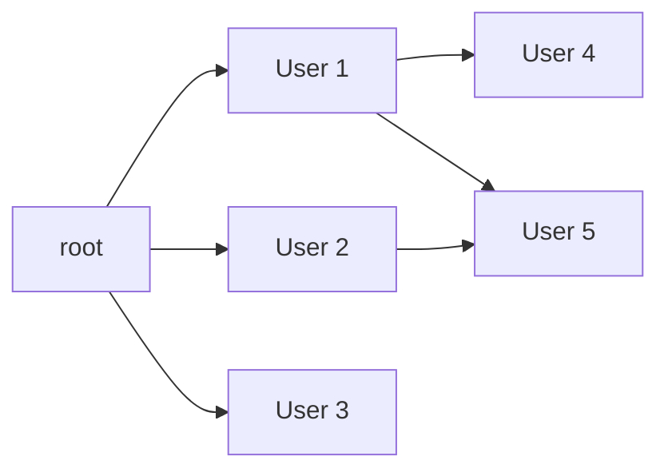

# Advanced SQL

在本节中我们主要介绍部分高级的 SQL 技巧/功能.

## 数据类型

我们再次从数据类型的讨论开始.除了SQL内置的数据类型以外,SQL还允许用户自定义的类型.一般而言,用户自定义的类型是需要建立在内置类型之上的,这相当于为类型取一个别名,例如:

```SQL
Create type person_name as varchar (20) 
Create table student 
		               (sno char(10) primary key, 
   		                sname person_name, 
  		                ssex char(1), 
		                birthday date) 
Drop type person_name 
```

除了自定义类型外,还有一个较为相似的概念是 DOMAIN , DOMAIN 相较于类型而言可以设置一些限制.但是区别在于 DOMAIN 实际上并没有创建一个新的类型,而是只是在原有的类型上增加了部分限制(Not Strongly Typed)
```SQL

# 创建两个实数类型,其中 Dollars 不能为空
Create domain Dollars as numeric(12, 2) not null; 
Create domain Pounds as numeric(12,2); 
```

对于一些较大的数据(例如图片,视频,超长文本等),我们可以用` Large-object types `进行存储(我们将会在数据库系统的设计中再次提及这个问题).SQL提供了两种内置类型 `blob`和`clob`来支持较大的对象的存储.在声明类型时,我们需要指出它最大的大小:

```SQL
Create table students (
    sid char(10) primary key, 
    name varchar(10), 
	gender char(1), 
    photo blob(20MB), 
	cv clob(10KB)
) 
```

## 数据约束

### 完整性约束

现实中的数据往往存在各种各样的约束,没有这些约束会有巨大的问题.例如:我们的非信用卡账户的余额不能为负数,V社的游戏不能有3.我们不能完全指望用户/应用来维护这些约束,所以我们期望在数据库中维护这些约束.

对于单个的关系而言,我们可以有以下的约束:

- ```#!sql Not null``` 非空
- ```#!sql Primary key``` 主键
- ```#!sql Unique``` 不重复
- ```#!sql Check(P)```检查条件(谓语)是否成立

再次回到我们银行的例子,我们希望分行的名称(唯一确定的)作为主键,分行资产非空且大于零,那么我们可以作出如下约束:

```SQL
Create table branch2 
	(branch_name varchar(30) primary key, 
	branch_city varchar(30), 
    assets integer not null, 
   	check (assets >= 100)) 
```

### 参照性约束

有的时候我们不能只在单一的关系上进行约束,因为有的约束是相对的(外键约束等).例如,我们不能在不存在账户上新建一个贷款,所以 loan.account_id 与 account.account_id 存在着一个外键约束.

当我们对一个关系进行操作时(INSERT,UPDATE,DELETE)时,我们可以作出额外的规定.我们可以阻止操作的发生(RESTRICT),我们可以同步操作的更新(CASCADE),我们可以同步为空,我们可以同步为默认值.

```SQL
Create table account 
	(account-number       char(10), 
	 branch-name	char(15), 
	 balance		integer, 
	 primary key (account-number), 
	 foreign key (branch-name) references branch); 

Create table depositor 
	(customer-name	char(20), 
	 account-number	char(10), 
	 primary key (customer-name, account-number), 
	 foreign key (account-number) references account on update cascade, 
	 foreign key (customer-name) references customer on update cascade); 
```

!!! note "参照性约束的检查"
    参照性约束的检查仅在一个事务的结束前才进行检查,这意味着我们在事务中可以短暂的违反参照性约束;否则,我们甚至无法创造一个相互参照外键的关系.

### 断言 ASSERTIONS

有的时候我们的约束比较复杂,无法在以上的关系中简单的描述.此时我们可以使用 `ASSERTION` 来进行复杂的约束(即我们可以使用复杂的谓语).

!!! example

    如果我们要求:每个分行的所有贷款金额总和必须小于该分行所有账户余额的总和.

    由于在 SQL 中我们不存在"任意"的说法,我们需要用"双重否定"的方法来描述,即不存在满足条件的P(X).

    ```SQL
    Create assertion branch_loan_constraint
    check (
        not exists (
            select branch_name
            from branch
            where (
                select sum(amount)
                from loan
                where loan.branch_name = branch.branch_name
            ) >= (
                select sum(balance)
                from account
                where account.branch_name = branch.branch_name
            )
        )
    );
    ```


### 触发器

有的时候我们不期望只有简单的约束,而是希望数据库系统能够在修改时自动的帮我们处理一些数据/事件.此时我们可以使用 `Trigger` 来完成.我们可以将 Trigger 看作我们的修改的"副作用".

一个基本的 Trigger 可以这样写:
```SQL
CREATE TRIGGER trigger_name
{ BEFORE | AFTER } { INSERT | UPDATE | DELETE }
ON table_name
[ FOR EACH ROW ]
[ WHEN (condition) ]
BEGIN
    -- 触发器的操作
    -- 可以是一个或多个 SQL 语句
END;
```
其中 BEFORE 与 AFTER 决定了在事件之前还是之后触发 Trigger, 而 INSERT 等指定了具体的相应的类型.[FOR EACH ROW] 代表对于什么样粒度的数据进行操作,否则默认对于整个语句进行操作.

```#!SQL REFERENCING { OLD | NEW } ROW AS ALIAS``` :

- OLD：表示触发事件之前的行数据，通常用于 UPDATE 和 DELETE 触发器。
- NEW：表示触发事件之后的行数据，通常用于 INSERT 和 UPDATE 触发器。
- alias：为引用的行数据指定一个别名，方便在触发器主体中使用。


```SQL
CREATE TRIGGER overdraft-trigger AFTER UPDATE ON account 
	REFERENCING NEW ROW AS nrow for each row 
	when nrow.balance < 0 
	    begin atomic 
		insert into borrower 
			(select customer-name, account-number from depositor 
	 		 where nrow.account-number = depositor.account-number) 
	    	insert into loan values 
			(nrow.account-number, nrow.branch-name, – nrow.balance) 
	    	update account set balance = 0 
			where account.account-number = nrow.account-number 
        end
```

!!! warning
    诚然 Trigger 十分强大,可以帮助我们维护数据,验证数据,实现日志等等...但是它也存在着诸多的问题,过多的触发器会降低数据库的性能,并且会增加调试的复杂度;不当的编写 Trigger甚至会导致循环递归的触发 Trigger.所以我们对 Trigger 的使用也需要谨慎.

## 授权

### 数据安全

数据库系统有较为复杂的权限系统,这是因为我们需要从各种意义上保证数据的安全.

- 数据库系统层面：授权机制保证只有被允许的用户能够访问/修改数据
- 操作系统层面：操作系统的管理员可以做任何事,所以我们需要更好的管理操作系统的权限
- 网络层面：需要是使用加密机制来避免数据泄漏和数据非法访问
- 物理层面: 我们需要 lock-key 的机制来保证物理层面数据的安全性

### View与授权
我们的授权涉及各个方面,从数据的操作而言：Read/Insert/Delete/Update Auth;从数据存储的结构而言：Index/Resources/Alteration/Drop

有时为了避免直接对于某些关系/表格的授权，我们可以创建一个View，只授予对于View的授权：假设一名银行职员需要知道每个分行的客户姓名，但没有权限查看具体的贷款信息。我们可以拒绝对贷款关系（loan 表）的直接访问权限，但授予对视图 cust-loan 的访问权限，该视图仅包含客户姓名和他们贷款所在的分行信息。

### Authorization Grant Graph
由于数据库管理是一个动态的过程，我们的授权可能呈现出一个图状的形式,例如:


<figure markdown="span">

<figcaption>Authorization Grant Graph</figcaption>
</figure>

如果此时我们撤销了对于User 1的授权，那么User 4的权限也将被取消，因为此时没有连接到root的路径。但是我们可以看到User 5还拥有权限，因为此时User 2对于User 5 的授权仍然有效

### SQL 授权语句

在SQL中授权的语句格式为：```#!sql GRANT <privilege list> ON <table | view> TO <user list> ```

其中<user list>可以是一个特定的用户,一个用户组,或者是一个`role`,也可以是public(对于所有人).

常见的<privilege list>有```#!sql Insert ,Delete ,Update ,Reference ,All privileges```

在授权时我们可以在末尾加上```#! with grant option```,这意味着我们授权的用户可以将其手中的权利进行再次授权

### SQL Role
在实际的使用中,我们可能更倾向于将权限与职务相绑定,即我们的权限不面向特定的用户,而是面向特定的人.例如 `Bob` 也许是经理,但是当 `Alice` 来接替这一职务时我们不希望先从 Bob 中收回,再授予 Alice 相应的权利。SQL中允许我们创建并授予抽象的用户组 `Role` 的权利。

```SQL
Create role teller; 
Create role manager; 
Grant select on branch to teller; 
Grant update (balance) on account to teller; 
Grant all privileges on account to manager; 
Grant teller to manager; 
Grant teller to alice, bob; 
Grant manager to avi; 
```

### SQL 授权的缺陷

- SQL 的授权并不允许在元组级别进行管理(尽管通过 View 应该能做到这一点)
- 随着Web服务的发展，现在所有的应用并不对应多个用户的权限了，而是统一映射到单个用户
- 目前越来越多的权限授予与验证变为了应用层的任务,而非数据库的任务

### SQL 审计

Audit Trails 可以记录和跟踪数据库中所有用户活动，这可以帮助我们监控和记录数据库的访问与操作。例如,我们想要审计用户scott每次成功地执行有关table的语句：```#!sql audit table by scott by access whenever successful ```

更具体而言,Audit的用法为```#!sql AUDIT <obj-opt> ON <obj> | DEFAULT [BY SESSION | BY ACCESS]  [WHENEVER SUCCESSFUL | WHENEVER NOT SUCCESSFUL] ```

- ```<obj-opt>```指定要审计的操作类型，例如 SELECT、INSERT、UPDATE、DELETE 等。

- ```<obj>```表示审计的对象,例如表格,视图,触发器等.

- ```BY SESSION | BY ACCESS``` 指定审计记录的粒度.

- ```WHENEVER SUCCESSFUL | WHENEVER NOT SUCCESSFUL``` 指定是否记录成功或失败的操作.

