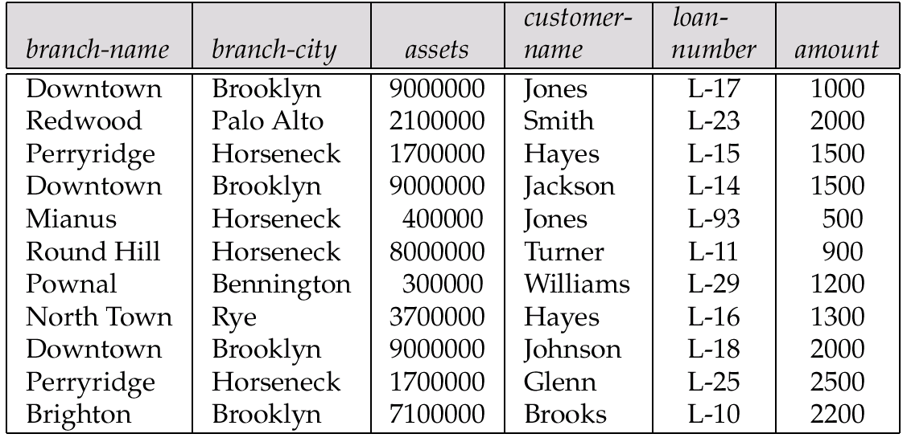
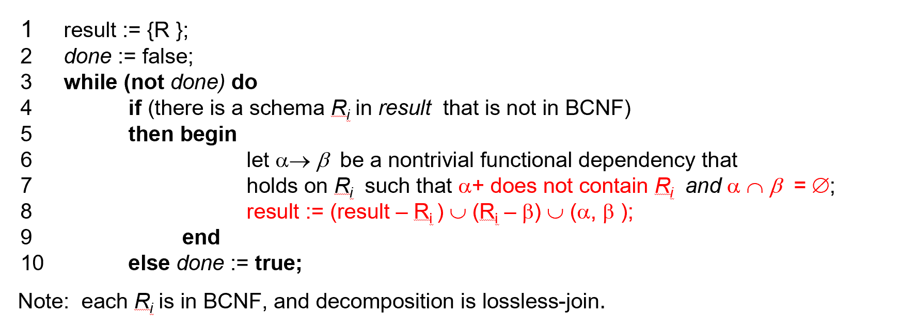

# Relational Database Design

## Preface

我们之所以设计关系类型的数据库,目的之一是希望通过数据间隐含的约束关系来优化和管理我们的数据;例如,如果我们知道了学生的id,就可以知道学生的姓名,年龄,年级等其他的属性.

一个＂不好＂的关系数据库的设计可能会导致：

- Information repetition (重复的存储数据)
- Insertion anomalies (插入异常,例如表格A与B中都存在学生id)
- Update difficulty (更新困难,例如表格A与B中都存在学生id)

所以我们希望能够设计一个好的关系的 Schemas(或者一种拆分的方法), 能够最小化存储的数据规模,简化插入与更新的同时最大化的保存了原始表格的信息(这些信息与关系可能是隐藏的)

下面便是一个不好的关系数据库的例子,我们可以看到每一笔贷款都重复的存储了某些branch的名字;我们对于资产的更新更加困难;我们无法在不引进NULL的情况下插入某些数据.





## Decomposition

令 $R$ 是一个关系模式,$R_1$和$R_2$是$R$的一个分解,那么有$R = R_1 \cup R_2$,即$R$所有的属性都在分解$(R_1,R_2)$中出现

### Lossless-Join
一个自然的想法是,一个好的 Decomposition 应该能够直接通过JOIN得到,这要求$r = \prod_{R_1}(r) \Join \prod_{R_2}(r)$

一个等价的说法是:公共属性是其中一个关系的Key,即:

- $R_1 \cap R_2 \rightarrow R_1$
- $R_1 \cap R_2 \rightarrow R_2$

我们称这样的分解为: Lossless-join decomposition 无损分解

### Dependency Preserving

在不同的属性间存在不同的关联,我们称这些关联为Dependency.例如sid 可以决定student_name和student_age.我们希望分解后,这些关联仍然存在.这样的分解称为Dependency Preserving Decomposition.

可以看到,Dependency Preserving 是更加困难的性质;在后面我们可以知道,我们一定能够找到一个满足良好性质的Lossless-Join 的分解,但是有可能无法满足Dependency Preserving

## Dependency

在本节中,我们主要讨论两种Denpendency:

- Functional Dependency (函数依赖)
- Multivalued Dependency (多值依赖)

### Functional Denpendency

函数依赖借助了数学上的函数的概念,即描述不同属性间的映射关系:

如果对于任意的元组$t_1$ 和 $t_2$ 有

$$ t_1[\alpha] = t_2[\alpha] \Rightarrow t_1[\beta] = t_2[\beta]$$ 

则称 $\alpha \rightarrow \beta$ 存在functional dependency.换言之,我们可以理解为$\alpha$ 可以确定$\beta$.

通过数据库的一些实例我们可以证明函数依赖不存在,但是我们不能证明函数依赖存在;因为依赖是来源于我们应用的规定的,这是先于数据库而存在的.

这里的$\alpha$与$\beta$不应定是单一的属性,它可以是不同的属性的集合;$A \rightarrow BC$ 这样的依赖也是合法的.

此时我们可以对我们之前的key概念作出更新的定义:

- K is a superkey for relation schema $R$ if and only if $K \rightarrow R$
- K is a candidate key for R iff $K \rightarrow R$ and $\neg \exists \alpha \in K , \alpha \rightarrow R$

很显然的是当包含关系存在时,函数依赖的导出是自然的,例如:$\alpha \rightarrow \alpha$,我们称这样的函数关系是平凡的(trivial);而我们应该关注的是那些不平凡的函数依赖.

### Closure

这里的概念与离散数学中的高度重合,我们可以通过定律从函数依赖的集合推导出一个函数依赖的全集,称为为R的一个闭包.

这些定律有(Armstrong's Axims):

- if $\beta \subseteq \alpha$ then $\alpha \rightarrow beta$ 自反律
- if $\alpha \rightarrow \beta$ then $\gamma \alpha \rightarrow \beta$ 增补律
- if $\alpha \rightarrow \beta$ and $\beta \rightarrow \gamma$ then $\alpha \rightarrow gamma$传递律

而一个属性(集合)的闭包,则是从它出发的可推导出的一个函数依赖的全集.

### Canonical Cover 

和闭包的概念相反,对于一个函数依赖的集合F,我们希望找到一个最小的表示$F_c$,使得F能够被$F_c$所推出.这样的一个$F_c$被称为正则覆盖;换言之,正则覆盖就是对集合F的一个化简,它们在逻辑上是相互等价的.

## Normal Form

有了理论基础,我们就可以设计一个好的关系模式,或者一个好的分解方法.

### Third Normal Form

第三范式是指,任何一个非平凡的函数依赖,如果左边不是一个Key,那么右边必须包含在一个 candidate key 里面.

即对于一个relation schema $R$ 和函数依赖的集合 $F^+$有: $\forall \alpha \rightarrow \beta \in F^+$ 满足以下之一的条件

- $\alpha \rightarrow \beta$ is trivial
- $\alpha$ is a superkey for $R$
- Each attribute A in $\beta - \alpha$ is contained in a candidate key for $R$


!!! exampl "Third Normal Form"
	例如: R(J,K,L),和 F = {JK -> L, L->K}

	我们可以推导得到有两个candidate key: JK 和 JL

	那么R是满足第三范式的,因为JK 是一个key,而K是candidate key 中的一个属性

现在我们有了判断是否是一个好的关系模式的判断标准,现在我们需要考虑另一个问题:给定一个不好的关系模式,我们怎么将其变为一个满足第三范式的关系模式?

```C
Let Fc be a canonical cover for F; 
i := 0; 
for each functional dependency a -> b in Fc do 
	{if none of the schemas Rj, 1 <= j <= i contains ab
	      then begin 
		    i := i  + 1; 
		    Ri := (ab) 
	      end} 
if none of the schemas Rj, 1 <= j  <= i contains a candidate key for R then 
begin 
	i := i  + 1; 
	Ri := any candidate key for R; 
end 
return (R1, R2, ..., Ri) 

```

第一部分保证了将$F_c$中的每个依赖分解为子模式$R_i = (\alpha,\beta)$,这样一定保证了 Dependency Preserving 的性质.

第二部分保证了至少在一个$R_i$中存在一个candidate key 从而保证是一个 Lossless-Join Decomposition

所以我们可以断言,一定存在一种分解是的一个Shema可以被分解为满足第三范式的的Schema,同时满足 Lossless-Join 和 Dependency Preverving 的性质

可以看到,第三范式满足的要求允许我们存在部分的重复,但是我们可以在不用计算JOIN的情况下验证所有的函数依赖关系;这是因为我们保证了 Dependency Preserving 的性质.

### Boyce-Codd Normal Form

在第三范式的基础上,我们还可以追求更少的重复和更严格的性质吗?一个自然的想法是我们可以对第三范式的三个充分条件进行修改.如果我们放宽要求:对于第三个条件,我们可以不满足,就得到了 BCNF 新的范式

BCNF 是指,任何一个非平凡的函数依赖,如果左边一定是关系的一个 Key.

即对于一个relation schema $R$ 和函数依赖的集合 $F^+$有: $\forall \alpha \rightarrow \beta \in F^+$ 满足以下之一的条件

- $\alpha \rightarrow \beta$ is trivial
- $\alpha$ is a superkey for $R$

!!! exampl "Boyce-Codd Normal Form"
	例如: R(J,K,L),和 F = {JK -> L, L->K}

	我们可以推导得到有两个candidate key: JK 和 JL

	那么R是满足第三范式的,因为JK 是一个key,而K是candidate key 中的一个属性
	
	但是其不满足BCNF,因为L不是一个Super Key


同样的,以下是一个得到BCNF的分解算法


由于我们抛弃了第三条条件,BCNF的分解有可能不能满足Dependency Preserving 的性质.


