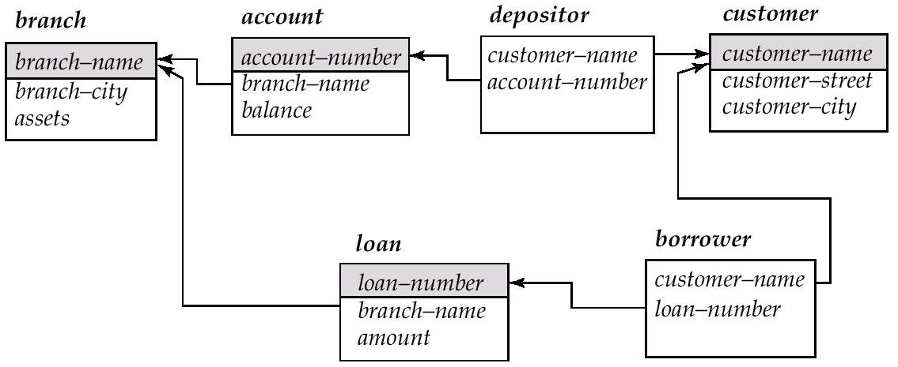

# SQL 基本语法与使用

!!! tip "Example 提示"
    在本节的例子中我们主要的情景建立在如下的银行例子上

    - branch(branch-name, branch-city, assets) 
    - customer(customer-name, customer-street, customer-city) 
    - account(account-number, branch-name, balance) 
    - loan(loan-number, branch-name, amount) 
    - depositor(customer-name, account-number) 
    - borrower(customer-name, loan-number)

    

## Data Definition Language 

DDL 在数据库中是用于定义数据库结构与数据库对象(schema,domain,integrity constraints,physical storage,indices,view)的语言。在DDL中我们主要通过 ``` CREATE DROP ALTER ```三个关键字来增/删/改。

### Domain Types

Domain 用于限定数据库中元素的“范围”

- char: 定长的字符串（用户指定）
- varchar: 不定长的字符串（用户指定最大长度）
- int: 整数（具体的位数由运行的机器限制）
- smallint: 小整数（具体的位数由运行的机器限制）
- numeric(p,d): 固定小数点的实数，由用户指定精度 p 和 小数位数 d 
- real,double precision: 浮点数，与IEEE标准相同
- float(n)：固定精度浮点数
- Null valus: 空值
- date/time/timestamp: 日期(2025-3-3)、时间(18:45:02)、时间戳(2025-3-3 18:45:02)

关于这些 Type 的实现，你可以在 [CMU 15/445 Database Storage](https://15445.courses.cs.cmu.edu/fall2023/slides/04-storage2.pdf "真得是仙品") 中查阅更多的细节（底层的实现与考量）

这里我们额外讨论一下 NULL这种特殊的类型。NULL一般用于只带未知的值或者值不存在。

- 任何对于NULL的算术运算将会返还NULL
- 任何对于NULL的比较运算将会返还NULL
- 对于NULL的逻辑运算如下：
    + OR:  
           - (unknown or true) = true 
           - (unknown or false) = unknown 
           - (unknown or unknown) = unknown 
    + AND:  
           * (true and unknown) = unknown 
           * (false and unknown) = false 
           * (unknown and unknown) = unknown 
    + NOT: (not unknown) = unknown

我们可以通过 `IS NULL` 来检查是否是空值（这里不用等号，因为 NULL = ？ 没有意义）

但是，聚合函数会直接忽略掉所有的空值

### Tables

我们可以通过 ```#!sql CREATE Table name (Attr1 Domain1 Constraint1, ...)``` 来创建不同的表格。

其中 Constraint 包含:

- Not null 非空
- Primary key 指定这个属性为主键(当然主键一定非空)
- Check (P) 要求填入表格的值符合谓语P

```sql
CREATE TABLE branch2
(
    branch_name char(20) primary key,
    branch_city char(30) not null, 
    assets      integer, 
    check (assets >= 0)
); 
```

我们可以通过 ```#!sql DROP Table name``` 来删除表格。
```sql
DROP TABLE branch2;
DROP TABLE bank.branch2;   #删除bank数据库中的branch2表格
```

我们可以通过 ```#!sql ALTER Table name (Attr1 Domain1 Constraint1, ...)``` 来为表格增加属性；```#!sql DROP Table name Attr1``` 来为表格删除属性。我们可以通过 ```#!sql ALTER TABLE branch MODIFY (Attr1 Domain1 Constraint1, ...)``` 来修改表格的属性。

### Index

Index索引是通过在部分属性建立数据结构（通常是 HashTable 与 B+Tree）的方法来增快部分数据的查询速度(1)。
{   .annotate   }

1.  [CMU 15/445 Hash Table Index](../../metacourses/CMU%2015-445/lec5.md) 和 [CMU 15/445 B+Tree Index](../../metacourses/CMU%2015-445/lec6.md)

我们可以通过 `CREATE` 和 `DROP` 来增加和删除 INDEX

```sql
CREATE INDEX b_index ON branch (branch_name); 
CREATE INDEX cust_strt_city_index ON customer (customer_city, customer_street); 
DROP INDEX b_index; 

```

## Data Manipulation Language

### Select Clause

从某种意义而言 Select 语句相当于关系代数中的 $\prod_{attr}$。

我们可以直接直接通过属性的名字来进行选择（选择的内容可以是某个属性，也可以是经过运算的结果，可以是某些函数...）；可以通过 DISTINCT 关键字来对选择的属性进行去重；而关键字 * 则代表所有属性。
```sql
SELECT branch_name 
FROM loan ;

SELECT distinct branch_name 
FROM loan ;
```

### From Clause
FROM Clause可以表明在查询中涉及的关系（这个关系可以是单张表格、多张表格、甚至是另一个查询运算的结果）。当FROM选定多个表格时，可以表示它们的笛卡尔积，例如```#!sql SELECT * FROM borrower, loan ``` 即为 $borrower \times loan$

!!! example 
    Find the customer name, loan number and loan amount of all customers having a loan at the Perryridge branch. 

    ```sql
    SELECT customer_name, borrower.loan_number, amount 
    FROM   borrower, loan 
    WHERE  borrower.loan_number = loan.loan_number and 
                branch_name = ‘Perryridge’ 
    ```

### Rename Option

我们可以通过 `AS` 关键字对表格、属性取一个别名。重命名的操作可以出现在多个地方：可以出现在 Select 中为属性重命名；可以在 From 中为表格重命名...其中，在From从句的命名尤为重要，它可以用于在求一个表格与自身的笛卡尔积中消除歧义。

```sql
SELECT customer_name, borrower.loan_number as loan_id, amount  
    FROM borrower, loan 
    WHERE borrower.loan_number = loan.loan_number;

SELECT customer_name, T.loan_number, S.amount 
   FROM borrower as T, loan as S 
   WHERE T.loan_number = S.loan_number ;

SELECT distinct T.branch_name 
    FROM branch as T, branch as S 
    WHERE T.assets > S.assets and S.branch_city = ‘Brooklyn’ ;
```

### String Option
由于不同的DBMS实现的问题，在字符串上的操作有着很大的不同。仅在字符串的拼接上，就出现了 `+``||` `strcat` 等多种不同的方式。但总体而言他们都指代着同一种功能。所以我们以课件上介绍的为准。

SQL提供了字符串匹配的运算符，用于字符串的查找(需要通过 LIKE 关键字进行):

- '%' 可以匹配任意的子串 

- '_' 可以匹配任意的字符

SQL中可以通过` ||` 进行字符串的连接；可以通过 `LOWER` 和 `UPPER` 进行大小写的转换；可以通过 `SUBSTR(pos,len)` 进行子串的裁剪；可以通过 `LEN` 来查看字符串的长度。

### Order By
我们可以通过 ORDER 关键字来实现排序。我们所指定的类型需要具有可排序的性质。
我们可以根据多个属性进行排序，即当当前属性相同时，按照下一属性进行排序；同时可以在属性后加上关键字 `DESC` 来表明该属性按照降序排序。 
```sql
SELECT distinct customer_name 
	FROM borrower A, loan B 
		WHERE A.loan_number = B.loan_number and 
			 branch_name = ‘Perryridge’ 
	ORDER BY customer_name；


SELECT * FROM customer 
    ORDER BY customer_city, customer_street desc, customer_name 
```

### Set Operations

在 SQL 中，我们可以用 `UNION` 来执行 $\cup$ 操作；可以用 `INTERSECT` 来执行 $\cap$ 操作；可以使用 `EXCEPT` 来执行 `-` 操作。但由于集合的性质，这三个操作保证一定会消除相同的元组的复制。当我们想要保留所有的元组的复制时，我们需要加上` ALL `关键字来保证其不会消除复制。

在这里同样存在“方言”的问题：Oracle通过 MINUS 来实现 EXCEPT；SQL Server 仅支持 UNION。

```sql
(SELECT customer_name FROM depositor) 
UNION 
(SELECT customer_name FROM borrower) ;

(SELECT customer_name FROM depositor) 
INTERSECT 
(SELECT customer_name FROM borrower) ;
```

### Aggregate Functions

我们可以通过 Aggregate Functions 对表格中的元素进行函数操作:

- avg(col): average value 
- min(col): minimum value 
- max(col): maximum value 
- sum(col): sum of values 
- count(col): number of values 

!!! warning
    一个非常重要的点是：当我们的 SELECT 中同时选中了返回单一值的对列的 Aggregate Function 和 某一列属性时，需要通过 GROUP BY 来使得查询有意义；这是因为返回单一值与某一列的组合是没有意义的。

    ```sql
    SELECT branch_name, avg(balance) avg_bal 
      FROM account 
      GROUP BY branch_name 

    SELECT branch_name, count(customer_name) tot_num 
      FROM depositor, account 
      WHERE depositor.account_number=account.account_number 
      GROUP BY branch_name 
    ```

GROUP BY 返回的值同样可以作为我们的选择条件之一，此时这个条件需要放到 HAVING 从句中。所有的聚合函数的结果的筛选都需要放入 Having 中，因为 Having 从句代表对分组后的结果进行筛选；而 Where 语句代表对分组前的数据进行筛选。

### Conclusion

事实上，我们执行一个 SELECT 查询的顺序为：

```#!sql FROM → WHERE → GROUP (AGGREGATE) → HAVING → SELECT → DISTINCT → ORDER BY ```

## More Sophisticated Technique

在我们的查询中，我们常常无法在一句SQL语言中描述我们想要查找的信息。为了简化我们查询的逻辑，我们可以通过一些更加高级的技巧和语法来实现更复杂的查询。

### Nested Subqueries 

我们的 `SELECT` 语句的查询结果可以作为另一个查询语句的一部分。这时候，我们的 FROM 可以从子查询中筛选出我们想要的结果。为了描述我们的查询与子查询的关系，我们可能需要 `IN` `ALL` `EXIST` 等谓语来描述。

!!! example 
    1. Find all customers who have both an account and a loan at the bank. 

    ```sql
    SELECT distinct customer_name 
      FROM borrower 
      WHERE customer_name in (SELECT customer_name 
                                            FROM depositor) 
    ```

    2. Find all customers who have loans at a bank but do not have an account at the bank. 
    
    ```sql
    SELECT distinct customer_name 
      \FROM borrower B, loan L 
	 WHERE B.loan_number = L.loan_number and 
        	    branch_name = ‘Perryridge’ and 
                (branch_name, customer_name) in 
		  (SELECT branch_name, customer_name 
		   FROM depositor D, account A 
		   WHERE D.account_number = A.account_number) 
    ```

    3. Find the account_number with the maximum balance for every branch. 

    ```sql
    SELECT account_number AN, balance 
	     FROM account  A 
          WHERE balance >= (SELECT max(balance) 
			                FROM account B 
			                WHERE A.branch_name = B.branch_name) 
	     ORDER by balance 
    ```

### Views

View是基于查询结果定义的虚拟表，它本身并不真正存储数据，而是存储一个SQL查询的定义。每次访问这个视图时，数据库会动态执行它的查询，得到最新的结果。这相当于一个临时的变量（甚至不算变量，因为它没有实际上存储，数据库将会动态的执行）。并且不是所有的用户都能访问View。

我们可以通过 ```#!sql CREATE VIEW <v_name> AS SELECT a1, a2, ... From ...``` 来定义一个 View ；通过 DROP 来删除一个 View。

??? example
    Create a view consisting of branches and their customer names. 

    ```sql
    CREAT view all_customer as 
         ((SELECT branch_name, customer_name 
          FROM depositor, account 
          WHERE depositor.account_number = account.account_number) 
       union
         (SELECT branch_name, customer_name 
          FROM borrower, loan 
          WHERE borrower.loan_number = loan.loan_number)) 
    ```

### Derived Relations 

Derived Relation是查询结果生成的临时关系，也可以叫查询表达式的结果表。它与 View 类似，但不同的是，他的生命周期仅仅存在于查询中。这意味着它比 View 更加临时。

??? example
    Example: Find the average account balance of those branches where the average account balance is greater than $500. 

    ```sql hl_lines="5 6"
    SELECT branch_name, avg_bal 
                 FROM (SELECT branch_name, avg(balance) 
	                 FROM account 
	                 GROUP BY branch_name) 
	                 as result (branch_name, avg_bal) 
                 WHERE avg_bal > 500 

    ```

### With Clause

WITH子句本质上是一个临时命名的子查询，它更类似于View，但他的定义仅仅局限于本地。With Clause 可以给一个子查询结果起名，后续SQL语句里可以多次引用这个名字，但只在当前这条SQL语句的上下文里有效。

??? example 
    Find all accounts with the maximum balance. 
    ```sql
    WITH max_balance(value) as 
                SELECT max(balance) 
                FROM account 
      SELECT account_number 
      FROM account, max_balance 
      WHERE account.balance = max_balance.value
    ```


| 特点 | View | Derived Relation | WITH（CTE） |
|---|---|---|---|
| 存储位置 | 数据库对象 | 查询内部 | 查询内部 |
| 生命周期 | 长期 | 当前查询 | 当前查询 |
| 可复用性 | 多个查询复用 | 只能在当前查询用一次 | 可以在 **当前查询** 里多次引用 |
| 语法位置 | `CREATE VIEW` | 子查询里 | 查询顶部的`WITH`段 |
| 作用 | 封装长期逻辑 | 局部临时表 | 复杂查询拆分+重用 |

